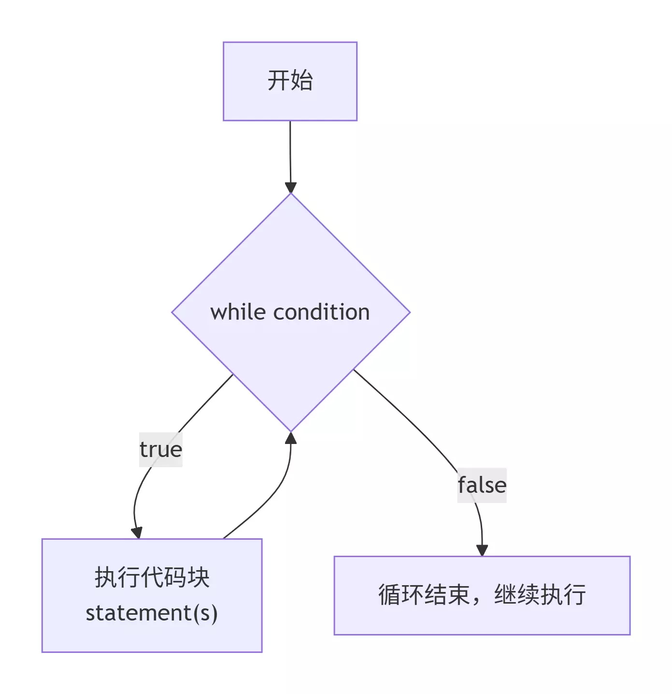
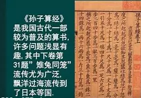

:::note
本系列将以一个学习者的眼光，从零基础一步一步学会最基础的C语言编程，本文将讲解C语言第三个板块：循环结构之while语句。
:::

为了更好的反复调用几行代码或者几行代码中可以提炼出相似点，便可以尝试使用本文所介绍的while循环语句，本文还会介绍一种新的算法：辗转相除法，让你更快的计算出最大公约数和最小公倍数。

### while语句



```c
while(/* 条件判断 */)
{
   /* 循环执行语句 */
}
```

**示例**

```c
#include<stdio.h>
 
int main()
{
    int a=0;
    while(a<10){
        printf("%d\n",a);
        a++;
    }
    return 0;
}
```

> **输出**：
>
> ```
> 0
> 1
> 2
> 3
> 4
> 5
> 6
> 7
> 8
> 9
> ```

### do...while语句

```c
do{
    /* 循环执行语句 */
}while(/* 条件判断 */)
```

**示例**

```c
#include<stdio.h>
 
int main()
{
    int a=0;
    do{
        printf("%d\n",a);
        a++;
    }while(a<10);
    return 0;
}
```

> **输出**：
>
> ```
> 0
> 1
> 2
> 3
> 4
> 5
> 6
> 7
> 8
> 9
> ```

### while和do while的区别

- while 循环：先判断，后执行，循环体执行次数：``0次 ~ N次``。
- do...while 循环：先执行，后判断，循环体执行次数：``1次 ~ N次``。

### 最大公约数和最小公倍数算法（辗转相除法）

> **算法名称**：辗转相除法（欧几里得算法）
>
> 辗转相除法是求GCD的核心算法
>
> LCM可通过GCD推导得出

**方式 1：循环版**

```c
int gcd(int a, int b) {
    //循环直到余数为0，a%b的结果会覆盖b，最终a是GCD
    while (b != 0) {
        int temp = a % b; //保存余数
        a = b;             //把除数赋给被除数
        b = temp;          //把余数赋给除数
    }
    return a;// b=0时，a就是最大公约数
}
```

**方式 2：递归版**

```c
int gcd(int a, int b) {
    if (b == 0) {
        return a; //递归终止条件：余数为0，返回当前a
    }
    return gcd(b, a % b); //递归调用，交换并取余
}
```

**基于GCD实现LCM**

```c
int lcm(int a, int b) {
    if (a == 0 || b == 0) {
        return 0; //0和任何数的公倍数无意义，返回0
    }
    return (a*b) / gcd(a, b);
    //原始公式：(a*b)/gcd(a,b)
}
```

> **总结**
>
> 1. 辗转相除法是求GCD的最优算法，核心规则为gcd(a,b)=gcd(b,a%b)，直到b=0；
> 2. C语言中GCD有循环版和递归版两种实现，循环版无栈开销，适合所有场景；
> 3. LCM无需单独实现算法，直接通过公式lcm(a,b)=(a*b)/gcd(a,b)推导，效率最高；
> 4. 多组数的GCD/LCM，通过两两依次计算即可实现；
> 5. 编程中重点注意数据类型溢出和0/负数的边界处理。

### 应用

> **7-1 sdut-C语言实验-A+B for Input-Output Practice (不确定次数循环)**
>
> Your task is to Calculate a + b.
>
> Too easy?! Of course! I specially designed the problem for all beginners.
>
> You must have found that some problems have the same titles with this one, yes, all these problems were designed for the same aim.
>
> **输入格式**：The input will consist of a series of pairs of integers a and b, separated by a space, one pair of integers per line.
>
> **输出格式**：For each pair of input integers a and b you should output the sum of a and b in one line, and with one line of output for each line in input.
>
> **输入示例**：
>
> ```
> 1 5
> 10 20
> ```
>
> **输出示例**：
>
> ```
> 6
> 30
> ```

<details>
<summary>7-1 解答：</summary>

```c
#include <stdio.h>

int main(){
    int a,b,sum;
    while(scanf("%d %d",&a,&b)!= EOF){
        sum = a + b;
        printf("%d\n",sum);
    }
    return 0;
}
```

</details>

> **7-2 sdut-C语言实验-偶数数位求和**
>
> 给定一个整数，请求出这个整数所有数位中是偶数的数位的和。例如，对于12436546，那么答案就是 2 + 4 + 6 + 4 + 6 。
>
> **输入格式**：输入一个数 n 。 (0 <= n <= 2147483647)
>
> **输出格式**：输出 n 的所有偶数数位的和。
>
> **输入示例**：
>
> ```
> 6768
> ```
>
> **输出示例**：
>
> ```
> 20
> ```

<details>
<summary>7-2 解答：</summary>

```c
#include <stdio.h>

int main(){
    int sum = 0;
    int a, b;
    scanf("%d", &b);
    while (b != 0) {
        a = b % 10;
        if (a % 2 == 0) {
            sum += a;
        }
        b = b / 10;
    }
    printf("%d", sum);
    return 0;
}
```

</details>

> **7-3 sdut-C语言实验-小树快长高**
>
> 宇宙只有一个地球，人类共有一个家园。地球是人类唯一赖以生存的家园，珍爱和呵护地球是人类的唯一选择。习总书记提出"绿水青山就是金山银山，良好生态环境既是自然财富“。小明坚决拥护习总书记的科学论断，并在植树节种了一棵小树。小明每天都给小树浇水，盼望着小树快快长高。他知道小树现在有 n cm，每天长高k cm，他想知道多少天小树可以长到m cm。
>
> **输入格式**：输入三个整数  n, m, k。 ( 0 <= n<= 10000, 0 <= m <= 10000,0 <= k <= 10000)
>
> **输出格式**：输出一个整数，即需要的天数。
>
> **输入示例**：
>
> ```
> 100 200 5
> ```
>
> **输出示例**：
>
> ```
> 20
> ```

<details>
<summary>7-3 解答：</summary>

```c
#include <stdio.h>

int main(){
    int n,m,k,d;
    while(scanf("%d %d %d",&n,&m,&k)!=EOF){
        if (k == 0) {
            printf("0\n");
        }
        if(m>=n){
            if(k!=0){
                d=(m-n)/k;
                if ((m-n) % k != 0) {
                    d++;
                }
                printf("%d\n",d);
            }
        }
        if(m<n){
            printf("0");
        }
    }
    return 0;
}
```

</details>

> **7-4 sdut-C语言实验-数位数**
>
> 给定一个正整数 n ，请你求出它的位数。
>
> **输入格式**：单组输入，输入一个整数 n 。（1<= n <= 2147483647）
>
> **输出格式**：输出一行，包含一个整数，即为 n 的位数。
>
> **输入示例**：
>
> ```
> 1234567
> ```
>
> **输出示例**：
>
> ```
> 7
> ```

<details>
<summary>7-4 解答：</summary>

```c
#include <stdio.h>

int main(){
    int a,b=0;
    scanf("%d",&a);
    while(a>0){
        a = a / 10;
        b++;
    }
    printf("%d",b);
    return 0;
}
```

</details>

> **7-5 sdut-C语言实验- 数列求和2**
>
> 正整数序列是指从1开始的序列，例如{1,2,3,4，......}
>
> 给定一个整数 n，现在请你求出正整数序列 1 - n 的和。
>
> **输入格式**：输入一个整数 n 。（1 <= n <= 1000）
>
> **输出格式**：输出一个整数，即为正确答案。
>
> **输入示例**：
>
> ```
> 2
> ```
>
> **输出示例**：
>
> ```
> 3
> ```

<details>
<summary>7-5 解答：</summary>

```c
#include <stdio.h>

int main(){
    int a,b=1,sum=0;
    scanf("%d",&a);
    while(a>=b){
        sum += b;
        b++;
    }
    printf("%d",sum);
    return 0;
}
```

</details>

> **7-6 sdut-C语言实验-N^3问题**
>
> 输入一个正整数N，求出N^3的各位数字的立方和。
>
> **输入格式**：输入N的值。N<=1024
>
> **输出格式**：问题描述中所要求的数值。
>
> **输入示例**：
>
> ```
> 3
> ```
>
> **输出示例**：
>
> ```
> 351
> ```

<details>
<summary>7-6 解答：</summary>

```c
#include <stdio.h>
#include <math.h>

int main(){
    int N,a,b,sum=0;
    scanf("%d",&N);
    a = N*N*N;
    while(a!=0){
        b=a%10;
        a=a/10;
        sum += b*b*b;
    }
    printf("%d",sum);
    return 0;
}
```

</details>

> **7-7 sdut-C语言实验-虎子的难题**
>
> 虎子是个爱学习的孩子，暑假也在家有规律的学习，但是他最近碰到了一道难题，题目是这样的：
>
> 给出一个正整数 n 和数字 m ( m 取值范围[0,9]中的一个数字)，求 m 在 n 中出现的次数。
>
> 比如 n = 2122345 , m = 2，答案就是  3 ，因为 2 在 2122345 中出现了三次。
>
> 你能帮帮他吗？
>
> **输入格式**：输入只有一行，包含两个空格分开的整数 n 和 m 。（0 <= m <= 9，1 <= n <= 2147483647）
>
> **输出格式**：输出一个数字，表示 m 在 n 中 出现的次数。
>
> **输入示例**：
>
> ```
> 2122345 2
> ```
>
> **输出示例**：
>
> ```
> 3
> ```

<details>
<summary>7-7 解答：</summary>

```c
#include <stdio.h>

int main(){
    int n,m,a,counts=0;
    scanf("%d %d",&n,&m);
    while(n!=0){
        a = n%10;
        if(a==m){
            counts++;
        }
        n=n/10;
    }
    printf("%d",counts);
    return 0;
}
```

</details>

> **7-8 sdut-C语言实验- A+B for Input-Output Practice (I)**
>
> Your task is to Calculate a + b.
>
> Too easy?! Of course! I specially designed the problem for acm beginners.
>
> You must have found that some problems have the same titles with this one, yes, all these problems were designed for the same aim
>
> **输入格式**：The input will consist of a series of pairs of integers a and b, separated by a space, one pair of integers per line.
>
> **输出格式**：For each pair of input integers a and b you should output the sum of a and b in one line, and with one line of output for each line in input.
>
> **输入示例**：
>
> ```
> 1 5
> 10 20
> ```
>
> **输出示例**：
>
> ```
> 6
> 30
> ```

<details>
<summary>7-8 解答：</summary>

```c
#include <stdio.h>

int main(){
    int a,b,sum;
    while(scanf("%d %d",&a,&b)!= EOF){
        sum = a + b;
        printf("%d\n",sum);
    }
    return 0;
}
```

</details>

> **7-9 sdut-C语言实验- A+B for Input-Output Practice (II)**
>
> Your task is to Calculate a + b.
>
> **输入格式**：Input contains multiple test cases. Each test case contains a pair of integers a and b, one pair of integers per line. A test case containing 0 0 terminates the input and this test case is not to be processed.
>
> **输出格式**：For each pair of input integers a and b you should output the sum of a and b in one line, and with one line of output for each line in input.
>
> **输入示例**：
>
> ```
> 1 5
> 10 20
> 0 0
> ```
>
> **输出示例**：
>
> ```
> 6
> 30
> ```

<details>
<summary>7-9 解答：</summary>

```c
#include <stdio.h>

int main(){
    int a,b,sum;
    while(scanf("%d %d",&a,&b)!= EOF){
        if(a==0&&b==0){
            break;
        }
        sum = a + b;
        printf("%d\n",sum);
    }
    return 0;
}
```

</details>

> **7-10 sdut-C语言实验-A+B for Input-Output Practice (III)**
>
> Your task is to Calculate a + b.
>
> **输入格式**：The input will consist of a series of pairs of integers a and b, separated by a space, one pair of integers per line.
>
> **输出格式**：For each pair of input integers a and b you should output the sum of a and b, and followed by a blank line.
>
> **输入示例**：
>
> ```
> 1 5
> 10 20
> ```
>
> **输出示例**：
>
> ```
> 6
>
> 30
> ```

<details>
<summary>7-10 解答：</summary>

```c
#include <stdio.h>

int main(){
    int a,b,sum;
    while(scanf("%d %d",&a,&b)!= EOF){
        sum = a + b;
        printf("%d\n\n",sum);
    }
    return 0;
}
```

</details>

> **7-11 3n+1**
>
> 有这样一个猜想：对于任意大于1的自然数n，若n为奇数，则将n变成3n+1,否则变成n的一半。经过若干次这样的变换，一定会使n变为1。例如3->10->5->16->8->4->2->1。对于n=1的情况，当然就不用变化了。
>
> **输入格式**：输入一个正整数n，n的范围是[1,999999]。
>
> **输出格式**：输出变换的次数。
>
> **输入示例**：
>
> ```
> 3
> ```
>
> **输出示例**：
>
> ```
> 7
> ```

<details>
<summary>7-11 解答：</summary>

```c
#include <stdio.h>

int main(){
    int n,a=0;
    scanf("%d",&n);
    while(n!=1){
        if(n%2==0){
            n=n/2;
        }else{
            n=3*n+1;
        }
        a++;
    }
    printf("%d",a);
    return 0;
}
```

</details>

> **7-12 Average Plus**
>
> You are going to read a serial of real numbers (number with decimal point). The exact number of the numbers are not known.
>
> Your program calculates the average of all the numbers, and prints the average which rounds to two decimal places.
>
> There is at least one number to be processed.
>
> **输入格式**：A serial of real numbers.
>
> **输出格式**：A number rounds to two decimal places, which is the average of the serial.
>
> Using C, the printf for this case is：``printf("%.2f\n", average);``
>
> **输入示例**：
>
> ```
> 1.0 2.1 3.2 4.3 5.4 6.5
> ```
>
> **输出示例**：
>
> ```
> 3.75
> ```

<details>
<summary>7-12 解答：</summary>

```c
#include <stdio.h>

int main(){
    int b=0;
    float a,average,sum=0;
    while(scanf("%f",&a)!= EOF){
        sum += a;
        b++;
    }
    average = sum/b;
    printf("%.2f\n", average);
    return 0;
}
```

</details>

> **7-13 求总金额**
>
> “绿水青山就是金山银山”是时任浙江省委书记习近平于2005年8月提出的科学论断。必须坚持节约资源和保护环境的基本国策。
>
> 小C带着自己不用的物品参加学校组织的跳蚤市场，共卖出了n件物品，请帮他计算一下总金额。
>
> **输入格式**：输入两行数据
>
> 第一行输入n的值，
>
> 第二行输入n件物品的价格，用空格分隔。
>
> **输出格式**：以保留两位小数的形式输出。
>
> **输入示例**：
>
> ```
> 3
> 5.6 8.4 4.5
> ```
>
> **输出示例**：
>
> ```
> 18.50
> ```

<details>
<summary>7-13 解答：</summary>

```c
#include <stdio.h>

int main(){
    int n;
    float a,sum=0.00;
    scanf("%d",&n);
    while(scanf(" %f",&a)!=EOF){
        sum += a;
    }
    printf("%.2f",sum);
    return 0;
}
```

</details>

> **7-14 判断4和7的倍数**
>
> 输入若干个整数，统计这些数中有多少个是4或7的倍数。
>
> **输入格式**：输入若干个整数，每个整数的取值在int范围之内，用空格隔开。
>
> **输出格式**：输出一个整数，为统计的结果。
>
> **输入示例**：
>
> ```
> 30 21 5 16 9
> ```
>
> **输出示例**：
>
> ```
> 2
> ```

<details>
<summary>7-14 解答：</summary>

```c
#include <stdio.h>

int main(){
    int a,count=0;
    while(scanf(" %d",&a)!= EOF){
        if(a%4==0||a%7==0){
            count++;
        }
    }
    printf("%d",count);
    return 0;
}
```

</details>

> **7-15 循环结构 —— 中国古代著名算题。趣味题目：物不知其数。**
>
> 中国古代著名算题。原载《孙子算经》：“今有物不知其数，三三数之剩二；五五数之剩三；七七数之剩二。问物几何?”。本题要求：设某物数量是 N，且三三数剩 x，五五数之剩y，七七数剩z 。 x,y,z 的值可从键盘输入，请求出对应的最小 N 值并输出。
>
> 
>
> **输入格式**：在一行中给出x、y、z的值，空格隔开。
>
> **输出格式**：输出N的值。
>
> **输入示例1**：
>
> ```
> 2 3 2
> ```
>
> **输出示例1**：
>
> ```
> 23
> ```
>
> **输入示例2**：
>
> ```
> 1 1 3
> ```
>
> **输出示例2**：
>
> ```
> 31
> ```

<details>
<summary>7-15 解答：</summary>

```c
#include <stdio.h>

int main(){
    int N=0,x,y,z;
    scanf("%d %d %d",&x,&y,&z);
    while (!(N % 3 == x && N % 5 == y && N % 7 == z)) {
        N++;
    }
    printf("%d\n", N);
    return 0;
}
```

</details>

> **7-16 N个数求和**
>
> 本题的要求很简单，就是求N个数字的和。麻烦的是，这些数字是以有理数分子/分母的形式给出的，你输出的和也必须是有理数的形式。
>
> **输入格式**：输入第一行给出一个正整数N（≤100）。随后一行按格式a1/b1 a2/b2 ...给出N个有理数。题目保证所有分子和分母都在长整型范围内。另外，负数的符号一定出现在分子前面。
>
> **输出格式**：输出上述数字和的最简形式 —— 即将结果写成整数部分 分数部分，其中分数部分写成分子/分母，要求分子小于分母，且它们没有公因子。如果结果的整数部分为0，则只输出分数部分。
>
> **输入示例1**：
>
> ```
> 5
> 2/5 4/15 1/30 -2/60 8/3
> ```
>
> **输出示例1**：
>
> ```
> 3 1/3
> ```
>
> **输入示例2**：
>
> ```
> 2
> 4/3 2/3
> ```
>
> **输出示例2**：
>
> ```
> 2
> ```
>
> **输入示例3**：
>
> ```
> 3
> 1/3 -1/6 1/8
> ```
>
> **输出示例3**：
>
> ```
> 7/24
> ```

<details>
<summary>7-16 解答：</summary>

```c
#include<stdio.h>
#include<math.h>

int main()
{
    int n;
    long a, b, c, d;
    long t, x, y;
    scanf("%d", &n);
    scanf("%ld/%ld", &a, &b);
    x = a;
    y = b;
    while (y != 0) {
        t = x % y;
        x = y;
        y = t;
    }
    t = x;
    a /= t;
    b /= t;
    n = n - 1;
    while (n--)
    {
        scanf("%ld/%ld", &c, &d);
        a = a * d + c * b;
        b = b * d;
        x = a;
        y = b;
        while (y != 0) {
            t = x % y;
            x = y;
            y = t;
        }
        t = x;
        a /= t;
        b /= t;
    }
    if (a % b == 0)
        printf("%ld", a / b);
    else if (a / b == 0 && a != 0)
        printf("%ld/%ld", a, b);
    else
        printf("%ld %ld/%ld", a / b, a % b, b);
    return 0;
}
```

</details>

> **7-17 念数字**
>
> 输入一个整数，输出每个数字对应的拼音。当整数为负数时，先输出fu字。十个数字对应的拼音如下：
>
> ```
> 0: ling
> 1: yi
> 2: er
> 3: san
> 4: si
> 5: wu
> 6: liu
> 7: qi
> 8: ba
> 9: jiu
> ```
>
> **输入格式**：输入在一行中给出一个整数，如：1234。
>
> 提示：整数包括负数、零和正数。
>
> **输出格式**：在一行中输出这个整数对应的拼音，每个数字的拼音之间用空格分开，行末没有最后的空格。如 yi er san si。
>
> **输入示例**：
>
> ```
> -600
> ```
>
> **输出示例**：
>
> ```
> fu liu ling ling
> ```

<details>
<summary>7-17 解答：</summary>

```c
#include <stdio.h>

int main() {
    int a, b, temp, count = 1;
    scanf("%d", &a);
    if (a < 0) {
        printf("fu ");
        a = -a;
    }
    temp = a;
    while (temp > 9) {
        temp /= 10;
        count *= 10;
    }
    while (count > 0) {
        b = a / count;
        switch (b) {
            case 0: printf("ling"); break;
            case 1: printf("yi"); break;
            case 2: printf("er"); break;
            case 3: printf("san"); break;
            case 4: printf("si"); break;
            case 5: printf("wu"); break;
            case 6: printf("liu"); break;
            case 7: printf("qi"); break;
            case 8: printf("ba"); break;
            case 9: printf("jiu"); break;
        }
        if (count > 1) {
            printf(" ");
        }
        a %= count;
        count /= 10;
    }
    printf("\n");
    return 0;
}
```

</details>

> **7-18 最大公约数和最小公倍数**
>
> 本题要求两个给定正整数的最大公约数和最小公倍数。
>
> **输入格式**：输入在一行中给出两个正整数M和N（≤1000）。
>
> **输出格式**：在一行中顺序输出M和N的最大公约数和最小公倍数，两数字间以1空格分隔。
>
> **输入示例**：
>
> ```
> 511 292
> ```
>
> **输出示例**：
>
> ```
> 73 2044
> ```

<details>
<summary>7-18 解答：</summary>

```c
#include <stdio.h>

int main(){
    int M,N,temp,gcd,lcm;
    scanf("%d %d",&M,&N);
    int O_M=M,O_N=N;
    while (N != 0) {
        temp = M % N;
        M = N;
        N = temp;
    }
    gcd = M;
    lcm = (O_M*O_N)/gcd;
    printf("%d %d", gcd,lcm);
    return 0;
}
```

</details>

> **7-19 求奇数和**
>
> 本题要求计算给定的一系列正整数中奇数的和。
>
> **输入格式**：输入在一行中给出一系列正整数，其间以空格分隔。当读到零或负整数时，表示输入结束，该数字不要处理。
>
> **输出格式**：在一行中输出正整数序列中奇数的和。
>
> **输入示例**：
>
> ```
> 8 7 4 3 70 5 6 101 -1
> ```
>
> **输出示例**：
>
> ```
> 116
> ```

<details>
<summary>7-19 解答：</summary>

```c
#include <stdio.h>

int main(){
    int a,sum=0;
    while(scanf("%d",&a)>0){
        if (a <= 0) {
            break;
        }
        if(a%2!=0){
            sum += a;
        }
    }
    printf("%d",sum);
    return 0;
}
```

</details>

> **7-20 猜数字游戏**
>
> 猜数字游戏是令游戏机随机产生一个100以内的正整数，用户输入一个数对其进行猜测，需要你编写程序自动对其与随机产生的被猜数进行比较，并提示大了（“Too big”），还是小了（“Too small”），相等表示猜到了。如果猜到，则结束程序。程序还要求统计猜的次数，如果1次猜出该数，提示“Bingo!”；如果3次以内猜到该数，则提示“Lucky You!”；如果超过3次但是在N（>3）次以内（包括第N次）猜到该数，则提示“Good Guess!”；如果超过N次都没有猜到，则提示“Game Over”，并结束程序。如果在到达N次之前，用户输入了一个负数，也输出“Game Over”，并结束程序。
>
> **输入格式**：输入第一行中给出两个不超过100的正整数，分别是游戏机产生的随机数、以及猜测的最大次数N。最后每行给出一个用户的输入，直到出现负数为止。
>
> **输出格式**：在一行中输出每次猜测相应的结果，直到输出猜对的结果或“Game Over”则结束。
>
> **输入示例**：
>
> ```
> 58 4
> 70
> 50
> 56
> 58
> 60
> -2
> ```
>
> **输出示例**：
>
> ```
> Too big
> Too small
> Too small
> Good Guess!
> ```

<details>
<summary>7-20 解答：</summary>

```c
#include <stdio.h>

int main(){
    int a,max_count,count=0,b,c=0;
    scanf("%d %d",&a,&max_count);
    while(count<max_count){
        scanf("%d",&b);
        if(b<0){
            break;
        }else if(b>a){
            printf("Too big\n");
        }else if(b<a){
            printf("Too small\n");
        }else if(b==a && count == 0){
            printf("Bingo!");
            c=1;
            break;
        }else if(b==a && count < 3 && count>0){
            printf("Lucky You!\n");
            c=1;
            break;
        }else if(b==a && count >= 3){
            printf("Good Guess!\n");
            c=1;
            break;
        }
        count++;
    }
    if(c!=1){
        printf("Game Over\n");
    }
    return 0;
}
```

</details>

### 总结

OK了，今天你学会了C语言程序的循环结构的while语句，还学习了神奇的最大公约数和最小公倍数算法（辗转相除法）！一起加油吧！
