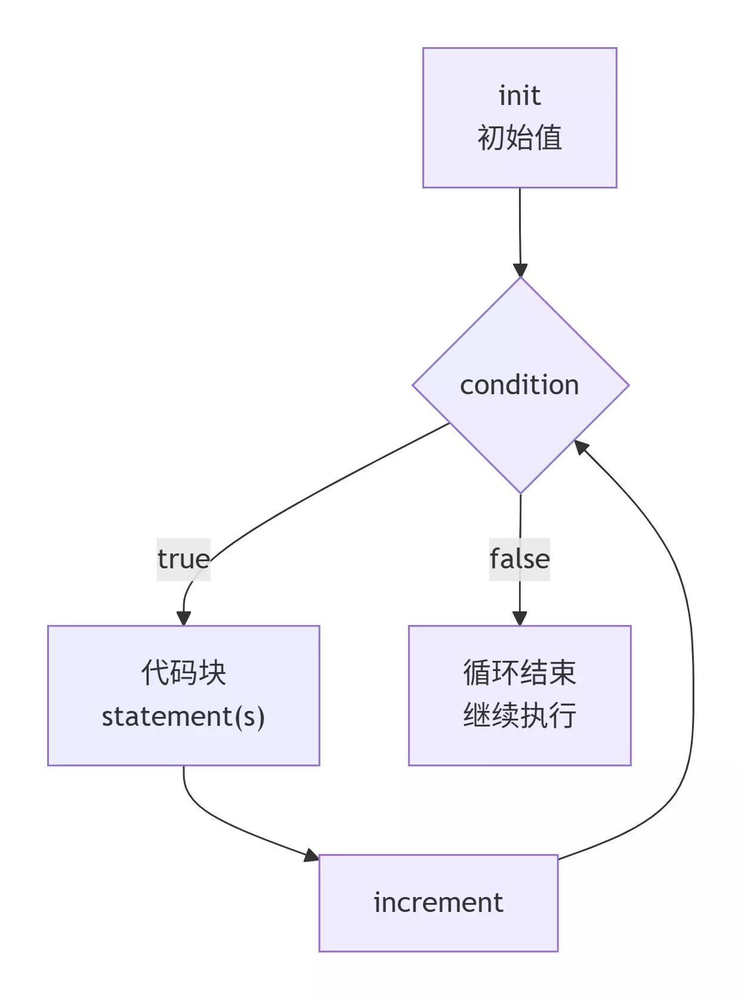

:::note
本系列将以一个学习者的眼光，从零基础一步一步学会最基础的C语言编程，本文将讲解C语言第四个板块：循环结构之for语句。
:::

为了更好的反复调用几行代码或者几行代码中可以提炼出相似点，便可以尝试使用本文所介绍的for循环语句。本文还要初步讲解math.h头文件的用法以及基本的math.h的常用部分函数。

### for语句



```c
for (/* 初始化变量 */;/* 判断语句 */;/* 变量更新语句 */)
{
   /* 循环语句 */
}
```

**示例**

```c
#include <stdio.h>

int main(){
    for(int i=0;i<10;i++){
        printf("%d",i);
    }
    return 0;
}
```

> **输出**：
>
> ```
> 0
> 1
> 2
> 3
> 4
> 5
> 6
> 7
> 8
> 9
> ```

### math.h头文件

#### sqrt()

```c
double sqrt(double x);
```

**x**：一个非负数，要计算平方根的值。

**返回值**: 返回 x 的平方根(double类型)。

**示例**

```c
#include <stdio.h>
#include <math.h>

int main() {
    double num1 = 2.0;
    double result1 = sqrt(num1);
    printf("sqrt(%.1f) ≈ %.4f\n", num1, result1);
    return 0;
}
```

> **输出**：
>
> ```
> sqrt(2.0) ≈ 1.4142
> ```

#### pow()

```c
double pow(double x, double y);
```

**x**：基数（底数），一个浮点数。

**y**：指数，一个浮点数。

**返回值**：返回 x 的 y 次幂，即 $x^y$。

**示例**

```c
#include <stdio.h>
#include <math.h>

int main() {
    double base1 = 10.0, exp1 = -2.0;
    double result1 = pow(base1, exp1);
    printf("pow(%.1f, %.1f) = %.2f\n", base1, exp1, result1);
    return 0;
}
```

> **输出**：
>
> ```
> pow(10.0, -2.0) = 0.01
> ```

### 应用

> **7-1 sdut-C语言实验-A+B for Input-Output Practice (Ⅳ)**
>
> Your task is to Calculate a + b.
>
> **输入格式**：Your task is to Calculate a + b.
>
> **输出格式**：For each pair of input integers a and b you should output the sum of a and b in one line, and with one line of output for each line in input.
>
> **输入示例**：
>
> ```
> 2
> 1 5
> 10 20
> ```
>
> **输出示例**：
>
> ```
> 6
> 30
> ```

<details>
<summary>7-1 解答：</summary>

```c
#include <stdio.h>

int main(){
    int a,b,c,sum;
    scanf("%d",&c);
    for(int i = 0; i < c; i++){
        scanf("%d %d",&a,&b);
        sum = a + b;
        printf("%d\n",sum);
    }
    return 0;
}
```

</details>

> **7-2 sdut- C语言实验-计算1到n的和（循环结构）**
>
> 从键盘上输入任意一个整数n，计算1到n的和。
>
> **输入格式**：从键盘输入任意整数n。
>
> **输出格式**：输出1到n的和。
>
> **输入示例**：
>
> ```
> 3
> ```
>
> **输出示例**：
>
> ```
> 6
> ```

<details>
<summary>7-2 解答：</summary>

```c
#include <stdio.h>

int main(){
    int n,sum=0,temp;
    scanf("%d",&n);
    for(int i = 0; i < n; i++){
        temp = i+1;
        sum +=temp;
    }
    printf("%d",sum);
    return 0;
}
```

</details>

> **7-3 sdut- C语言实验-判断素数（循环结构）**
>
> 从键盘上输入任意一个正整数，然后判断该数是否为素数。
>
> 如果是素数则输出"This is a prime."
>
> 否则输出“This is not a prime.”
>
> **输入格式**：输入任意一个正整数n(1 <= n <= 1000000)。
>
> **输出格式**：判断n是否为素数，并输出判断结果：
>
> 如果n是素数则输出"This is a prime."
>
> 否则输出“This is not a prime.”
>
> 特别提醒：请注意对1的判定，1不是素数。
>
> **输入示例**：
>
> ```
> 3
> ```
>
> **输出示例**：
>
> ```
> This is a prime.
> ```

<details>
<summary>7-3 解答：</summary>

```c
#include <stdio.h>
#include <math.h>

int main(){
    int a;
    scanf("%d",&a);
    if (a <= 1) {
        printf("This is not a prime.");
        return 0;
    }
    if (a == 2) {
        printf("This is a prime.");
        return 0;
    }
    if (a % 2 == 0) {
        printf("This is not a prime.");
        return 0;
    }
    for (int i = 3; i <= sqrt(a); i += 2) {
        if (a % i == 0) {
            printf("This is not a prime.");
            return 0;
        }
    }
    printf("This is a prime.");
    return 0;
}
```

</details>

> **7-4 sdut-C语言实验-求阶乘（循环结构）**
>
> 从键盘输入任意一个大于等于0的整数n，然后计算n的阶乘，并把它输出。
>
> 提示： 0！是 1 。
>
> **输入格式**：输入任意一个大于等于0的整数n。
>
> **输出格式**：输出n！
>
> **输入示例**：
>
> ```
> 3
> ```
>
> **输出示例**：
>
> ```
> 6
> ```

<details>
<summary>7-4 解答：</summary>

```c
#include <stdio.h>

int main(){
    int n,temp=0,result=1;
    scanf("%d",&n);
    for(int i = 0; i < n; i++){
        temp = i+1;
        result *= temp;
    }
    printf("%d",result);
    return 0;
}
```

</details>

> **7-5 sdut-C语言实验-数位数**
>
> 给定一个正整数 n ，请你求出它的位数。
>
> **输入格式**：单组输入，输入一个整数 n 。（1<= n <= 2147483647）
>
> **输出格式**：输出一行，包含一个整数，即为 n 的位数。
>
> **输入示例**：
>
> ```
> 1234567
> ```
>
> **输出示例**：
>
> ```
> 7
> ```

<details>
<summary>7-5 解答：</summary>

```c
#include <stdio.h>

int main(){
    int a,temp=0;
    scanf("%d",&a);
    for(int i = 0;a>0;i++){
        a = a / 10;
        temp = i+1;
    }
    printf("%d",temp);
    return 0;
}
```

</details>

> **7-6 sdut-C语言实验-数列求和**
>
> 数列求和是一类常见的问题，本题有一定的代表性：
>
> 求s=a+aa+aaa+aaaa+……+aa…aa（n位）
>
> 其中，a的值由键盘输入，位数n也由键盘输入。
>
> **输入格式**：第一行输入a的值；
>
> 第二行输入位数n。
>
> **输出格式**：输出对n个数完成求和运算后的结果。
>
> 比如a=3，n=6时，s=3+33+333+3333+33333+333333
>
> **输入示例**：
>
> ```
> 3
> 6
> ```
>
> **输出示例**：
>
> ```
> 370368
> ```

<details>
<summary>7-6 解答：</summary>

```c
#include <stdio.h>

int main(){
    int a,n,s=0,b=1,c;
    scanf("%d %d",&a,&n);
    c = a;
    for(int i=0;i<n;i++){
        s = s + a;
        b = b*10;
        a = c*b+a;
    }
    printf("%d",s);
    return 0;
}
```

</details>

> **7-7 sdut-C语言实验-完美的素数**
>
> 素数又称质数。指一个大于1的自然数，除了1和此整数自身外，不能被其他自然数整除的数。我们定义：如果一个素数是完美的素数，当且仅当它的每一位数字之和也是一个素数。现在给你一个正整数，你需要写个程序判断一下这个数按照上面的定义是不是一个完美的素数。
>
> **输入格式**：输入包含多组测试数据。
>
> 每组测试数据只包含一个正整数 n (1 < n <= 10^6)。
>
> **输出格式**：对于每组测试数据，如果 n 是完美的素数，输出“YES”，否则输出“NO”(输出均不含引号)。
>
> **输入示例**：
>
> ```
> 11
> 13
> ```
>
> **输出示例**：
>
> ```
> YES
> NO
> ```

<details>
<summary>7-7 解答：</summary>

```c
#include <stdio.h>

int main(){
    int n,a,b;
    int sum=0;
    int i,j;
    while(scanf("%d",&n)!=EOF){
        for(i=2;i<n;i++){
            if(n%i==0)
                break;
        }
        if(n==i){
            while(n>0){
                a=n%10;
                sum=sum+a;
                n=n/10;
            }
            for(j=2;j<sum;j++){
                if(sum%j==0)
                break;
            }
            if(sum==j){
                printf("YES\n");
            }
            else{
                printf("NO\n");
            }
        }
        else{
            printf("NO\n");
        }
    }
} 
```

</details>

> **7-8 sdut-C语言实验-虎子的虎年理财计划**
>
> 传说西塔发明了国际象棋而使国王十分高兴，他决定要重赏西塔，西塔说：“我不要你的重赏，陛下，只要你在我的棋盘上赏一些麦子就行了。在棋盘的第1个格子里放1粒，在第2个格子里放2粒，在第3个格子里放4粒，在第4个格子里放8粒，依此类推，以后每一个格子里放的麦粒数都是前一个格子里放的麦粒数的2倍，直到放满第64个格子就行了”。国王觉得很容易就可以满足他的要求，于是就同意了。但很快国王就发现，即使将国库所有的粮食都给他，也不够百分之一。
>
> 虎子深受启发，他开始了自己伟大的理财梦想：如果按照上面的复利计算，从这个虎年开始，第一年存1元钱，第二年存2元钱，第三年存4元钱，以此类推。你帮他算算，如果存n年(1<=n<=18)，到下一个虎年虎子会存多少钱？
>
> **输入格式**：输入一个n，表示存n年。
>
> **输出格式**：输出虎子n年后的存款数额。
>
> **输入示例**：
>
> ```
> 12
> ```
>
> **输出示例**：
>
> ```
> 4095
> ```

<details>
<summary>7-8 解答：</summary>

```c
#include <stdio.h>

int main(){
    int n,sum=0;
    scanf("%d",&n);
    for(int i=0;i<n;i++){
        sum += pow(2,i);
    }
    printf("%d",sum);
    return 0;
}
```

</details>

> **7-9 sdut-C语言实验—两个数比较**
>
> 求2个数中较大者。
>
> **输入格式**：第一行为测试的数据组数N，接下来的N行分别是两个待比较的整数。
>
> **输出格式**：输出N行，每一行的值为每组数中较大的整数。
>
> **输入示例**：
>
> ```
> 2
> 1 2
> 15 10
> ```
>
> **输出示例**：
>
> ```
> 2
> 15
> ```

<details>
<summary>7-9 解答：</summary>

```c
#include <stdio.h>

int main(){
    int a,b,max,n;
    scanf("%d",&n);
    for(int i = 0;i<n;i++){
        scanf("%d %d",&a,&b);
        if(a>b){
            max = a;
        }
        else{
            max = b;
        }
        printf("%d\n",max);
    }
    return 0;
}
```

</details>

> **7-10 sdut-C语言实验- 求绝对值最大值**
>
> 求n个整数中的绝对值最大的数(要求n个数的绝对值不相等)。
>
> **输入格式**：输入数据有2行，第一行为n，第二行是n个整数。
>
> **输出格式**：输出n个整数中绝对值最大的数。
>
> **输入示例**：
>
> ```
> 5
> -1 2 3 4 -5
> ```
>
> **输出示例**：
>
> ```
> -5
> ```

<details>
<summary>7-10 解答：</summary>

```c
#include <stdio.h>

int main(){
    int n;
    scanf(" %d",&n);
    int arr[n],group[n];
    for(int i=0;i<n;i++){
        scanf(" %d",&arr[i]);
        if(arr[i]<0){
            group[i]=-arr[i];
        }else{
            group[i]=arr[i];
        }
    }
    int max=group[0],maxs;
    for(int a=0;a<n;a++){
        if(max<group[a]){
            max = group[a];
            maxs = arr[a];
        }
    }
    printf("%d",maxs);
    return 0;
}
```

</details>

> **7-11 sdut-C语言实验- 平方数**
>
> 飞飞特别喜欢平方数，可是他数学并不好，你能帮他计算 n 与 m 之间所有平方数之和吗？
>
> 提示1：若一个整数的开方还是整数，它就是平方数。例如：4、9、16、25是平方数。n 和 m 均可能为 0 至 100000000 内的任意整数，n、m不一定有序。
>
> 提示2：开方的函数是sqrt()，比如i的开方是sqrt(i)，需要将头文件math.h包含进来。
>
> **输入格式**：第一行 T 代表数据的组数。
>
> 接下来有 T 行，每行两个整数n,m (0 <= n, m <= 100000000)
>
> **输出格式**：输出一个整数，代表所求区间内平方数之和。
>
> **输入示例**：
>
> ```
> 3
> 1 4
> 10 3
> 17 20
> ```
>
> **输出示例**：
>
> ```5
> 13
> 0
> ```

<details>
<summary>7-11 解答：</summary>

```c
#include <stdio.h>
#include <math.h>

int main(){
    int t;
    scanf("%d",&t);
    for(int i=0;i<t;i++){
        int a,b,sum=0;
        scanf("%d %d",&a,&b);
        if(a<b){
            for(int m = a;m<=b;m++){
                int x;
                x = sqrt(m);
                if(x*x==m){
                    sum += m;
                }
            }
        }
        if(a>b){
            for(int n = b;n<=a;n++){
                int y;
                y = sqrt(n);
                if(y*y==n){
                    sum += n;
                }
            }
        }
        printf("%d\n",sum);
    }
    return 0;
}
```

</details>

> **7-12 sdut - C语言—圆周率**
>
> 输入n值，并利用下列格里高里公式计算并输出圆周率： $\frac{\pi}{4} = 1 - \frac{1}{3} + \frac{1}{5} - \frac{1}{7} + \dots + \frac{1}{4n-3} - \frac{1}{4n-1}$
>
> **输入格式**：输入公式中的n值。
>
> **输出格式**：输出圆周率，保留5位小数。
>
> **输入示例**：
>
> ```
> 1
> ```
>
> **输出示例**：
>
> ```
> 2.66667
> ```

<details>
<summary>7-12 解答：</summary>

```c
#include <stdio.h>

int main() {
    double n,i;
    double pi,sum; 
    scanf("%lf", &n);
    for (i = 1; i <= n; i++) {
        sum=sum+(1/(4*i-3)-1/(4*i-1));
    }
    pi = 4*sum;
    printf("%.5lf\n", pi);
    return 0;
}
```

</details>

> **7-13 sdut-C语言实验- 做乘法**
>
> 请用C语言编写一个程序。此程序接收一个正整数N，然后打印输出“N次N*(1->N)格式”的数据。例如：此程序接收正整数5，那会输出以下格式的数据：
>
> ```
> 5 * 1 = 5
> 5 * 2 = 10
> 5 * 3 = 15
> 5 * 4 = 20
> 5 * 5 = 25
> ```
>
> **输入格式**：只有一个正整数N（N<=100）。
>
> **输出格式**：输出共N行数据，如上面的例子所示。
>
> **输入示例**：
>
> ```
> 5
> ```
>
> **输出示例**：
>
> ```
> 5*1=5
> 5*2=10
> 5*3=15
> 5*4=20
> 5*5=25
> ```

<details>
<summary>7-13 解答：</summary>

```c
#include <stdio.h>

int main(){
    int n,sum;
    scanf("%d",&n);
    for(int i = 1;i<=n;i++){
        sum = n*i;
        printf("%d*%d=%d\n",n,i,sum);
    }
}
```

</details>

> **7-14 sdut-C语言实验- 简单计算**
>
> 接受从键盘输入的N个整数，输出其中的最大值、最小值和平均值（平均值为整除的商）。
>
> **输入格式**：第一行一个正整数N（N<=100）；
>
> 第二行有N个用空格隔开的整数Ti (1 <= i <= N, 0 <= Ti <= 10000000)
>
> **输出格式**：三个有空格隔开的整数分别为最大值、最小值和平均值，其中平均值为整除的商。
>
> **输入示例**：
>
> ```
> 5
> 1 2 3 5 4
> ```
>
> **输出示例**：
>
> ```
> 5 1 3
> ```

<details>
<summary>7-14 解答：</summary>

```c
#include <stdio.h>

int main() {
    int N;
    int nums[100];
    int max, min;
    int sum = 0;
    int avg;
    int i;
    scanf("%d", &N);
    for (i = 0; i < N; i++) {
        scanf("%d", &nums[i]);
    }
    max = nums[0];
    min = nums[0];
    sum = nums[0];
    for (i = 1; i < N; i++) {
        if (nums[i] > max) {
            max = nums[i];
        }
        if (nums[i] < min) {
            min = nums[i];
        }
        sum += nums[i];
    }
    avg = sum / N;
    printf("%d %d %d\n", max, min, avg);
    return 0;
}
```

</details>

> **7-15 sdut- C语言实验-新判断素数（循环结构）**
>
> 所谓的数是这样一个正整数：除了1和它本身之外没有其他的因子的数。从键盘上输入任意一个正整数，然后判断该数是否为素数。 如果是素数则输出"YES." 否则输出“NO.”
>
> **输入格式**：输入任意一个正整数n(1 <= n )。
>
> **输出格式**：判断n是否为素数，并输出判断结果： 如果n是素数则输出"YES." 否则输出“NO.”
>
> 特别提醒：请注意对1的判定，1不是素数。
>
> **输入示例**：
>
> ```
> 3
> ```
>
> **输出示例**：
>
> ```
> YES.
> ```

<details>
<summary>7-15 解答：</summary>

```c
#include <stdio.h>
#include <math.h>

int main(){
    int a;
    scanf("%d",&a);
    if (a <= 1) {
        printf("NO.");
        return 0;
    }
    if (a == 2) {
        printf("YES.");
        return 0;
    }
    if (a % 2 == 0) {
        printf("NO.");
        return 0;
    }
    for (int i = 3; i <= sqrt(a); i += 2) {
        if (a % i == 0) {
            printf("NO.");
            return 0;
        }
    }
    printf("YES.");
    return 0;
}
```

</details>

> **7-16 sdut- C语言实验—分数序列**
>
> 有一个分数序列：2/1, 3/2, 5/3, 8/5, 13/8, …编写程序求出这个序列的前n项之和。
>
> **输入格式**：输入只有一个正整数n，1≤n≤10。
>
> **输出格式**：请在这里描述输出格式。例如：对每一组输入，在一行中输出A+B的值。
>
> **输入示例**：
>
> ```
> 3
> ```
>
> **输出示例**：
>
> ```
> 5.166667
> ```

<details>
<summary>7-16 解答：</summary>

```c
#include <stdio.h>

int main() {
    int n;
    scanf("%d", &n);
    double total = 0.0;
    int a = 2, b = 1;
    for (int i = 0; i < n; i++) {
        total += (double)a / b;
        int temp = a;
        a = a + b;
        b = temp;
    }
    printf("%.6f\n", total);
    return 0;
}
```

</details>

> **7-17 计算阶乘和**
>
> 对于给定的正整数N，需要你计算 $S=1!+2!+3!+...+N!$。
>
> **输入格式**：输入在一行中给出一个不超过10的正整数N。
>
> **输出格式**：在一行中输出S的值。
>
> **输入示例**：
>
> ```
> 3
> ```
>
> **输出示例**：
>
> ```
> 9
> ```

<details>
<summary>7-17 解答：</summary>

```c
#include <stdio.h>

int main(){
    int n,S=0;
    scanf("%d",&n);
    for(int i=1;i<=n;i++){
        int C=1;
        for(int j=1;j<=i;j++){
            C*=j;
        }
        S+=C;
    }
    printf("%d",S);
}
```

</details>

> **7-18 水仙花数**
>
> 水仙花数是指一个N位正整数（N≥3），它的每个位上的数字的N次幂之和等于它本身。例如：$153=1^3+5^3+3^3$。本题要求编写程序,计算所有N位水仙花数。
>
> **输入格式**：输入在一行中给出一个正整数N（3≤N≤7）。
>
> **输出格式**：按递增顺序输出所有N位水仙花数，每个数字占一行。
>
> **输入示例**：
>
> ```
> 3
> ```
>
> **输出示例**：
>
> ```
> 153
> 370
> 371
> 407
> ```

<details>
<summary>7-18 解答：</summary>

```c
#include <stdio.h>

int main() {
    int N;
    scanf("%d", &N);
    long long start = 1;
    for (int i = 0; i < N - 1; i++) {
        start *= 10;
    }
    long long end = start * 10 - 1;
    long long power[10];
    for (int i = 0; i < 10; i++) {
        power[i] = 1;
        for (int j = 0; j < N; j++) {
            power[i] *= i;
        }
    }
    for (long long num = start; num <= end; num++) {
        long long temp = num;
        long long sum = 0;
        while (temp > 0) {
            int digit = temp % 10;
            sum += power[digit];
            temp /= 10;
        }
        if (sum == num) {
            printf("%lld\n", num);
        }
    }
    return 0;
}
```

</details>

> **7-19 输出整数各位数字**
>
> 本题要求编写程序，对输入的一个整数，从高位开始逐位分割并输出它的各位数字。
>
> **输入格式**：输入在一行中给出一个长整型范围内的非负整数。
>
> **输出格式**：从高位开始逐位输出该整数的各位数字，每个数字后面有一个空格。
>
> **输入示例**：
>
> ```
> 123456
> ```
>
> **输出示例**：
>
> ```
> 1 2 3 4 5 6 
> ```

<details>
<summary>7-19 解答：</summary>

```c
#include <stdio.h>

int main() {
    int num;
    scanf("%d", &num);
    int arr[10];
    int count = 0;
    if (num == 0) {
        printf("0 ");
        return 0;
    }
    while (num > 0) {
        arr[count] = num % 10;
        num = num / 10;
        count++;
    }
    for (int j = count - 1; j >= 0; j--) {
        printf("%d ", arr[j]);
    }
    return 0;
}
```

</details>

> **7-20 打印九九口诀表**
>
> 下面是一个完整的下三角九九口诀表：
>
> ```
> 1*1=1  
> 1*2=2　　2*2=4   
> 1*3=3　　2*3=6　　 3*3=9   
> 1*4=4　　2*4=8 　　3*4=12　　4*4=16
> 1*5=5　　2*5=10　　3*5=15　　4*5=20　　5*5=25  
> 1*6=6　　2*6=12　　3*6=18　　4*6=24　　5*6=30　　6*6=36　　
> 1*7=7　　2*7=14　　3*7=21　　4*7=28　　5*7=35　　6*7=42　　7*7=49  
> 1*8=8　　2*8=16　　3*8=24　　4*8=32　　5*8=40　　6*8=48　　7*8=56　　8*8=64  
> 1*9=9　　2*9=18　　3*9=27　　4*9=36　　5*9=45　　6*9=54　　7*9=63　　8*9=72　　9*9=81 
> ```
>
> 本题要求对任意给定的一位正整数N，输出从1\*1到N\*N的部分口诀表。
>
> **输入格式**：输入在一行中给出一个正整数N（1≤N≤9）。
>
> **输出格式**：输出下三角N*N部分口诀表，其中等号右边数字占4位、左对齐。
>
> **输入示例**：
>
> ```
> 4
> ```
>
> **输出示例**：
>
> ```
> 1*1=1
> 1*2=2　　2*2=4   
> 1*3=3　　2*3=6　　3*3=9   
> 1*4=4　　2*4=8　　3*4=12　　4*4=16  
> ```

<details>
<summary>7-20 解答：</summary>

```c
#include <stdio.h>

int main(){
    int N,sum = 0;
    scanf("%d",&N);
    for(int i=1;i<=N;i++){
        for(int j=1;j<=i;j++){
            sum = i*j;
            if(sum<10){
                printf("%d*%d=%d   ",j,i,sum);
            }else{
                printf("%d*%d=%d  ",j,i,sum);
            }
        }
        printf("\n");
    }
}
```

</details>

> **7-21 找完数**
>
> 所谓完数就是该数恰好等于除自身外的因子之和。例如：6=1+2+3，其中1、2、3为6的因子。本题要求编写程序，找出任意两正整数m和n之间的所有完数。
>
> **输入格式**：输入在一行中给出2个正整数m和n（1<m≤n≤10000），中间以空格分隔。
>
> **输出格式**：逐行输出给定范围内每个完数的因子累加形式的分解式，每个完数占一行，格式为“完数 = 因子1 + 因子2 + ... + 因子k”，其中完数和因子均按递增顺序给出。若区间内没有完数，则输出“None”。
>
> **输入示例**：
>
> ```
> 2 30
> ```
>
> **输出示例**：
>
> ```
> 6 = 1 + 2 + 3
> 28 = 1 + 2 + 4 + 7 + 14
> ```

<details>
<summary>7-21 解答：</summary>

```c
#include <stdio.h>

int main(){
    int m,n;
    scanf("%d %d", &m, &n);
    int has_perfect = 0;
    for (int x = m; x <= n; x++) {
        int factors[1000];
        int count = 0;
        int sum = 0;
        for (int i = 1; i <= x / 2; i++) {
            if (x % i == 0) {
                factors[count++] = i;
                sum += i;
            }
        }
        if (sum == x) {
            has_perfect = 1;
            printf("%d = ", x);
            for (int j = 0; j < count; j++) {
                if (j == 0) {
                    printf("%d", factors[j]);
                } else {
                    printf(" + %d", factors[j]);
                }
            }
            printf("\n");
        }
    }
    if (!has_perfect) {
        printf("None\n");
    }
    return 0;
}
```

</details>

> **7-22 编程打印空心字符菱形**
>
> 本题目要求读入菱形起始字母和菱形的高度，然后输出空心字符菱形。所谓“空心菱形”是指：每行由两端为字母、中间为空格的字符串构成，每行的字符串中心对齐；上半部分相邻两行字符串长度差2，且字母从给定的起始字母逐一递增；下半部分与上半部分对称。
>
> **输入格式**：输入在一行中给出起始字母（范围为英文大写字母A-G）和菱形的高度（为不超过10的奇数）。
>
> **输出格式**：输出空心字符菱形。
>
> **输入示例**：
>
> ```
> B 5
> ```
>
> **输出示例**：
>
> ```
>   B
>  C C
> D   D
>  C C
>   B
> ```

<details>
<summary>7-22 解答：</summary>

```c
#include <stdio.h>

int main() {
    char start;
    int h;
    scanf("%c %d", &start, &h);
    int top = (h + 1) / 2;
    int bottom = h - top;
    for (int i = 0; i < top; i++) {
        char c = start + i;
        int lead = top - 1 - i;
        for (int k = 0; k < lead; k++) {
            putchar(' ');
        }
        putchar(c);
        if (i != 0) {
            int mid = 2 * i - 1;
            for (int k = 0; k < mid; k++) {
                putchar(' ');
            }
            putchar(c);
        }
        putchar('\n');
    }
    for (int j = 0; j < bottom; j++) {
        int i_prime = top - 2 - j;
        char c = start + i_prime;
        int lead = top - 1 - i_prime;

        for (int k = 0; k < lead; k++) {
            putchar(' ');
        }
        putchar(c);
        if (i_prime != 0) {
            int mid = 2 * i_prime - 1;
            for (int k = 0; k < mid; k++) {
                putchar(' ');
            }
            putchar(c);
        }
        putchar('\n');
    }
    return 0;
}
```

</details>

### 总结

OK了，今天你学会了C语言程序的循环结构的for语句，还学习了math.h头文件的用法以及基本的math.h的常用部分函数！一起加油吧！
