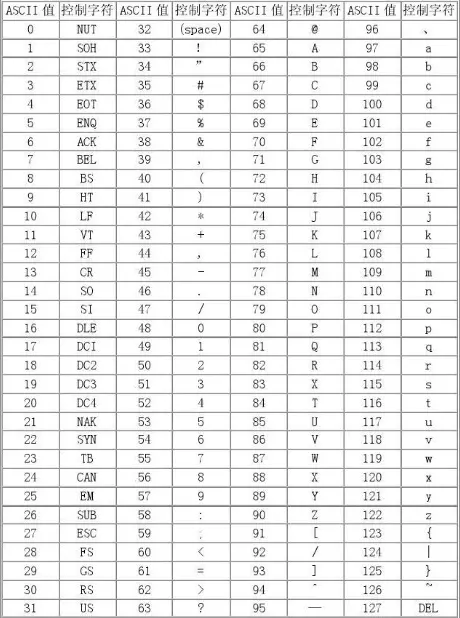

:::note
本系列将以一个学习者的眼光，从零基础一步一步学会最基础的C语言编程，本文将讲解C语言第一个板块：编程基础与顺序结构。
:::

### 基本结构

首先我们要了解C语言的基本结构，如下框

```c
#include <stdio.h> //首先这个地方是头文件，引用打包好的库

int main(){ //其次这里是主函数，程序执行优先从主函数运行
    printf("Hello World!");//这里是printf，可以打印带有format的内容
    return 0;//最后这里就是一个函数的返回值
}
```

我们大部分的C语言程序，均需要按照上述的格式进行编写。
好了，我们看完了基本结构，那我们简单的介绍一下头文件部分。

### 常用头文件

|  头文件  |                      用处                      |
| :------: | :--------------------------------------------: |
| stdio.h |            处理最基础的输入输出功能            |
|  math.h  |         数学库，可以调用基础的数学计算         |
| string.h | 字符串操作函数，可以对字符串进行一系列的操作哦 |
| ctype.h |           这个就是对字符进行操作的库           |

这些就是比较常用的头文件了，具体的用法会在我们后续的文章中给大家介绍,我们给大家介绍一下变量。

### 变量

变量这一块也是非常好理解，就是给一个内容起一个别称，这个内容呢，有很种类型，比如char、int、float、double类型。
那么我们分别了解一下char、int、float、double吧

|  类型  |     名称     |                                 描述                                 |
| :----: | :----------: | :-------------------------------------------------------------------: |
|  int  |     常数     |             可以记录如同 `1`、`-5`、`2026`这种数值             |
| float | 单精度浮点数 | 可以记录 `3.14`、`-3.14`这种小数，但是只能记录6~7位十进制有效数字 |
| double | 双精度浮点数 |             能保证15~16位十进制有效数字，精度远高于float             |
|  char  |     字符     |              仅可以记录单个字符，如 `a`、`1`、`A`              |

> **注**：C 语言C99 标准才正式引入原生布尔类型，C99之前无专门的布尔类型，需通过整数模拟；C99及之后通过<stdbool.h>头文件实现标准布尔变量，这是目前开发的首选方式。

### stdio.h头文件

接触C语言，首先就要接触一下stdio.h头文件，这是最最最基础的处理输入与输出的头文件。

#### 1. printf()

```c
printf(const char *format, ...)
```

**常用格式参量表**

| 格式字符 |         意义         |
| :------: | :------------------: |
|   f/lf   |  输出单、双精度实数  |
|    d    | 输出带符号十进制整数 |
|    c    |     输出单个字符     |
|    s    |      输出字符串      |
|    p    |     输出指针地址     |

| flags（标识） |                      描述                      |
| :-----------: | :--------------------------------------------: |
|       -       |            在给定的字段宽度内左对齐            |
|       +       |          强制在结果之前显示加号或减号          |
|     空格     | 如果没有写入任何符号，则在该值前面插入一个空格 |

| width（宽度） |          描述          |
| :-----------: | :--------------------: |
|   (number)   | 要输出的字符的最小数目 |

| .precision（精度） |                  描述                  |
| :----------------: | :------------------------------------: |
|      .number      | f/lf说明符，要在小数点后输出的小数位数 |

**示例：**

```c
#include <stdio.h>
int main() {
    int a = 10;
    char str = 'a';
    printf("%d %c", a, str);
    return 0;
}
```

> **输出：**
>
> ```
> 10 a
> ```

#### 2.scanf()

```c
scanf(const char *format, ...)
```

> **注**：格式参量表同前文

**示例：**

```c
#include <stdio.h>
int main() {
    int a;
    char str;
    scanf("%d %c", &a, &str);
    return 0;
}
```

#### 3.fgets()

```c
fgets(char *str, int n, FILE *stream)
```

|  参数  |            作用            |
| :----: | :------------------------: |
|  str  | 这是指向一个字符数组的指针 |
|   n   |   这是要读取的最大字符数   |
| stream |  这是指向 FILE 对象的指针  |

#### 4.puts()

```c
puts(const char *str)
```

| 参数 |          作用          |
| :--: | :---------------------: |
| str | 这是要被写入的 C 字符串 |

### 运算符

```c
int a=10;
int b=20;
```

| 运算符 |                                       描述                                       |              实例              |
| :----: | :------------------------------------------------------------------------------: | :-----------------------------: |
|   +   |                                 把两个操作数相加                                 |         A + B 将得到 30         |
|   -   |                         从第一个操作数中减去第二个操作数                         |        A - B 将得到 -10        |
|   *   |                                 把两个操作数相乘                                 |        A * B 将得到 200        |
|   /   |                                   分子除以分母                                   |         B / A 将得到 2         |
|   %   |                             取模运算符，整除后的余数                             |         B % A 将得到 0         |
|   ++   |                             自增运算符，整数值增加 1                             |          A++ 将得到 11          |
|   --   |                             自减运算符，整数值减少 1                             |          A-- 将得到 9          |
|   ==   |                  检查两个操作数的值是否相等，如果相等则条件为真                  |          (A == B) 为假          |
|   !=   |                 检查两个操作数的值是否相等，如果不相等则条件为真                 |          (A != B) 为真          |
|   >   |              检查左操作数的值是否大于右操作数的值，如果是则条件为真              |          (A > B) 为假          |
|   <   |              检查左操作数的值是否小于右操作数的值，如果是则条件为真              |          (A < B) 为真          |
|   >=   |           检查左操作数的值是否大于或等于右操作数的值，如果是则条件为真           |          (A >= B) 为假          |
|   <=   |           检查左操作数的值是否小于或等于右操作数的值，如果是则条件为真           |          (A <= B) 为真          |
|   &&   |               称为逻辑与运算符。如果两个操作数都非零，则条件为真。               |          (A && B) 为假          |
|  \|\|  |           称为逻辑或运算符。如果两个操作数中有任意一个非零，则条件为真           |         (A\|\| B) 为真         |
|   !   | 称为逻辑非运算符。用来逆转操作数的逻辑状态。如果条件为真则逻辑非运算符将使其为假 |         !(A && B) 为真         |
|   =   |                 简单的赋值运算符，把右边操作数的值赋给左边操作数                 | C = A + B 将把 A + B 的值赋给 C |
|   +=   |         加且赋值运算符，把右边操作数加上左边操作数的结果赋值给左边操作数         |     C += A 相当于 C = C + A     |
|   -=   |         减且赋值运算符，把左边操作数减去右边操作数的结果赋值给左边操作数         |     C -= A 相当于 C = C - A     |
|   *=   |         乘且赋值运算符，把右边操作数乘以左边操作数的结果赋值给左边操作数         |     C *= A 相当于 C = C * A     |
|   /=   |         除且赋值运算符，把左边操作数除以右边操作数的结果赋值给左边操作数         |     C /= A 相当于 C = C / A     |
|   %=   |                求模且赋值运算符，求两个操作数的模赋值给左边操作数                |     C %= A 相当于 C = C % A     |

### ASCII



> **规律**：
>
> 将小写字母转换为大写字母，减去 32
>
> 将大写字母转换为小写字母，加上 32。

### 应用

> **7-1 sdut-C语言实验——Hello World!**
>
> 请输出Hello World!
>
> **输入格式**：无。
>
> **输出格式**：Hello World!
>
> **输入示例**：
>
> ```
>
> ```
>
> **输出示例**：
>
> ```
> Hello World!
> ```

<details>
<summary>7-1 解答：</summary>

```c
#include <stdio.h>

int main(){
    printf("Hello World!");
    return 0;
}
```

</details>

> **7-2 sdut-C语言实验-输出字符串**
>
> 在屏幕上输出一行信息： C is so fun.
>
> **输入格式**：
>
> ```
>
> ```
>
> **输出格式**：输出字符串 C is so fun.
>
> **输入示例**：
>
> ```
>
> ```
>
> **输出示例**：
>
> ```
> C is so fun.
> ```

<details>
<summary>7-2 解答：</summary>

```c
#include <stdio.h>

int main(){
    printf("C is so fun.");
    return 0;
}
```

</details>

> **7-3 输出倒三角图案**
>
> 本题要求编写程序，输出指定的由“*”组成的倒三角图案。
>
> **输入格式**：本题目没有输入。
>
> **输出格式**：
>
> ```
> * * * *
>  * * *
>   * *
>    *
> ```
>
> **输入示例**：
>
> ```
>
> ```
>
> **输出示例**：
>
> ```
> * * * *
>  * * *
>   * *
>    *
> ```

<details>
<summary>7-3 解答：</summary>

```c
#include <stdio.h>

int main(){
    printf("* * * *\n * * *\n  * *\n   *");//这里的\n为换行符
    return 0;
}
```

</details>

> **7-4 sdut-C语言 -交换两个整数的值**
>
> 交换两个变量的值，由终端输入两个整数给变量x、y，然后交换x和y的值后，输出x和y。
>
> **输入格式**：从键盘输入两个整数变量x和y；
>
> **输出格式**：在交换x、y的值后将x和y输出！
>
> **输入示例**：
>
> ```
> 4 6
> ```
>
> **输出示例**：
>
> ```
> 6 4
> ```

<details>
<summary>7-4 解答：</summary>

```c
#include <stdio.h>

int main(){
    int x,y,temp;
    scanf("%d %d",&x,&y);
    temp = x;
    x = y;
    y = temp;
    printf("%d %d",x,y);
    return 0;
}
```

</details>

> **7-5 sdut-C语言-计算A+B（顺序结构）**
>
> 从键盘上输入两个整数，然后计算他们的和，并把他们的和打印出来。
>
> **输入格式**：从键盘上输入两个整数，这两个整数在同一行上！
>
> **输出格式**：在这两个整数的下面一行是输出这两个整数的和！
>
> **输入示例**：
>
> ```
> 2 3
> ```
>
> **输出示例**：
>
> ```
> 5
> ```

<details>
<summary>7-5 解答：</summary>

```c
#include <stdio.h>

int main(){
    int x,y,sum;
    scanf("%d %d",&x,&y);
    sum = x+y;
    printf("%d",sum);
    return 0;
}
```

</details>

> **7-6 sdut-C语言实验-求两个整数的和**
>
> 求两个整数之和，不从键盘输入数据，直接使用赋值语句（a=123；b=456）输入数据，然后计算两个整数之和输出。
>
> **输入格式**：本题目没有输入。
>
> **输出格式**：输出a和b之和。
>
> **输入示例**：
>
> ```
>
> ```
>
> **输出示例**：
>
> ```
> sum is 579
> ```

<details>
<summary>7-6 解答：</summary>

```c
#include <stdio.h>

int main(){
    int a = 123;
    int b = 456;
    int sum;
    sum = a+b;
    printf("sum is %d",sum);
    return 0;
}
```

</details>

> **7-7 sdut-C语言实验-虎子分糖果**
>
> 我们中国各个地区都有拜年的美好习俗，小朋友最喜欢走亲访友了，因为亲戚们会给准备很多糖果吃。虎子家也不例外，妈妈买了很多俄罗斯糖果准备给前来拜年的小朋友分。为了公平，给每个小朋友的糖果数一定得是一样的。
>
> 假设虎子妈妈准备了m块俄罗斯糖果，来了n位小朋友，请问每个小朋友可以分到多少块糖？还剩多少块？
>
> **输入格式**：输入n和m，其中n>0,m>0。
>
> **输出格式**：输出每个小朋友分到的糖果数和剩余的糖果数。
>
> **输入示例**：
>
> ```
> 3 31
> ```
>
> **输出示例**：
>
> ```
> 10 1
> ```

<details>
<summary>7-7 解答：</summary>

```c
#include <stdio.h>

int main(){
    int n,m,x,y;
    scanf("%d %d",&n,&m);
    x = m/n;
    y = m%n;
    printf("%d %d",x,y);
    return 0;
}
```

</details>

> **7-8 sdut-C语言-三个整数和、积与平均值**
>
> 给出三个整数，请你设计一个程序，求出这三个数的和、乘积和平均数。
>
> **输入格式**：输入只有三个正整数a、b、c。
>
> **输出格式**：输出一行，包括三个的和、乘积、平均数。 数据之间用一个空格隔开，其中平均数保留小数后面两位。
>
> **输入示例**：
>
> ```
> 2 3 3
> ```
>
> **输出示例**：
>
> ```
> 8 18 2.67
> ```

<details>
<summary>7-8 解答：</summary>

```c
#include <stdio.h>

int main(){
    int a,b,c,d,e;
    float f;
    scanf("%d %d %d",&a,&b,&c);
    d = a+b+c;
    e = a*b*c;
    f = d/3.00f;
    printf("%d %d %.2f",d,e,f);
    return 0;
}
```

</details>

> **7-9 sdut-C语言-圆柱体计算**
>
> 已知圆柱体的底面半径r和高h，计算圆柱体底面周长和面积、圆柱体侧面积以及圆柱体体积。其中圆周率定义为3.1415926。
>
> **输入格式**：输入数据有一行，包括2个正实数r和h，以空格分隔。
>
> **输出格式**：输出数据一行，包括圆柱体底面周长和面积、圆柱体侧面积以及圆柱体体积，以空格分开，所有数据均保留2位小数。
>
> **输入示例**：
>
> ```
> 1 2
> ```
>
> **输出示例**：
>
> ```
> 6.28 3.14 12.57 6.28
> ```

<details>
<summary>7-9 解答：</summary>

```c
#include <stdio.h>

int main(){
    float Pi = 3.1415926;
    float r,h,dC,dS,cS,V;
    scanf("%f %f",&r,&h);
    dC = 2*Pi*r;
    dS = Pi*r*r;
    cS = dC*h;
    V = dS*h;
    printf("%.2f %.2f %.2f %.2f",dC,dS,cS,V);
    return 0;
}
```

</details>

> **7-10 sdut-C语言实验——温度转换**
>
> 输入一个华氏温度，输出摄氏温度，其转换公式为：$C=5(F-32)/9$。
>
> **输入格式**：输入数据只有一个实数，即华氏温度。
>
> **输出格式**：输出数据只有一个，即摄氏温度，保留2位小数。
>
> **输入示例**：
>
> ```
> 32.0
> ```
>
> **输出示例**：
>
> ```
> 0.00
> ```

<details>
<summary>7-10 解答：</summary>

```c
#include <stdio.h>

int main(){
    float F,C;
    scanf("%f",&F);
    C = 5*(F-32)/9;
    printf("%.2f",C);
    return 0;
}
```

</details>

> **7-11 计算摄氏温度**
>
> 给定一个华氏温度F，本题要求编写程序，计算对应的摄氏温度C。计算公式：$C=5×(F−32)/9$。题目保证输入与输出均在整型范围内。
>
> **输入格式**：输入在一行中给出一个华氏温度。
>
> **输出格式**：在一行中按照格式“Celsius = C”输出对应的摄氏温度C的整数值。
>
> **输入示例**：
>
> ```
> 150
> ```
>
> **输出示例**：
>
> ```
> Celsius = 65
> ```

<details>
<summary>7-11 解答：</summary>

```c
#include <stdio.h>

int main(){
    int F,C;
    scanf("%d",&F);
    C = 5*(F-32)/9;
    printf("Celsius = %d",C);
    return 0;
}
```

</details>

> **7-12 sdut-C语言——逆置正整数**
>
> 输入一个三位正整数，将它反向输出。注意130逆置后是31。
>
> **输入格式**：3位正整数。
>
> **输出格式**：逆置后的正整数。
>
> **输入示例**：
>
> ```
> 123
> ```
>
> **输出示例**：
>
> ```
> 321
> ```

<details>
<summary>7-12 解答：</summary>

```c
#include <stdio.h>

int main(){
    int a,b,c,d,e;
    scanf("%d",&a);
    b = a/100;
    c = (a-b*100)/10;
    d = (a-b*100-c*10)/1;
    e = d*100+c*10+b;
    printf("%d",e);
    return 0;
}
```

</details>

> **7-13 整数四则运算**
>
> 本题要求编写程序，计算2个正整数的和、差、积、商并输出。题目保证输入和输出全部在整型范围内。
>
> **输入格式**：输入在一行中给出2个正整数A和B。
>
> **输出格式**：在4行中按照格式“A 运算符 B = 结果”顺序输出和、差、积、商。
>
> **输入示例**：
>
> ```
> 3 2
> ```
>
> **输出示例**：
>
> ```
> 3 + 2 = 5
> 3 - 2 = 1
> 3 * 2 = 6
> 3 / 2 = 1
> ```

<details>
<summary>7-13 解答：</summary>

```c
#include <stdio.h>

int main(){
    int A,B,C,D,E,F;
    scanf("%d %d",&A,&B);
    C = A+B;
    D = A-B;
    E = A*B;
    F = A/B;
    printf("%d + %d = %d\n",A,B,C);
    printf("%d - %d = %d\n",A,B,D);
    printf("%d * %d = %d\n",A,B,E);
    printf("%d / %d = %d\n",A,B,F);
    return 0;
}
```

</details>

> **7-14 计算物体自由下落的距离**
>
> 一个物体从100米的高空自由落下。编写程序，求它在前3秒内下落的垂直距离。设重力加速度为10米/秒$^2$。
>
> **输入格式**：本题目没有输入。
>
> **输出格式**：结果保留2位小数。
>
> **输入示例**：
>
> ```
>
> ```
>
> **输出示例**：
>
> ```
> height = 垂直距离值
> ```

<details>
<summary>7-14 解答：</summary>

```c
#include <stdio.h>

int main(){
    float height;
    height = 0.5*10*3*3;
    printf("height = %.2f",height);
    return 0;
}
```

</details>

> **7-15 sdut-C语言实验-转换字母（顺序结构）**
>
> 从键盘上输入一个小写字母，然后将小写字母装换成大写字母输出！
>
> **输入格式**：从键盘上输入一个小写字母。
>
> **输出格式**：小写字母装换成大写字母输出。
>
> **输入示例**：
>
> ```
> a
> ```
>
> **输出示例**：
>
> ```
> A
> ```

<details>
<summary>7-15 解答：</summary>

```c
#include <stdio.h>

int main() {
    char a;
    char b;
    scanf("%c",&a);
    b = a - 32;//这里使用ASCII码的int值减32实现小写转大写
    printf("%c",b);
    return 0;
}
```

</details>

### 总结

OK了，今天你学会了C语言程序的基本结构，基础头文件、stdio.h头文件的基础函数、运算符、ASCII码！一起加油吧！
