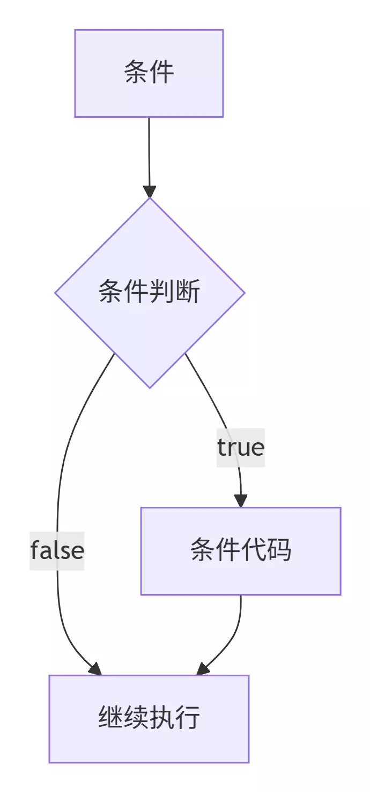
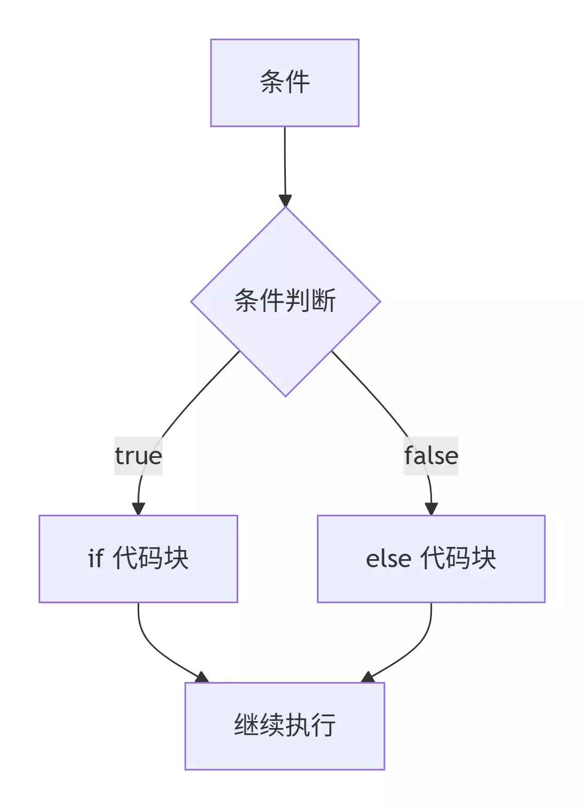
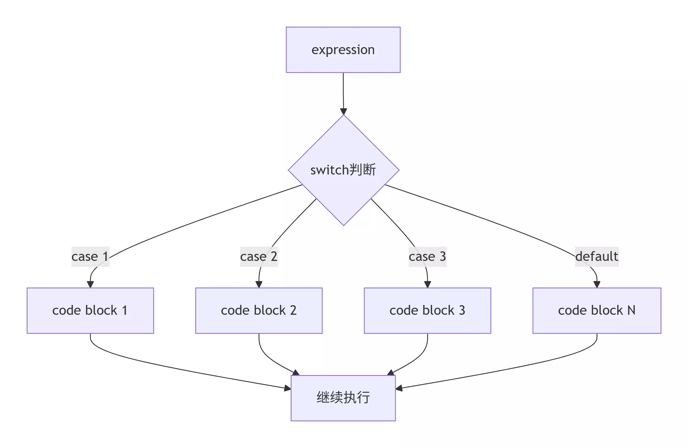
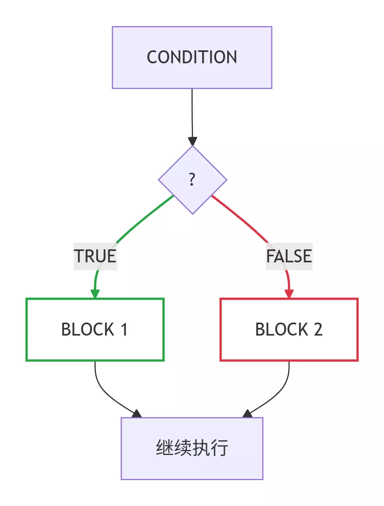

:::note
本系列将以一个学习者的眼光，从零基础一步一步学会最基础的C语言编程，本文将讲解C语言第二个板块：选择结构。
:::

我们本次将从if、if...else、嵌套if、switch...case、嵌套switch、三元运算符这几个方面展开学习。

### if语句

#### 1.基本结构



```c
if(/* 判断条件 */){
    /* 若符合条件则执行语句 */
}
```

**示例**

```c
#include <stdio.h>

int main(){
    int a=10,b=0;
    if(a==10){
        printf("a=%d",a);
    }
    if(b==10){
        printf("b=%d",b);
    }
    return 0;
}
```

> **输出**：
>
> ```
> a=10
> ```

#### 2.if...else语句



```c
if(/* 判断条件 */){
    /* 若符合条件则执行语句 */
}else{
    /* 若不符合条件则执行语句 */
}
```

**示例**

```c
#include <stdio.h>

int main(){
    int a=10,b=0;
    if(a==0){
        printf("a=%d",a);
    }else{
        printf("b=%d",b);
    }
    return 0;
}
```

> **输出**：
>
> ```
> b=0
> ```

#### 3.嵌套 if 语句

```c
if(/* 判断条件 */){
    // 第一个判断条件满足时执行下方代码
    if(/* 判断条件 */){
        // 第二个判断条件满足时执行下方代码
    }
}
```

**示例**

```c
#include <stdio.h>

int main(){
    int a=10,b=0;
    if(a==10){
        if(b==0){
            printf("N\n");
        }
        printf("Y\n");
    }
    return 0;
}
```

> **输出**：
>
> ```
> Y
> N
> ```

### switch语句

#### 1.switch...case



```c
switch(表达式){
    case 常量表达式:
        /* 执行语句 */;
        /* 中断（可选） */
    case 常量表达式:
        /* 执行语句 */;
        /* 中断（可选） */
    default: //可选
        /* 执行语句 */;
}
```

**示例**

```c
#include <stdio.h>

int main(){
    int a=5;
    switch(a){
        case 1:
            printf("周一");
            break;
        case 2:
            printf("周二");
            break;
        case 3:
            printf("周三");
            break;
        case 4:
            printf("周四");
            break;
        case 5:
            printf("周五");
            break;
        case 6:
            printf("周六");
            break;
        case 7:
            printf("周日");
            break;
        default:
            printf("输入错误!");
    }
    return 0;
}
```

> **输出**：
>
> ```
> 周五
> ```

#### 2.嵌套switch语句

```c
switch(表达式1){
    case 常量表达式1:
        //当表达式1满足常量表达式1时，执行下方switch语句
        switch(表达式2){
            case 常量表达式a:
                /* 执行语句 */;
                /* 中断（可选） */
            case 常量表达式b:
                /* 执行语句 */;
                /* 中断（可选） */
            default: //可选
                /* 执行语句 */;
        }
    case 常量表达式2:
        /* 执行语句 */;
        /* 中断（可选） */
    default: //可选
        /* 执行语句 */;
}
```

**示例**

```c
#include <stdio.h>

int main(){
    int a=5,b=10;
    switch(a){
        case 1:
            printf("周一\n");
            break;
        case 2:
            printf("周二\n");
            break;
        case 3:
            printf("周三\n");
            break;
        case 4:
            printf("周四\n");
            break;
        case 5:
            printf("周五\n");
            switch(b){
                case 0:
                    printf("?");
                    break;
                case 10:
                    printf("!");
                    break;
                default:
                    printf("/")
            }
            break;
        case 6:
            printf("周六\n");
            break;
        case 7:
            printf("周日\n");
            break;
        default:
            printf("输入错误!\n");
    }
    return 0;
}
```

> **输出**：
>
> ```
> 周五
> !
> ```

### ? : 运算符(三元运算符)



```c
Exp1 ? Exp2 : Exp3;
```

若Exp1的值为真,则执行Exp2;若Exp1的值为假,则执行Exp3。

**示例**

```c
#include<stdio.h>
 
int main()
{
    int num1=2;
    int num2=3;
    (num1%2==0)?printf("偶数"):printf("奇数");
    printf("\n");
    (num2%2==0)?printf("偶数"):printf("奇数");
    return 0;
}
```

> **输出**：
>
> ```
> 偶数
> 奇数
> ```

### 应用

> **7-1 sdut-C语言实验——求两个整数之中较大者**
>
> 输入两个整数，请编程求其中的较大者。
>
> **输入格式**：在一行中输入用空格隔开的两个整数，例如5 9。
>
> **输出格式**：输出两个整数之中较大者，输出形式举例：max=9。
>
> **输入示例**：
>
> ```
> 5 9
> ```
>
> **输出示例**：
>
> ```
> max=9
> ```

<details>
<summary>7-1 解答：</summary>

```c
#include <stdio.h>

int main(){
    int a,b,max;
    scanf("%d %d",&a,&b);
    if(a>b){
        max = a;
    }
    else{
        max = b;
    }
    printf("max=%d",max);
    return 0;
}
```

</details>

> **7-2 sdut-C语言实验-求绝对值（选择结构）**
>
> 从键盘上输入任意一个整数，然后输出它的绝对值！
>
> **输入格式**：从键盘上输入任意一个整数。
>
> **输出格式**：输出它的绝对值。
>
> **输入示例**：
>
> ```
> -4
> ```
>
> **输出示例**：
>
> ```
> 4
> ```

<details>
<summary>7-2 解答：</summary>

```c
#include <stdio.h>

int main(){
    int a,b;
    scanf("%d",&a);
    if(a<0){
        b = a * -1;
    }
    else{
        b = a;
    }
    printf("%d",b);
    return 0;
}
```

</details>

> **7-3 sdut-C语言实验——整除**
>
> 判断一个数n能否同时被3和5整除。
>
> **输入格式**：输入一个正整数n。
>
> **输出格式**：如果能够同时被3和5整除，输出Yes，否则输出No。
>
> **输入示例**：
>
> ```
> 15
> ```
>
> **输出示例**：
>
> ```
> Yes
> ```

<details>
<summary>7-3 解答：</summary>

```c
#include <stdio.h>

int main(){
    int n;
    scanf("%d",&n);
    if(n%3==0){
        if(n%5==0){
            printf("Yes");
        }
        else{
            printf("No");
        }
    }
    else{
            printf("No");
    }
    return 0;
}
```

</details>

> **7-4 sdut-C语言实验- 相加和最大值**
>
> 输入三个整数a,b,c。并进行两两相加，最后比较相加和的最大值。
>
> **输入格式**：输入数据包含三个整数，用空格分开。
>
> **输出格式**：输出两两相加后的最大值。
>
> **输入示例**：
>
> ```
> 1 2 3
> ```
>
> **输出示例**：
>
> ```
> 5
> ```

<details>
<summary>7-4 解答：</summary>

```c
#include <stdio.h>

int main(){
    int a,b,c,d,e,f,g,h,max;
    scanf("%d %d %d",&a,&b,&c);
    d = a+b;
    e = a+c;
    f = b+c;
    if(d>e){
        g = d;
    }
    else{
        g = e;
    }
    if(g>f){
        h = g;
    }
    else{
        h = f;
    }
    printf("%d",h);
    return 0;
}
```

</details>

> **7-5 sdut-C语言实验——找中间数**
>
> 输入三个整数，找出其中的中间数。（这里的中间数指的是大小，不是位置。）
>
> **输入格式**：输入3个整数。
>
> **输出格式**：输出中间数。
>
> **输入示例**：
>
> ```
> 1 2 3
> ```
>
> **输出示例**：
>
> ```
> 2
> ```

<details>
<summary>7-5 解答：</summary>

```c
#include <stdio.h>

int main(){
    int a,b,c,mid;
    scanf("%d %d %d",&a,&b,&c);
    if ((a >= b && a <= c) || (a <= b && a >= c)) {
        mid = a;
    }
    else if ((b >= a && b <= c) || (b <= a && b >= c)) {
        mid = b;
    }
    else {
        mid = c;
    }
    printf("%d",mid);
    return 0;
}
```

</details>

> **7-6 sdut-C语言实验——三个数排序**
>
> 输入三个整数x,y,z，请把这三个数由小到大输出。
>
> **输入格式**：输入数据包含3个整数x,y,z，分别用逗号隔开。
>
> **输出格式**：输出由小到大排序后的结果，用空格隔开。
>
> **输入示例**：
>
> ```
> 2,1,3
> ```
>
> **输出示例**：
>
> ```
> 1 2 3
> ```

<details>
<summary>7-6 解答：</summary>

```c
#include <stdio.h>

int main() {
    int x,y,z,temp;
    scanf("%d,%d,%d", &x, &y, &z);
    if(x>y){
        temp = x;
        x = y;
        y = temp;
    }
    if(x>z){
        temp = x;
        x = z;
        z = temp;
    }
    if(y>z){
        temp = y;
        y = z;
        z = temp;
    }
    printf("%d %d %d\n", x, y, z);
    return 0;
}
```

</details>

> **7-7 sdut-C语言实验-三位数整数的各位数字**
>
> 本题要求编写程序，输入一个三位数的正整数，并输出它的个位数字、十位数字和百位数字的值。
>
> **输入格式**：请输入三位正整数，例如152。
>
> **输出格式**：按照以下格式输出：
>
> 152 = 个位数字 + 十位数字10 + 百位数字100
>
> 如不是三位数，输出“Please input a three digits number.”。
>
> **输入示例**：
>
> ```
> 125
> ```
>
> **输出示例**：
>
> ```
> 125 = 5 + 2*10 + 1*100
> ```

<details>
<summary>7-7 解答：</summary>

```c
#include <stdio.h>

int main(){
    int a,b,c,d;
    scanf("%d",&a);
    if(a>=100 && a<1000){
        b = a/100;
        c = (a-b*100)/10;
        d = (a-b*100-c*10)/1;
        printf("%d = %d + %d*10 + %d*100",a,d,c,b);
    }
    else{
        printf("Please input a three digits number.");
    }
    return 0;
}
```

</details>

> **7-8 sdut-C语言实验-求三个整数的最大值**
>
> 请编写程序，输入三个整数，求出其中的最大值输出。
>
> **输入格式**：在一行上输入三个整数，整数间用逗号分隔。
>
> **输出格式**：输出三个数中的最大值。
>
> **输入示例**：
>
> ```
> 5,7,9
> ```
>
> **输出示例**：
>
> ```
> max=9
> ```

<details>
<summary>7-8 解答：</summary>

```c
#include <stdio.h>

int main(){
    int a,b,c,g,h;
    scanf("%d,%d,%d",&a,&b,&c);
    if(a>b){
        g = a;
    }
    else{
        g = b;
    }
    if(g>c){
        h = g;
    }
    else{
        h = c;
    }
    printf("max=%d",h);
    return 0;
}
```

</details>

> **7-9 sdut-C语言实验-时间间隔**
>
> 从键盘输入两个时间点（24小时制），输出两个时间点之间的时间间隔，时间间隔用“小时\:分钟\:秒”表示。
>
> 如：3点5分25秒应表示为--03\:05\:25。假设两个时间在同一天内，时间先后顺序与输入无关。
>
> **输入格式**：输入包括两行。
>
> 第一行为时间点1。
>
> 第二行为时间点2。
>
> **输出格式**：以“小时\:分钟\:秒”的格式输出时间间隔。
>
> 格式参看输入输出。
>
> **输入示例**：
>
> ```
> 12:01:12
> 13:09:43
> ```
>
> **输出示例**：
>
> ```
> 01:08:31
> ```

<details>
<summary>7-9 解答：</summary>

```c
#include <stdio.h>

int main(){
    int a,b,c,d,e,f,g,h,delta,i,j,k;
    scanf("%d:%d:%d %d:%d:%d",&a,&b,&c,&d,&e,&f);
    g = a*60*60+b*60+c;
    h = d*60*60+e*60+f;
    if(h>g){
        delta = h - g;
        i = delta /3600;
        j = (delta - 3600*i)/60;
        k = (delta - 3600*i - 60*j)/1;
        printf("%02d:%02d:%02d",i,j,k);
    }
    else{
        delta = g - h;
        i = delta /3600;
        j = (delta - 3600*i)/60;
        k = (delta - 3600*i - 60*j)/1;
        printf("%02d:%02d:%02d",i,j,k);
    }
    return 0;
}
```

</details>

> **7-10 然后是几点**
>
> 有时候人们用四位数字表示一个时间，比如 1106 表示 11 点零 6 分。现在，你的程序要根据起始时间和流逝的时间计算出终止时间。
>
> 读入两个数字，第一个数字以这样的四位数字表示当前时间，第二个数字表示分钟数，计算当前时间经过那么多分钟后是几点，结果也表示为四位数字。当小时为个位数时，没有前导的零，例如 5 点 30 分表示为 530；0 点 30 分表示为 030。注意，第二个数字表示的分钟数可能超过 60，也可能是负数。
>
> **输入格式**：输入在一行中给出 2 个整数，分别是四位数字表示的起始时间、以及流逝的分钟数，其间以空格分隔。注意：在起始时间中，当小时为个位数时，没有前导的零，即 5 点 30 分表示为 530；0 点 30 分表示为 030。流逝的分钟数可能超过 60，也可能是负数。
>
> **输出格式**：输出不多于四位数字表示的终止时间，当小时为个位数时，没有前导的零。题目保证起始时间和终止时间在同一天内。
>
> **输入示例**：
>
> ```
> 1120 110
> ```
>
> **输出示例**：
>
> ```
> 1310
> ```

<details>
<summary>7-10 解答：</summary>

```c
#include<stdio.h>

int main(){
    int st, per, h, m;
    scanf("%d%d", &st, &per);
    m = st % 100;
    h = st / 100;
    m += per;
    if (m < 0) {
        m += 60;
        h--;
    }
    h += m / 60;
    m %= 60;
    printf("%d%02d\n", h, m);
    return 0;
}
```

</details>

> **7-11 计算分段函数[1]**
>
> 本题目要求计算下列分段函数f(x)的值：$y=f(x)=\begin{cases}\dfrac{1}{x},&x\neq0\\0,&x=0\end{cases}$
>
> **输入格式**：输入在一行中给出实数x。
>
> **输出格式**：在一行中按“f(x) = result”的格式输出，其中x与result都保留一位小数。
>
> **输入示例**：
>
> ```
> 10
> ```
>
> **输出示例**：
>
> ```
> f(10.0) = 0.1
> ```

<details>
<summary>7-11 解答：</summary>

```c
#include <stdio.h>

int main(){
    float x,result;
    scanf("%f",&x);
    if(x==0){
        result = 0;
    }
    else{
        result=1/x;
    }
    printf("f(%.1f) = %.1f",x,result);
    return 0;
}
```

</details>

> **7-12 计算分段函数[2]**
>
> 本题目要求计算下列分段函数f(x)的值：$f(x)=\begin{cases}x^{0.5},&x\ge0\\(x+1)^2+2x+\frac1x,&x<0\end{cases}$
>
> 注：可在头文件中包含math.h，并调用sqrt函数求平方根，调用pow函数求幂。
>
> **输入格式**：输入在一行中给出实数x。
>
> **输出格式**：在一行中按“f(x) = result”的格式输出，其中x与result都保留两位小数。
>
> **输入示例1**：
>
> ```
> 10
> ```
>
> **输出示例1**：
>
> ```
> f(10.00) = 3.16
> ```
>
> **输入示例2**：
>
> ```
> -0.5
> ```
>
> **输出示例2**：
>
> ```
> f(-0.50) = -2.75
> ```

<details>
<summary>7-12 解答：</summary>

```c
#include <stdio.h>
#include <math.h>

int main(){
    float x,result;
    scanf("%f",&x);
    if(x>=0){
        result = sqrt(x);
    }
    else{
        result = pow((x+1),2)+2*x+(1/x);
    }
    printf("f(%.2f) = %.2f",x,result);
    return 0;
}
```

</details>

> **7-13 sdut-C语言实验-虎子算电费**
>
> 为了提倡居民节约用电，某省电力公司执行“阶梯电价”，安装一户一表的居民用户电价分为两个“阶梯”：月用电量50千瓦时（含50千瓦时）以内的，电价为0.53元/千瓦时；超过50千瓦时的，超出部分的用电量，电价上调0.05元/千瓦时。
>
> 虎子决定编写程序计算一算家里电费。你也会编写这个程序吧？
>
> **输入格式**：输入在一行中给出虎子家的月用电量（单位：千瓦时）。
>
> **输出格式**：在一行中输出虎子家应支付的电费（元），结果保留两位小数，格式如：“cost = 应付电费值”；若用电量小于0，则输出"Invalid Value!"。
>
> **输入示例1**：
>
> ```
> 10
> ```
>
> **输出示例1**：
>
> ```
> cost = 5.30
> ```
>
> **输入示例2**：
>
> ```
> 100
> ```
>
> **输出示例2**：
>
> ```
> cost = 55.50
> ```

<details>
<summary>7-13 解答：</summary>

```c
#include <stdio.h>

int main(){
    float x,cost;
    scanf("%f",&x);
    if(x<0){
        printf("Invalid Value!");
        return 0;
    }
    if(x<=50){
        cost = x*0.53;
    }
    else{
        cost = 50*0.53+(x-50)*0.58;
    }
    printf("cost = %.2f",cost);
    return 0;
}
```

</details>

> **7-14 sdut-C语言实验-时间格式转换**
>
> 24 小时制的时间格式为 "HH\:mm"，如 “05\:20”，而 12 小时制的时间格式为 "h\:mm AM/PM"，如 "5\:20 AM"。
>
> 24 小时制到 12 小时制的对应关系如下：
>
> 0 时：12 时 (AM)
>
> 1-11 时：1-11 时 (AM)
>
> 12 时：12 时 (PM)
>
> 13-23 时：1-11 时 (PM)
>
> 例如："00\:00" 对应 "12\:00 AM"，"01\:20" 对应 "1\:20 AM"，"12\:35" 对应 "12\:35 PM"，"13\:17" 对应 "1\:17 PM"，"23\:59" 对应 "11\:59 PM"。
>
> 现在给你一个 24 小时制的时间，请你编写程序将其转换为 12 小时制的时间。
>
> **输入格式**：输入只有一行，包含一个 24 小时制的时间。
>
> **输出格式**：输出一行，表示转换为 12 小时制以后的时间。其中分钟部分若不足两位需要加 0 补足两位。
>
> **输入示例**：
>
> ```
> 00:05
> ```
>
> **输出示例**：
>
> ```
> 12:05 AM
> ```

<details>
<summary>7-14 解答：</summary>

```c
#include <stdio.h>

int main(){
    int a,b,c;
    scanf("%d:%d",&a,&b);
    if(a==00||a==24){
        printf("12:%02d AM",b);
        return 0;
    }else if(a<12){
        printf("%d:%02d AM",a,b);
        return 0;
    }else if(a==12){
        printf("%d:%02d PM",a,b);
    }else{
        c=a-12;
        printf("%d:%02d PM",c,b);
        return 0;
    }
    return 0;
}
```

</details>

> **7-15 sdut-C语言实验——模拟计算器**
>
> 简单计算器模拟：输入两个整数和一个运算符，输出运算结果。
>
> 假设虎子妈妈准备了m块俄罗斯糖果，来了n位小朋友，请问每个小朋友可以分到多少块糖？还剩多少块？
>
> **输入格式**：第一行输入两个整数，用空格分开；
>
> 第二行输入一个运算符（+、-、*、/、%）。
>
> 所有运算均为整数运算。
>
> 对除数进行特判，如果为0，提示“整除和取余运算除数不能为0”。
>
> **输出格式**：输出对两个数运算后的结果。
>
> **输入示例**：
>
> ```
> 30 50
> *
> ```
>
> **输出示例**：
>
> ```
> 1500
> ```

<details>
<summary>7-15 解答：</summary>

```c
#include <stdio.h>

int main(){
    int a,b,result;
    char c;
    scanf("%d %d",&a,&b);
    scanf(" %c",&c);
    if(c=='+'){
        result = a + b;
    }else if(c=='-'){
        result = a - b;
    }else if(c=='*'){
        result = a * b;
    }else if(c=='/'){
        result = a / b;
    }
    printf("%d",result);
    return 0;
}
```

</details>

> **7-16 sdut-C语言实验——输入数字星期，输出英文(switch语句)**
>
> 从键盘上输入数字星期，然后输出它的英文。
>
> 其对应关系是：
>
> ```
> 1 Monday
> 2 Tuesday
> 3 Wednesday
> 4 Thursday
> 5 Friday
> 6 Saturday
> 7 Sunday
> ```
>
> 如果输入1-7之外的数字，则输出：error
>
> **输入格式**：从键盘输入数字星期，输入数字在1-7之间。
>
> **输出格式**：输出该数字对应的英文星期表示。
>
> **输入示例**：
>
> ```
> 3
> ```
>
> **输出示例**：
>
> ```
> Wednesday
> ```

<details>
<summary>7-16 解答：</summary>

```c
#include <stdio.h>

int main(){
    int a;
    scanf("%d",&a);
    switch(a){
        case 1:
            printf("Monday\n");
            break;
        case 2:
            printf("Tuesday\n");
            break;
        case 3:
            printf("Wednesday\n");
            break;
        case 4:
            printf("Thursday\n");
            break;
        case 5:
            printf("Friday\n");
            break;
        case 6:
            printf("Saturday\n");
            break;
        case 7:
            printf("Sunday\n");
            break;
        default:
            printf("error\n");
            break;
    }
    return 0;
}
```

</details>

### 总结

OK了，今天你学会了C语言程序的选择结构，包括if、if...else、嵌套if判断，switch...case、嵌套switch判断以及三元运算符！一起加油吧！
