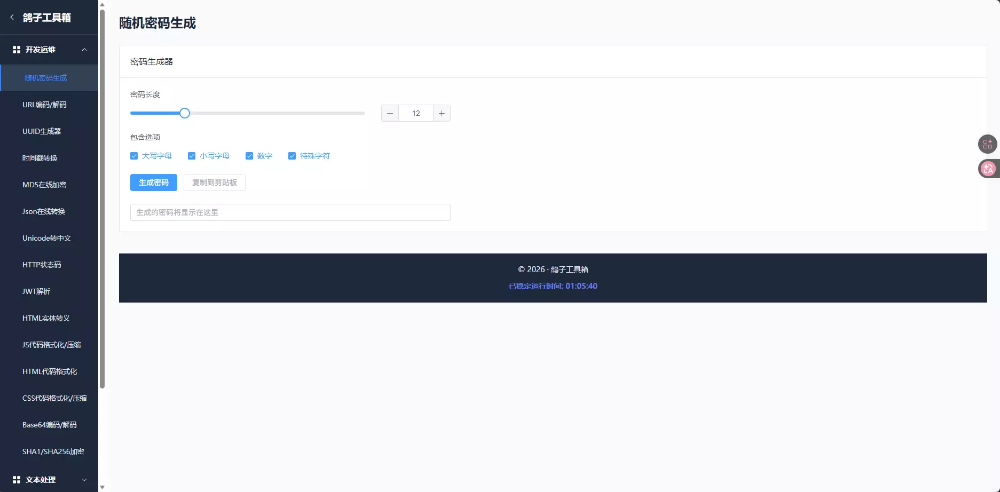
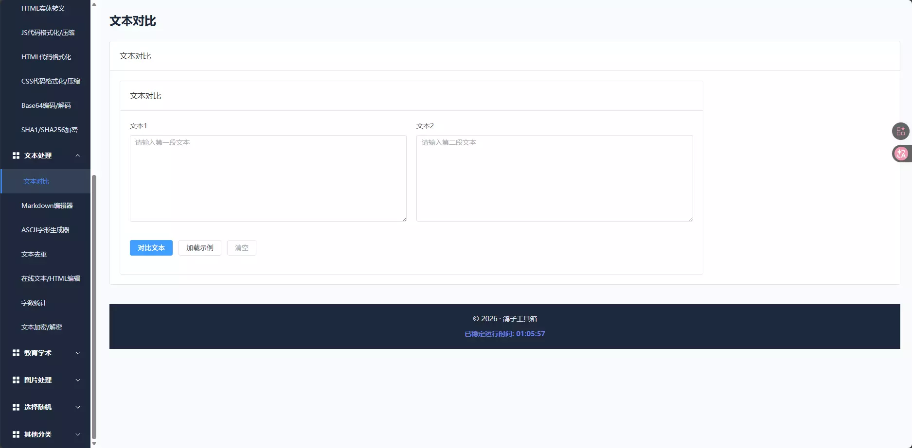
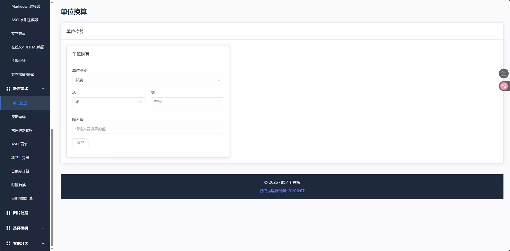
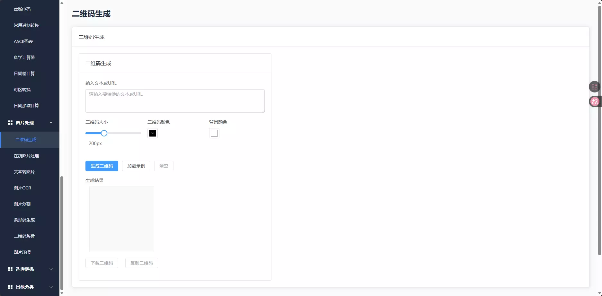
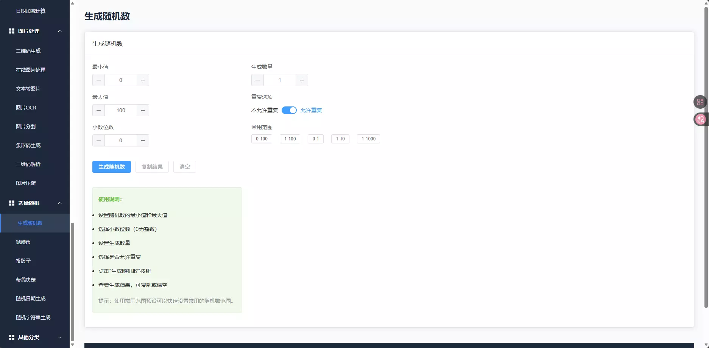
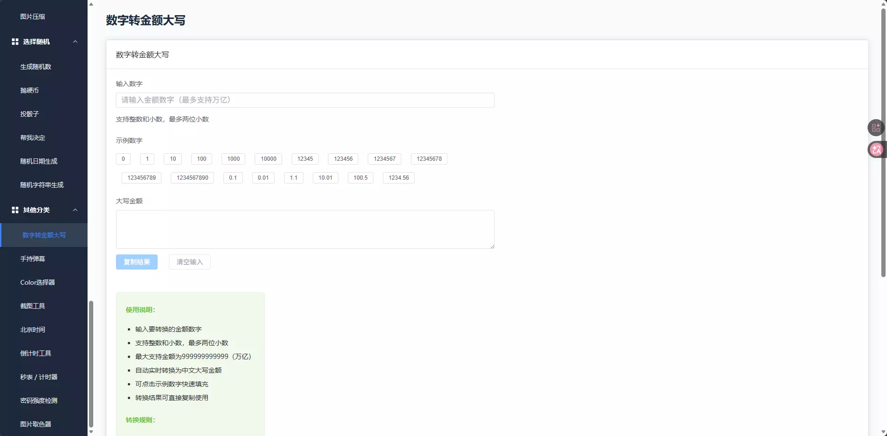

:::note
哇，又一个实用姊妹站上线啦 ——鸽子工具箱正式和大家见面！这里汇总了互联网上部分高频使用的在线工具，把零散的功能打包成一个完整合集，让日常操作更顺手～
:::

### 初衷

AI产品的迅速兴起，AI的确可以帮助我们做很多工作，甚至是在某些领域里某些AI已经可以媲美小部分人工的工作内容，但 “隐私安全” 始终是绕不开的顾虑：我们的个人数据会不会被用作训练素材？会不会在传输中泄露？

而纯前端式的老牌工具箱，恰好能补上这个缺口——它不需要后端服务器，所有数据都在你的浏览器本地处理，既轻便又能把隐私牢牢握在自己手里。这就是我们做鸽子工具箱的核心原因：用 “无后端、纯前端” 的模式，换一份实实在在的安全感。

### 简单介绍

我们基于 ``Vue3 + Element UI``搭建了整个工具站框架，拒绝冗余代码和复杂加载，打开页面就能用，低配设备也能流畅运行；功能实现上，我们精选成熟、稳定的 ``第三方JS``库，兼顾实用性和可靠性，避免 “花里胡哨却不好用” 的尴尬。

我们的工具箱将分为以下几个模块，``开发运维``、``文本处理``、``教育学术``、``图片处理``、``选择随机``、``其他分类``，里面包含各式各样的小功能、小工具。

**``开发运维``模块**：随机密码生成、URL编码/解码、UUID生成器、时间戳转换、MD5在线加密、Json在线转换、Unicode转中文、HTTP状态码、JWT解析、HTML实体转义、JS代码格式化/压缩、HTML代码格式化、CSS代码格式化/压缩、Base64编码/解码、SHA1/SHA256加密

**``文本处理``模块**：文本对比、Markdown编辑器、ASCII字形生成器、文本去重、在线文本/HTML编辑、字数统计、文本加密/解密

**``教育学术``模块**：单位换算、摩斯电码、常用进制转换、ASCII码表、科学计算器、日期差、计算时区转换、日期加减计算

**``图片处理``模块**：二维码生成、在线图片处理、文本转图片、图片OCR、图片分割、条形码生成、二维码解析、图片压缩

**``选择随机``模块**：生成随机数、抛硬币、投骰子、帮我决定、随机日期生成、随机字符串生成

**``其他分类``模块**：数字转金额大写、手持弹幕、Color选择器、截图工具、北京时间、倒计时工具、秒表/计时器、密码强度检测、图片取色器

### 后续展望

鸽子工具箱永远是「未完成态」—— 我们拒绝 “一上线就摆烂”，始终把 “用户需要” 放在第一位。

所以我们欢迎大家积极为我们的网站挖掘出来已发布小工具的各种BUG或者为我们贡献更多、更有意思、更好玩的小工具的建议，希望大家可以在此文章下方评论，我们会光速追进，更新、优化大家所需要的各种功能。

我们的工具站也会保证完全公开、免费，如果觉得它帮到了你，或者是大家想支持我们，可以去文末给我们的仓库点一个star，也可以通过本文下方的 ``支付宝``，``微信``按钮进行投喂，鼓励我们继续创作哦~

### 总结

网站的工具汇总是为了方便大家更好更快捷的使用这些细小的功能，使得网站间的来回跳转变少，无效操作减少，使得操作更为便捷，方便大家使用，如果大家感觉不错，可以点击下方按钮跳转到我们的鸽子工具箱哦~ 也欢迎分享给身边需要的朋友！

[立即跳转至鸽子工具箱(https://tool.pigeons2023.asia/)](https://tool.pigeons2023.asia/)

> 源码仓库：[鸽子工具箱仓库(https://github.com/pigeons2023/Tool)](https://github.com/pigeons2023/Tool)，如果这个工具箱对你有帮助，也欢迎你给个star支持一下！你的鼓励是我持续维护的最大动力～
