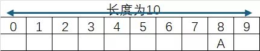

:::note
本系列将以一个学习者的眼光，从零基础一步一步学会最基础的C语言编程，本文将讲解C语言第五个板块：一维数组。
:::

我们本次将从一维数组的认识、使用、操作等这几个方面展开学习。

### 一维数组

C语言支持数组数据结构，它可以存储一个固定大小的相同类型元素的顺序集合。数组是用来存储一系列数据，但它往往被认为是一系列相同类型的变量。

我们当然可以把一维数组认为是一个只有一行的表格，今后要学习的二维数组或者是多维数组就是有两行或者多行的表格，如下图：



上图中，我们定义了一个新的一维数组，它的长度为10，他的位置编号从0-9，数组中的特定元素可以通过索引访问，第一个索引值为0。

如图中的数组，数组名为a,则A为数组```a[8]```，在数组中第9的位置内。

**示例**

#### 1.读取元素很简单，只需要```数组名[索引值]```就能把值读取出来。

```c
#include <stdio.h>

int main() {
    int arr[3] = {5, 10, 15};
    printf("第二个元素是: %d\n", arr[1]);
    return 0;
}
```

> **输出**：
>
> ```
> 第二个元素是: 10
> ```

#### 2.这是简单的输入数组内容，只需要```数组名[索引值]```写入```scanf```内，就能正确读取输入内容写入数组内，一般情况下，需要填充整个数组则需要使用```for```循环语句。

```c
#include <stdio.h>

int main() {
    int arr[3];

    printf("请输入一个数字: ");
    scanf("%d", &arr[0]);
    
    printf("您输入的是: %d\n", arr[0]);
    
    return 0;
}
```

> **输入**：
>
> ```
> 请输入一个数字: 25
> ```

> **输出**：
>
> ```
> 您输入的是: 25
> ```

#### 3.这是简单的修改数组内容，只需要```数组名[索引值]=新值```，就能够修改数组。

```c
#include <stdio.h>

int main() {
    int arr[3] = {1, 2, 3};
    
    printf("修改前: %d\n", arr[1]);

    arr[1] = 100;
    
    printf("修改后: %d\n", arr[1]);
    
    return 0;
}
```

> **输出**：
>
> ```
> 修改前: 2
> 修改后: 100
> ```

#### 4.这是遍历数组，使用```for```循环，循环变量作为数组的索引值，进行遍历。

```c
#include <stdio.h>

int main() {
    int arr[3] = {7, 8, 9};
    
    printf("数组元素: ");
    
    for(int i = 0; i < 3; i++) {
        printf("%d ", arr[i]);
    }
    
    return 0;
}
```

> **输出**：
>
> ```
> 数组元素: 7 8 9
> ```

### 应用

> **7-1 sdut- C语言实验—最值**
>
> 有一个长度为n的整数序列，其中最小值和最大值不会出现在序列的第一和最后一个位置。
>
> 请写一个程序，把序列中的最小值与第一个数交换，最大值与最后一个数交换。输出转换好的序列。
>
> **输入格式**：输入包括两行。
> 第一行为正整数n（1≤n≤10）。
> 
> 第二行为n个正整数组成的序列。
>
> **输出格式**：输出转换好的序列。数据之间用空格隔开。
>
> **输入示例**：
>
> ```
> 6
> 2 3 8 1 4 5
> ```
>
> **输出示例**：
>
> ```
> 1 3 5 2 4 8
> ```

<details>
<summary>7-1 解答：</summary>

```c
#include <stdio.h>

int main(){
    int n;
    int k=0,l=0;
    scanf(" %d",&n);
    int arr[n];
    for(int i=0;i<n;i++){
        scanf("%d",&arr[i]);
    }
    int min=arr[0],max=arr[0];
    for(int j=0;j<n;j++){
        if(max<=arr[j]){
            max = arr[j];
            k = j;
        }
        if(min>=arr[j]){
            min = arr[j];
            l = j;
        }
    }
    arr[l] = arr[0];
    arr[0] = min;
    arr[k] = arr[n-1];
    arr[n-1] = max;
    printf("%d",arr[0]);
    for(int m=1;m<n;m++){
        printf(" %d",arr[m]);
    }
    return 0;
}
```

</details>

> **7-2 sdut-C语言实验-整数位**
>
> 输入一个不多于5位的正整数，要求：
>
>（1）求出它是几位数；
>
>（2）分别输出每一位数字；
>
>（3）按逆序输出各位数字。
>
> **输入格式**：输入一个不多于5位的正整数。
>
> **输出格式**：输出数据有3行，第一行为正整数位数，第二行为各位数字，第三行为逆序的各位数字。
>
> **输入示例**：
>
> ```
> 123
> ```
>
> **输出示例**：
>
> ```
> 3
> 1 2 3
> 3 2 1
> ```

<details>
<summary>7-2 解答：</summary>

```c
#include <stdio.h>

int main(){
    int a,b;
    scanf("%d",&a);
    if(a/10000!=0){
        b = 5;
    }else if(a/1000!=0){
        b = 4;
    }else if(a/100!=0){
        b = 3;
    }else if(a/10!=0){
        b = 2;
    }else if(a/1!=0){
        b = 1;
    }
    printf("%d\n",b);

    int c[5];
    c[0] = a / 10000;
    c[1] = (a % 10000) / 1000;
    c[2] = (a % 1000) / 100;
    c[3] = (a % 100) / 10;
    c[4] = a % 10;
    int d = 5 -b;
    for(int i = d;i<5;i++){
        if(i == d){
            printf("%d",c[i]);
        }else{
            printf(" %d",c[i]);
        }
    }
    printf("\n");
    for(int i = 4;i>=d;i--){
        if(i == 4){
            printf("%d",c[i]);
        }else{
            printf(" %d",c[i]);
        }
    }
    return 0;
}
```

</details>

> **7-3 sdut-C语言实验-众数**
>
> 众数是指在一组数据中，出现次数最多的数。例如：1, 1, 3 中出现次数最多的数为 1，则众数为 1。
>
> 给定一组数，你能求出众数吗？
>
> **输入格式**：输入数据有多组（数据组数不超过 50），到 EOF 结束。
> 
> 对于每组数据：
> 
> 第 1 行输入一个整数 n (1 <= n <= 10000)，表示数的个数。
> 
> 第 2 行输入 n 个用空格隔开的整数 Ai (0 <= Ai <= 1000)，依次表示每一个数。
>
> **输出格式**：对于每组数据，在一行中输出一个整数，表示这组数据的众数。
> 
> 数据保证有唯一的众数。
>
> **输入示例1**：
>
> ```
> 3
> 1 1 3
> ```
>
> **输出示例1**：
>
> ```
> 1
> ```
> **输入示例2**：
>
> ```
> 5
> 0 2 3 1 2
> 7
> 12 10 12 34 9 12 8 
> ```
>
> **输出示例2**：
>
> ```
> 2
> 12
> ```

<details>
<summary>7-3 解答：</summary>

```c
#include <stdio.h>

int main(){
    int n;
    while (scanf("%d", &n) != EOF) {
        int arr[n],count[n];
        for(int i = 0; i < n; i++){
            scanf("%d",&arr[i]);
        }
        for(int j = 0; j<n;j++){
            count[j] = 0;
            for(int k = 0; k < n; k++){
                if(arr[j] == arr[k]){
                    count[j] ++;
                }
            }
        }
        int maxcount=count[0],m=0;
        for(int l = 0; l < n; l++){
            if(maxcount<count[l]){
                maxcount = count[l];
                m = l;
            }
        }
        printf("%d\n",arr[m]);
    }
    return 0;
}
```

</details>

> **7-4 sdut-C语言实验-区间之和**
>
> 给定一个由 n 个整数组成的序列A1，A2，……， An 和两个整数L，R，你的任务是写一个程序来计算序列号在L，R 这段位置区间内所有数的总和。
>
> **输入格式**：输入只有一组测试数据：
> 
> 测试数据的第一行为一个整数 n （1< n < 10000）；
> 
> 第二行为 n 个 int 类型的整数；
> 
> 第三行为两个整数 L，R（0 < L < R <= n）。
>
> **输出格式**：输出序列号在区间[L，R]内所有数的和，数据保证和在 int 类型范围内。
>
> **输入示例**：
>
> ```
> 5
> 3 5 6 2 9
> 2 4
> ```
>
> **输出示例**：
>
> ```
> 13
> ```

<details>
<summary>7-4 解答：</summary>

```c
#include <stdio.h>

int main(){
    int a,sum=0;
    scanf(" %d",&a);
    int arr[a];
    for(int i = 0; i < a; i++){
        scanf(" %d",&arr[i]);
    }
    int L,R;
    scanf(" %d %d",&L,&R);
    for (int i = L - 1; i <= R - 1; i++) {
        sum += arr[i];
    }
    printf("%d",sum);
    return 0;
}
```

</details>

> **7-5 sdut-C语言实验- 排序**
>
> 给你N(N<=100)个数,请你按照从小到大的顺序输出。
>
> **输入格式**：输入数据第一行是一个正整数N,第二行有N个整数。
>
> **输出格式**：输出一行，从小到大输出这N个数，中间用空格隔开。
>
> **输入示例**：
>
> ```
> 5
> 1 4 3 2 5
> ```
>
> **输出示例**：
>
> ```
> 1 2 3 4 5
> ```

<details>
<summary>7-5 解答：</summary>

```c
#include<stdio.h>
 
int main()
{
    int n;
    scanf("%d", &n);
    int data[n];
    int i, j;
    for(i = 0; i < n; i++)
    {
        scanf("%d", &data[i]);
    }
    for(i = 0; i < n; i++)
    {
        for(j = 0; j < n - 1 - i; j++)
        {
            if(data[j] > data[j + 1])
            {
                int temp = data[j];
                data[j] = data[j + 1];
                data[j + 1] = temp;
            }
        }
    }
    for(i = 0; i < n; i++)
    {
        if(i == 0){
            printf("%d", data[i]);
        }
        else{
            printf(" %d", data[i]);
        }
    }
    return 0;
}
```

</details>

> **7-6 sdut-C语言实验-排序问题**
>
> 输入10个整数，将它们从小到大排序后输出，并给出现在每个元素在原来序列中的位置。
>
> **输入格式**：输入数据有一行，包含10个整数，用空格分开。
>
> **输出格式**：输出数据有两行，第一行为排序后的序列，第二行为排序后各个元素在原来序列中的位置。
>
> **输入示例**：
>
> ```
> 1 2 3 5 4 6 8 9 10 7
> ```
>
> **输出示例**：
>
> ```
> 1 2 3 4 5 6 7 8 9 10
> 1 2 3 5 4 6 10 7 8 9
> ```

<details>
<summary>7-6 解答：</summary>

```c
#include <stdio.h>

int main()
{
    int n = 10;
    int data[n];
    int pos[n];
    int i, j;
    for(i = 0; i < n; i++)
    {
        scanf("%d", &data[i]);
        pos[i] = i + 1;
    }
    for(i = 0; i < n - 1; i++)
    {
        for(j = 0; j < n - 1 - i; j++)
        {
            if(data[j] > data[j + 1])
            {
                int temp = data[j];
                data[j] = data[j + 1];
                data[j + 1] = temp;
                temp = pos[j];
                pos[j] = pos[j + 1];
                pos[j + 1] = temp;
            }
        }
    }
    for(i = 0; i < n; i++)
    {
        if(i > 0){
            printf(" ");
        }
        printf("%d", data[i]);
    }
    printf("\n");
    for(i = 0; i < n; i++)
    {
        if(i > 0){
            printf(" ");
        }
        printf("%d", pos[i]);
    }
    printf("\n");
    return 0;
}
```

</details>

> **7-7 sdut-C语言实验- 数列有序!**
>
> 有n(n<=100)个整数，已经按照从大到小顺序排列好，现在另外给一个整数m，请将该数插入到序列中，并使新的序列仍然有序。
>
> **输入格式**：输入数据包含多个测试实例，每组数据由两行组成，第一行是n和m，第二行是已经有序的n个数的数列。n和m同时为0表示输入数据的结束，本行不做处理。
>
> **输出格式**：对于每个测试实例，输出插入新的元素后的数列。
>
> **输入示例**：
>
> ```
> 3 3
> 4 2 1
> 0 0
> ```
>
> **输出示例**：
>
> ```
> 4 3 2 1
> ```

<details>
<summary>7-7 解答：</summary>

```c
#include <stdio.h>

int main() {
    int n, m;
    while (scanf("%d %d", &n, &m) != EOF) {
        if (n == 0 && m == 0) {
            break;
        }
        int arr[n];
        for (int i = 0; i < n; i++) {
            scanf("%d", &arr[i]);
        }
        int new_arr[n + 1];
        int pos = n;
        for (int i = 0; i < n; i++) {
            if (m > arr[i]) {
                pos = i;
                break;
            }
        }
        int j;
        for (j = 0; j < pos; j++) {
            new_arr[j] = arr[j];
        }
        new_arr[pos] = m;
        for (j = pos; j < n; j++) {
            new_arr[j + 1] = arr[j];
        }
        for (int k = 0; k < n + 1; k++) {
            if (k > 0) {
                printf(" ");
            }
            printf("%d", new_arr[k]);
        }
        printf("\n");
    }
    return 0;
}
```

</details>

> **7-8 sdut-C语言实验- 冒泡排序中数据交换的次数**
>
> 听说过冒泡排序么？一种很暴力的排序方法。今天我们不希望你用它来排序，而是希望你能算出从小到大冒泡排序的过程中一共进行了多少次数据交换。
>
> **输入格式**：输入数据的第一行为一个正整数 T ，表示有 T 组测试数据。
> 
> 接下来T行，每行第一个整数N, 然后有N个整数，无序。0< N <=100
>
> **输出格式**：输出共 T 行。
>
> 每行一个整数，代表本行数据从小到大冒泡排序所进行的交换次数
>
> **输入示例**：
>
> ```
> 3
> 5 1 2 3 4 5
> 4 5 3 7 1
> 2 2 1
> ```
>
> **输出示例**：
>
> ```
> 0
> 4
> 1
> ```

<details>
<summary>7-8 解答：</summary>

```c
#include <stdio.h>

int main() {
    int T;
    scanf("%d", &T);
    while (T>0) {
        int N;
        scanf("%d", &N);
        int arr[N];
        for (int i = 0; i < N; i++) {
            scanf("%d", &arr[i]);
        }
        int count = 0;
        for (int i = 0; i < N - 1; i++) {
            for (int j = 0; j < N - 1 - i; j++) {
                if (arr[j] > arr[j + 1]) {
                    int temp = arr[j];
                    arr[j] = arr[j + 1];
                    arr[j + 1] = temp;
                    count++;
                }
            }
        }
        printf("%d\n",count);
        T--;
    }
    return 0;
}
    
```

</details>

> **7-9 sdut-C语言实验-矩阵输出（数组移位）**
>
> 输入N个整数，输出由这些整数组成的n行矩阵。
>
> **输入格式**：第一行输入一个正整数N（N<=20），表示后面要输入的整数个数。
>
> 下面依次输入N个整数。
>
> **输出格式**：以输入的整数为基础，输出有规律的N行数据。
>
> **输入示例**：
>
> ```
> 5
> 3 6 2 5 8
> ```
>
> **输出示例**：
>
> ```
> 3 6 2 5 8
> 8 3 6 2 5
> 5 8 3 6 2
> 2 5 8 3 6
> 6 2 5 8 3
> ```

<details>
<summary>7-9 解答：</summary>

```c
#include <stdio.h>

int main() {
    int n;
    scanf("%d", &n);
    int arr[20];
    for (int i = 0; i < n; i++) {
        scanf("%d", &arr[i]);
    }
    for (int i = 0; i < n; i++) {
        for (int j = n - i; j < n; j++) {
            printf("%d ", arr[j]);
        }
        for (int j = 0; j < n - i; j++) {
            printf("%d", arr[j]);
            if (j != n - i - 1) {
                printf(" ");
            }
        }
        printf("\n");
    }
    return 0;
}

```

</details>

> **7-10 sdut- C语言实验-数组逆序（数组移位）**
>
> 有n个整数，使其最后m个数变成最前面的m个数，其他各数顺序向后移m（m < n < 100）个位置。
>
> **输入格式**：输入数据有2行，第一行的第一个数为n，后面是n个整数，第二行整数m。
>
> **输出格式**：按先后顺序输出n个整数。
>
> **输入示例**：
>
> ```
> 5 1 2 3 4 5
> 2
> ```
>
> **输出示例**：
>
> ```
> 4 5 1 2 3
> ```

<details>
<summary>7-10 解答：</summary>

```c
#include <stdio.h>

int main() {
    int n,i;
    scanf("%d", &n);
    int arr[100];
    for (int i = 0; i < n; i++) {
        scanf("%d", &arr[i]);
    }
    scanf("%d",&i);
    for (int j = n - i; j < n; j++) {
        printf("%d ", arr[j]);
    }
    for (int j = 0; j < n - i; j++) {
        printf("%d", arr[j]);
           if (j != n - i - 1) {
            printf(" ");
        }
    }
    printf("\n");
    return 0;
}

```

</details>

> **7-11 简版田忌赛马**
>
> 这是一个简版田忌赛马问题，具体如下：
>
>田忌与齐王赛马，双方各有n匹马参赛，每场比赛赌注为200两黄金，现已知齐王与田忌的每匹马的速度，并且齐王肯定是按马的速度从快到慢出场，请写一个程序帮助田忌计算他最多赢多少两黄金（若输，则用负数表>示）。
>
>简单起见，保证2n匹马的速度均不相同。
>
> **输入格式**：首先输入一个正整数T，表示测试数据的组数，然后是T组测试数据。
>
>每组测试数据输入3行，第一行是n（1≤n≤100），表示双方参赛马的数量，第2行n个正整数，表示田忌的马的速度，第3行n个正整数，表示齐王的马的速度。
>
> **输出格式**：对于每组测试数据，输出一行，包含一个整数，表示田忌最多赢多少两黄金。
>
> **输入示例**：
>
> ```
> 4
> 3
> 92 83 71
> 95 87 74
> 2
> 20 25
> 21 12
> 10
> 1 2 3 24 5 6 7 8 9 12
> 11 13 15 19 22 34 14 21 44 99
> 4
> 10 15 16 37
> 14 20 30 40
> ```
>
> **输出示例**：
>
> ```
> 200
> 400
> -1200
> 0
> ```

<details>
<summary>7-11 解答：</summary>

```c
#include <stdio.h>

int main() {
    int T;
    scanf("%d", &T);
    while (T--) {
        int n;
        scanf("%d", &n);
        int tianji[100];
        for (int i = 0; i < n; i++) {
            scanf("%d", &tianji[i]);
        }
        int qiwang[100];
        for (int i = 0; i < n; i++) {
            scanf("%d", &qiwang[i]);
        }
        for (int i = 0; i < n-1; i++) {
            for (int j = 0; j < n-1-i; j++) {
                if (tianji[j] < tianji[j+1]) {
                    int temp = tianji[j];
                    tianji[j] = tianji[j+1];
                    tianji[j+1] = temp;
                }
            }
        }
        for (int i = 0; i < n-1; i++) {
            for (int j = 0; j < n-1-i; j++) {
                if (qiwang[j] < qiwang[j+1]) {
                    int temp = qiwang[j];
                    qiwang[j] = qiwang[j+1];
                    qiwang[j+1] = temp;
                }
            }
        }
        int win = 0;
        int lose = 0;
        int t_left = 0, t_right = n - 1;
        int q_left = 0, q_right = n - 1;
        while (t_left <= t_right) {
            if (tianji[t_left] > qiwang[q_left]) {
                win++;
                t_left++;
                q_left++;
            }
            else if (tianji[t_right] > qiwang[q_right]) {
                win++;
                t_right--;
                q_right--;
            }
            else {
                lose++;
                t_right--;
                q_left++;
            }
        }
        int result = (win - lose) * 200;
        printf("%d\n", result);
    }
    return 0;
}
```

</details>

> **7-12 选择法排序之第k趟**
>
> 本题要求使用选择法排序，将给定的n个整数从小到大进行排序，输出第k趟（k从0开始）排序后的结果。
> 
> 选择排序的算法步骤如下：
> 
> 第0步：在未排序的n个数（a[0] 〜 a[n−1]）中找到最小数，将它与 a[0] 交换；
> 
> 第1步：在剩下未排序的n−1个数（a[1] 〜 a[n−1]）中找到最小数，将它与 a[1] 交换；
> 
> ……
> 
> 第k步：在剩下未排序的n−k个数（a[k] 〜 a[n−1]）中找到最小数，将它与 a[k] 交换；
> 
> ……
> 
> 第n−2步：在剩下未排序的2个数（a[n−2] 〜 a[n−1]）中找到最小数，将它与 a[n−2]``` 交换。
>
> **输入格式**：输入第一行给出一个不超过10的正整数n和一个不超过n-1的正整数k。第二行给出n个整数，其间以空格分隔。
>
> **输出格式**：在一行中输出排序过程中第k步（k从0开始）的中间结果，即第k步后a[0] 〜 a[n−1]的值，相邻数字间有一个空格，行末不得有多余空格。
>
> **输入示例**：
>
> ```
> 4 1
> 5 1 7 2
> ```
>
> **输出示例**：
>
> ```
> 1 2 7 5
> ```

<details>
<summary>7-12 解答：</summary>

```c
#include <stdio.h>

int main() {
    int n, k;
    scanf("%d %d", &n, &k);
    int a[10];
    for (int i = 0; i < n; i++) {
        scanf("%d", &a[i]);
    }
    for (int i = 0; i <= k; i++) {
        int min_index = i;
        for (int j = i; j < n; j++) {
            if (a[j] < a[min_index]) {
                min_index = j;
            }
        }
        int temp = a[i];
        a[i] = a[min_index];
        a[min_index] = temp;
    }
    for (int i = 0; i < n; i++) {
        if (i > 0) {
            printf(" ");
        }
        printf("%d", a[i]);
    }
    printf("\n");
    return 0;
}
```

</details>

> **7-13 阅览室**
>
> 天梯图书阅览室请你编写一个简单的图书借阅统计程序。当读者借书时，管理员输入书号并按下S键，程序开始计时；当读者还书时，管理员输入书号并按下E键，程序结束计时。书号为不超过1000的正整数。当管理员将0作为书号输入时，表示一天工作结束，你的程序应输出当天的读者借书次数和平均阅读时间。
> 
> 注意：由于线路偶尔会有故障，可能出现不完整的纪录，即只有S没有E，或者只有E没有S的纪录，系统应能自动忽略这种无效纪录。另外，题目保证书号是书的唯一标识，同一本书在任何时间区间内只可能被一位读者借阅。
>
> **输入格式**：输入在第一行给出一个正整数N（≤10），随后给出N天的纪录。每天的纪录由若干次借阅操作组成，每次操作占一行，格式为：
> 
> 书号（[1, 1000]内的整数） 键值（S或E） 发生时间（hh:mm，其中hh是[0,23]内的整数，mm是[0, 59]内整数）
> 
> 每一天的纪录保证按时间递增的顺序给出。
>
> **输出格式**：对每天的纪录，在一行中输出当天的读者借书次数和平均阅读时间（以分钟为单位的精确到个位的整数时间）。
>
> **输入示例**：
>
> ```
> 3
> 1 S 08:10
> 2 S 08:35
> 1 E 10:00
> 2 E 13:16
> 0 S 17:00
> 0 S 17:00
> 3 E 08:10
> 1 S 08:20
> 2 S 09:00
> 1 E 09:20
> 0 E 17:00
> ```
>
> **输出示例**：
>
> ```
> 2 196
> 0 0
> 1 60
> ```

<details>
<summary>7-12 解答：</summary>

```c
#include <stdio.h>

int main() {
    int n, day;
    scanf("%d", &n);
    for (day = 0; day < n; day++) {
        int borrow_time[1001];
        int i;
        for (i = 0; i <= 1000; i++) {
            borrow_time[i] = -1;
        }
        int total_time = 0;
        int count = 0;
        while (1) {
            int book_id;
            char op;
            int hh, mm;
            char colon;
            scanf("%d", &book_id);
            if (book_id == 0) {
                scanf(" %c %d%c%d", &op, &hh, &colon, &mm);
                break;
            }
            scanf(" %c %d%c%d", &op, &hh, &colon, &mm);
            int current_minutes = hh * 60 + mm;
            if (op == 'S') {
                borrow_time[book_id] = current_minutes;
            }
            else if (op == 'E') {
                if (borrow_time[book_id] != -1) {
                    total_time += current_minutes - borrow_time[book_id];
                    count++;
                    borrow_time[book_id] = -1;
                }
            }
        }
        if (count == 0) {
            printf("0 0\n");
        } else {
            int avg_time = (total_time + count / 2) / count;
            printf("%d %d\n", count, avg_time);
        }
    }
    return 0;
}
```

</details>

### 总结

OK了，今天你学会了C语言程序的一位数组！一起加油吧！
