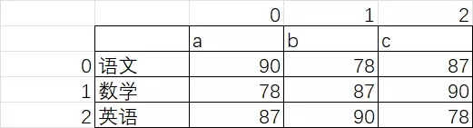

:::note
本系列将以一个学习者的眼光，从零基础一步一步学会最基础的C语言编程，本文将讲解C语言第六个板块：二维数组。
:::

我们本次将从二维数组、多维数组的认识、使用、操作等这几个方面展开学习。

### 二维数组

上一章，我们认识了一维数组的认识、使用、操作等这几个方面，有一维数组，那么相应就会有二维数组、多维数组，首先我们来认识一下二维数组.

二维顾名思义，也就是有x，y两个变量所夹的数据，比如下面这个表格，就是一个抽象化的二维数组



他就是一个有多行的表格，上图中我们定义了一个3x3的二维数组，他横向编号是0-2，纵向编号是0-2

如图中这种二维数组，我们将数组名设为a，则b的数学成绩可以表示为```a[1][1]```

### 多维数组

多维数组则是更多的维度来筛选数字，比如常见的三维数组，我们便可以将其抽象为在立方体中的表格，有长宽高三个变量可以选择，我们便可以使用一样的方法读取，```a[1][2][3]```

其他维度的数组理论相同，就不在赘述，且用法与一维数组相同，在此也不再过多赘述。

### 应用

> **7-1 sdut-C语言实验-求一个3*3矩阵对角线元素之和**
>
> 给定一个3*3的矩阵，请你求出对角线元素之和。
>
> **输入格式**：按照行优先顺序输入一个3*3矩阵，每个矩阵元素均为整数。
>
> **输出格式**：从左下角到右上角这条对角线上的元素之和。
>
> **输入示例**：
>
> ```
> 1 2 3
> 3 4 5
> 6 0 1
> ```
>
> **输出示例**：
>
> ```
> 13
> ```

<details>
<summary>7-1 解答：</summary>

```c
#include <stdio.h>

int main(){
    int arr[3][3];
    int sum=0;
    for(int i = 0;i<3;i++){
        for(int j = 0;j<3;j++){
            scanf("%d",&arr[i][j]);
        }
    }
    for(int k = 0;k<3;k++){
        int h = 2 - k;
        sum += arr[k][h];
    }
    printf("%d",sum);
    return 0;
}
```

</details>

> **7-2 求矩阵各行元素之和**
>
> 本题要求编写程序，求一个给定的m×n矩阵各行元素之和。
>
> **输入格式**：输入第一行给出两个正整数m和n（1≤m,n≤6）。随后m行，每行给出n个整数，其间
> 
> 以空格分隔。
>
> **输出格式**：每行输出对应矩阵行元素之和。
>
> **输入示例**：
>
> ```
> 3 2
> 6 3
> 1 -8
> 3 12
> ```
>
> **输出示例**：
>
> ```
> 9
> -7
> 15
> ```

<details>
<summary>7-2 解答：</summary>

```c
#include <stdio.h>

int main(){
    int m,n;
    scanf("%d %d",&m,&n);
    int arr[m][n];
    for(int i = 0;i<m;i++){
        int sum=0;
        for(int j = 0;j<n;j++){
            scanf("%d",&arr[i][j]);
            sum += arr[i][j];
        }
        printf("%d\n",sum);
    }
    return 0;
}
```

</details>

> **7-3 sdut-C语言实验- 对称矩阵的判定**
>
> 对于一个n行n列的矩阵，先输入矩阵的行数，再依次输入矩阵的每行元素，判断该矩阵是否为对称矩阵，若矩阵对称输出“Yes."，不对称输出"No."。
>
> **输入格式**：输入有多组，每一组第一行输入一个正整数N（N<=20），表示矩阵的行数（若N=0，表示输入结束）。
> 
> 下面依次输入N行数据。
>
> **输出格式**：若矩阵对称输出“Yes."，不对称输出”No.”。
>
> **输入示例**：
>
> ```
> 3
> 6 3 12
> 3 18 8
> 12 8 7
> 3
> 6 9 12
> 3 5 8
> 12 6 3
> 0
> ```
>
> **输出示例**：
>
> ```
> Yes.
> No.
> ```

<details>
<summary>7-3 解答：</summary>

```c
#include <stdio.h>

int main() {
    int n, i, j;
    int matrix[20][20];
    while (scanf("%d", &n) == 1 && n != 0) {
        for (i = 0; i < n; i++) {
            for (j = 0; j < n; j++) {
                scanf("%d", &matrix[i][j]);
            }
        }
        int is_sym = 1;
        for (i = 0; i < n && is_sym; i++) {
            for (j = i + 1; j < n && is_sym; j++) {
                if (matrix[i][j] != matrix[j][i]) {
                    is_sym = 0;
                }
            }
        }
        printf("%s\n", is_sym ? "Yes." : "No.");
    } 
    return 0;
}
```

</details>

> **7-4 sdut- C语言实验-矩阵转置**
>
> 输入N*N的矩阵，输出它的转置矩阵。
>
> **输入格式**：第一行为整数N（1≤N≤100）。
> 
> 接着是一个N*N的矩阵。
>
> **输出格式**：转置矩阵。
>
> **输入示例**：
>
> ```
> 2
> 1 2
> 1 2
> ```
>
> **输出示例**：
>
> ```
> 1 1
> 2 2
> ```

<details>
<summary>7-4 解答：</summary>

```c
#include <stdio.h>

int main(){
    int n;
    scanf("%d",&n);
    int arr[n][n];
    for(int i=0;i<n;i++){
        for(int j=0;j<n;j++){
            scanf("%d",&arr[i][j]);
        }
    }
    for(int j=0;j<n;j++){
        for(int i=0;i<n;i++){
            if(i==0){
                printf("%d",arr[i][j]);
            }else{
                printf(" %d",arr[i][j]);
            }

        }
        printf("\n");
    }
    return 0;
}
```

</details>

> **7-5 sdut-C语言实验- 杨辉三角**
>
> 1
>
> 1  1
>
> 1  2   1
>
> 1  3   3   1
>
> 1  4   6   4  1
>
> 1  5 10 10  5  1
>
> 上面的图形熟悉吗？它就是我们中学时候学过的杨辉三角。
>
> 杨辉三角，是二项式系数在三角形中的一种几何排列，中国南宋数学家杨辉1261年所著的《详解九章算法》一书中出现。在欧洲，帕斯卡（1623----1662）在1654年发现这一规律，所以这个表又叫做帕斯卡三角形。帕斯卡的发现比杨辉要迟393年，比贾宪迟600年。
> 
> 21世纪以来国外也逐渐承认这项成果属于中国，所以有些书上称这是“中国三角形”（Chinese triangle）。
> 
> 其实，中国古代数学家在数学的许多重要领域中处于遥遥领先的地位。中国古代数学史曾经有自己光辉灿烂的篇章，而杨辉三角的发现就是十分精彩的一页。
> 
> 让我们开始做题吧！
>
> **输入格式**：输入数据包含多组测试数据。
> 
> 每组测试数据的输入只有一个正整数n（1≤n≤30），表示将要输出的杨辉三角的层数。
>
> 输入以0结束。
>
> **输出格式**：对应于每一个输入，请输出相应层数的杨辉三角，每一层的整数之间用一个空格隔开，每一个杨辉三角后面加一个空行。
>
> **输入示例**：
>
> ```
> 2
> 3
> 0
> ```
>
> **输出示例**：
>
> ```
> 1
> 1 1
> 
> 1
> 1 1
> 1 2 1
>
>
> ```

<details>
<summary>7-5 解答：</summary>

```c
#include <stdio.h>

int main() {
    int n;
    while (scanf("%d", &n) == 1 && n != 0) {
        int yanghui[30][30] = {0};
        for (int i = 0; i < n; i++) {
            yanghui[i][0] = 1;
            yanghui[i][i] = 1;
            for (int j = 1; j < i; j++) {
                yanghui[i][j] = yanghui[i-1][j-1] + yanghui[i-1][j];
            }
        }
        for (int i = 0; i < n; i++) {
            for (int j = 0; j <= i; j++) {
                printf("%d", yanghui[i][j]);
                if (j != i) {
                    printf(" ");
                }
            }
            printf("\n");
        }
        printf("\n");
    }
    return 0;
}
```

</details>

> **7-6 sdut-C语言实验- 鞍点计算**
>
> 找出具有m行n列二维数组Array的“鞍点”，即该位置上的元素在该行上最大，在该列上最小，其中1<=m,n<=10。同一行和同一列没有相同的数。
>
> **输入格式**：输入数据有多行，第一行有两个数m和n，下面有m行，每行有n个数。
>
> **输出格式**：按下列格式输出鞍点：
> 
> Array[i][j]=x
> 
> 其中，x代表鞍点，i和j为鞍点所在的数组行和列下标，我们规定数组下标从0开始。
> 
> 一个二维数组并不一定存在鞍点，此时请输出None。
> 
> 我们保证不会出现两个鞍点的情况，比如：
> 
> 3 3
> 
> 1 2 3
> 
> 1 2 3
> 
> 3 6 8
> 
>
> **输入示例**：
>
> ```
> 3 3
> 1 2 3
> 4 5 6
> 7 8 9
> ```
>
> **输出示例**：
>
> ```
> Array[0][2]=3
> ```

<details>
<summary>7-6 解答：</summary>

```c
#include <stdio.h>

int main() {
    int m, n;
    int arr[10][10];
    scanf("%d %d", &m, &n);
    for (int i = 0; i < m; i++) {
        for (int j = 0; j < n; j++) {
            scanf("%d", &arr[i][j]);
        }
    }
    int found = 0;
    int x, y, val;
    for (int i = 0; i < m; i++) {
        int max_val = arr[i][0];
        int col = 0;
        for (int j = 1; j < n; j++) {
            if (arr[i][j] > max_val) {
                max_val = arr[i][j];
                col = j;
            }
        }
        int is_min = 1;
        for (int k = 0; k < m; k++) {
            if (arr[k][col] < max_val) {
                is_min = 0;
                break;
            }
        }
        if (is_min) {
            found = 1;
            x = i;
            y = col;
            val = max_val;
            break;
        }
    }

    if (found) {
        printf("Array[%d][%d]=%d\n", x, y, val);
    } else {
        printf("None\n");
    }
    return 0;
}
```

</details>

> **7-7 矩阵列平移**
>
> 给定一个 n×n 的整数矩阵。对任一给定的正整数 k<n，我们将矩阵的偶数列的元素整体向下依次平移 1、……、k、1、……、k、…… 个位置，平移空出的位置用整数 x 补。你需要计算出结果矩阵的每一行元素的和。
>
> **输入格式**：输入第一行给出 3 个正整数：n（<100）、k（<n）、x（<100），分别如题面所述。
> 
> 接下来 n 行，每行给出 n 个不超过 100 的正整数，为矩阵元素的值。数字间以空格分隔。
>
> **输出格式**：在一行中输出平移后第 1 到 n 行元素的和。数字间以 1 个空格分隔，行首尾不得有多余空格。
>
> **输入示例**：
>
> ```
> 7 2 99
> 11 87 23 67 20 75 89
> 37 94 27 91 63 50 11
> 44 38 50 26 40 26 24
> 73 85 63 28 62 18 68
> 15 83 27 97 88 25 43
> 23 78 98 20 30 81 99
> 77 36 48 59 25 34 22
> ```
>
> **输出示例**：
>
> ```
> 440 399 369 421 302 386 428
> ```
>
> **样例解读**：
> 需要平移的是第 2、4、6 列。给定 k=2，应该将这三列顺次整体向下平移 1、2、1 位（如果有更多列，就应该按照 1、2、1、2 …… 这个规律顺次向下平移），顶端的空位用 99 来填充。平移后的矩阵变成：
> ```
> 11 99 23 99 20 99 89
> 37 87 27 99 63 75 11
> 44 94 50 67 40 50 24
> 73 38 63 91 62 26 68
> 15 85 27 26 88 18 43
> 23 83 98 28 30 25 99
> 77 78 48 97 25 81 22
> `
`
<details>
<summary>7-7 解答：</summary>

```c
#include <stdio.h>

int main() {
    int n, k, x;
    scanf("%d %d %d", &n, &k, &x);
    int matrix[100][100];
    for (int i = 0; i < n; i++) {
        for (int j = 0; j < n; j++) {
            scanf("%d", &matrix[i][j]);
        }
    }
    int cols[100];
    int col_count = 0;
    for (int j = 0; j < n; j++) {
        if (j % 2 == 1) {
            cols[col_count++] = j;
        }
    }
    for (int t = 0; t < col_count; t++) {
        int col = cols[t];
        int step = (t % k) + 1;
        int temp_col[100];
        for (int i = 0; i < n; i++) {
            if (i < step) {
                temp_col[i] = x;
            } else {
                temp_col[i] = matrix[i - step][col];
            }
        }
        for (int i = 0; i < n; i++) {
            matrix[i][col] = temp_col[i];
        }
    }
    int row_sum[100] = {0};
    for (int i = 0; i < n; i++) {
        for (int j = 0; j < n; j++) {
            row_sum[i] += matrix[i][j];
        }
    }
    for (int i = 0; i < n; i++) {
        if (i == 0) {
            printf("%d", row_sum[i]);
        } else {
            printf(" %d", row_sum[i]);
        }
    }
    printf("\n");
    return 0;
}
```

</details>

> **7-8 方阵循环右移**
>
> 本题要求编写程序，将给定n×n方阵中的每个元素循环向右移m个位置，即将第0、1、⋯、n−1列变换为第n−m、n−m+1、⋯、n−1、0、1、⋯、n−m−1列。
>
> **输入格式**：输入第一行给出两个正整数m和n（1≤n≤6）。接下来一共n行，每行n个整数，表示一个n阶的方阵。
>
> **输出格式**：按照输入格式输出移动后的方阵：即输出n行，每行n个整数，每个整数后输出一个空格。
>
> **输入示例**：
>
> ```
> 2 3
> 1 2 3
> 4 5 6
> 7 8 9
> ```
>
> **输出示例**：
>
> ```
> 2 3 1 
> 5 6 4 
> 8 9 7 
> ```

<details>
<summary>7-8 解答：</summary>

```c
#include <stdio.h>

int main() {
    int m, n;
    scanf("%d %d", &m, &n);
    int matrix[6][6];
    for (int i = 0; i < n; i++) {
        for (int j = 0; j < n; j++) {
            scanf("%d", &matrix[i][j]);
        }
    }
    int step = m % n;
    for (int i = 0; i < n; i++) {
        for (int j = 0; j < n; j++) {
            int original_j = (j - step + n) % n;
            printf("%d ", matrix[i][original_j]);
        }
        printf("\n");
    }
    return 0;
}   
```

</details>

### 总结

OK了，今天你学会了C语言程序的二位数组和多维数组！一起加油吧！
