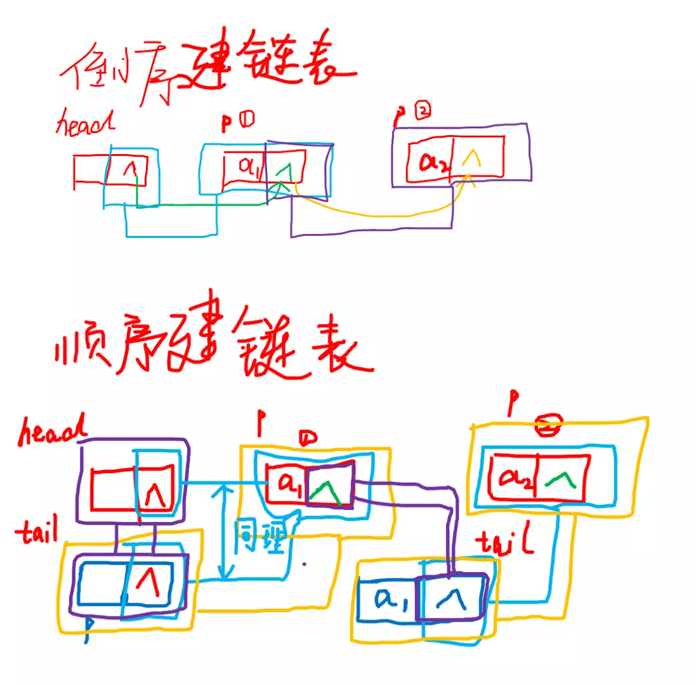

:::note
本系列将以一个学习者的眼光，从零基础一步一步学会最基础的C语言编程，本文将讲解C语言第十一个板块：链表。
:::

在C语言中，数组的长度在定义时就已固定，无法动态扩容/缩容；而**链表**通过结构体+动态内存分配（`malloc`/`free`）实现，每个节点独立分配内存，节点间通过指针连接，可灵活增删节点。链表的核心是**节点结构体定义**和**动态内存管理**，本文重点讲解单链表的创建、顺序插入、倒序插入等核心操作。

### 动态内存分配

| 函数原型                                             | 功能说明                                    | 关键特性                                                                                                                  |
| ---------------------------------------------------- | ------------------------------------------- | ------------------------------------------------------------------------------------------------------------------------- |
| `void *malloc(unsigned int size);`                 | 分配 `size`字节的连续堆内存               | 1. 内存未初始化<br />2. 成功返回内存首地址，失败返回 `NULL`                                                             |
| `void *calloc(unsigned int n, unsigned int size);` | 分配 `n`个大小为 `size`字节的连续堆内存 | 1. 内存自动初始化为0<br />2. 等价于 `malloc(n*size) + 内存清零`<br />3. 失败返回 `NULL`                               |
| `void *realloc(void *p_block, unsigned int size);` | 调整已分配内存块的大小                      | 1.`p_block`为 `malloc/calloc`返回的地址 <br />2. 可扩容/缩容，可能迁移内存块 <br />3. 失败返回 `NULL`，原内存块保留 |
| `void free(void *p_block);`                        | 释放已分配的堆内存                          | 1.`p_block`必须是动态分配的地址 <br />2. 释放后指针需置 `NULL`，避免野指针 <br />3. 不能重复释放/释放栈内存           |

### 链表基础

#### 1. 链表节点的定义

链表的核心是**节点结构体**，每个节点包含两部分：`数据域`和 `指针域`。

#### 2. 核心语法

```c
// 1. 定义链表节点结构体
struct ListNode {
    int data;// 数据域：存储节点数据
    struct ListNode *next;  // 指针域：指向下一个节点的指针
};

// 2. 动态内存分配函数
// 分配新节点内存：malloc，返回void*，需强制类型转换
struct ListNode *createNode(int data) {
    // 分配节点内存
    struct ListNode *newNode = (struct ListNode *)malloc(sizeof(struct ListNode));
    // 内存分配失败判断
    if (newNode == NULL) {
        printf("内存分配失败！\n");
        exit(1);
    }
    // 初始化节点数据和指针
    newNode->data = data;
    newNode->next = NULL; // 新节点默认指向NULL
    return newNode;
}
// 3. 遍历链表
void traverseList(struct ListNode *head) {
    struct ListNode *p = head;
    if (p == NULL) {
        printf("链表为空！\n");
        return;
    }
    printf("链表节点：");
    while (p != NULL) {
        printf("%d ", p->data);
        p = p->next;
    }
    printf("\n");
}
```

### 链表的插入操作

链表插入的核心是**调整指针指向**，分为**顺序插入**（按数据大小/先后插入到链表尾部）和**倒序插入**（插入到链表头部，新节点成为新头节点）。

#### 1. 倒序插入（头插法）

**核心逻辑**：新节点的 `next`指向原头节点，再将头指针指向新节点，最终链表顺序与插入顺序相反。

```c
// 倒序插入：新节点插入到链表头部
struct ListNode *insertReverse(struct ListNode *head, int data) {
    // 1. 创建新节点
    struct ListNode *newNode = createNode(data);
    // 2. 新节点next指向原头节点
    newNode->next = head;
    // 3. 头指针指向新节点
    head = newNode;
    return head; // 返回新的头节点
}
```

#### 2. 顺序插入（尾插法）

**核心逻辑**：找到链表最后一个节点（`next`为NULL），将最后一个节点的 `next`指向新节点，最终链表顺序与插入顺序一致。

```c
// 顺序插入：新节点插入到链表尾部
struct ListNode *insertOrder(struct ListNode *head, int data) {
    // 1. 创建新节点
    struct ListNode *newNode = createNode(data);
    // 2. 链表为空时，新节点直接作为头节点
    if (head == NULL) {
        head = newNode;
        return head;
    }
    // 3. 找到链表最后一个节点
    struct ListNode *p = head;
    while (p->next != NULL) {
        p = p->next;
    }
    // 4. 最后一个节点的next指向新节点
    p->next = newNode;
    return head; // 头节点不变，返回原头
}
```


**注**：先后顺序为绿色、蓝色、黄色、紫色


### 链表的查找操作

#### 1.按值查找结点

**核心逻辑**：从链表头节点开始遍历，逐个比对节点数据域与目标值，找到则返回该节点指针；遍历结束未找到则返回 NULL。

```c
// 按值查找：返回第一个数据等于target的节点指针，未找到返回NULL
struct ListNode *findNode(struct ListNode *head, int target) {
    // 1. 空链表直接返回NULL
    if (head == NULL) {
        return NULL;
    }
    // 2. 遍历链表
    struct ListNode *p = head;
    while (p != NULL) {
        // 3. 找到目标节点，返回指针
        if (p->data == target) {
            return p;
        }
        // 4. 未找到则移动到下一个节点
        p = p->next;
    }
    // 5. 遍历结束未找到，返回NULL
    return NULL;
}
```

#### 2.按位置查找结点

**核心逻辑**：按索引（从 0 开始）查找节点，遍历过程中计数，计数等于目标索引则返回该节点；索引越界返回 NULL。

```c
// 按位置查找：返回索引为index的节点指针（索引从0开始），越界返回NULL
struct ListNode *findNodeByIndex(struct ListNode *head, int index) {
    // 1. 空链表或负索引直接返回NULL
    if (head == NULL || index < 0) {
        return NULL;
    }
    // 2. 遍历链表并计数
    struct ListNode *p = head;
    int count = 0;
    while (p != NULL) {
        // 3. 找到目标索引，返回指针
        if (count == index) {
            return p;
        }
        count++;
        p = p->next;
    }
    // 4. 索引越界，返回NULL
    return NULL;
}
```

### 链表的删除操作

#### 1.按值删除结点

**核心逻辑：**

- 步骤1：找到待删节点的前驱节点（若删除头节点则无前驱，直接更新头指针）；

- 步骤2：调整前驱节点的next指向待删节点的后继节点；

- 步骤3：释放待删节点的内存，避免内存泄漏。

```c
// 按值删除：删除第一个数据等于target的节点，返回新的头节点
struct ListNode *deleteNode(struct ListNode *head, int target) {
    // 1. 空链表直接返回NULL
    if (head == NULL) {
        return NULL;
    }

    struct ListNode *p = head;
    struct ListNode *prev = NULL; // 保存前驱节点

    // 2. 处理删除头节点的情况
    if (p->data == target) {
        head = p->next; // 头指针指向原头节点的下一个节点
        free(p);        // 释放原头节点内存
        p = NULL;
        return head;
    }

    // 3. 遍历查找待删节点及其前驱
    while (p != NULL && p->data != target) {
        prev = p;
        p = p->next;
    }

    // 4. 未找到目标节点，返回原头节点
    if (p == NULL) {
        return head;
    }

    // 5. 找到目标节点，调整前驱节点指针
    prev->next = p->next;
    // 6. 释放待删节点内存
    free(p);
    p = NULL;

    return head; // 返回头节点（未删除头节点则不变）
}
```

### 逆置单链表

#### 1.迭代法逆置单链表

**核心逻辑**：用三个指针（前驱prev、当前curr、后继next）遍历链表，逐个将当前节点的next指向前驱，最终prev指向新头节点。

```c
// 迭代法逆置单链表，返回新头节点
struct ListNode *reverseList(struct ListNode *head) {
    struct ListNode *prev = NULL;  // 前驱节点初始为空
    struct ListNode *curr = head;  // 当前节点从原头节点开始
    struct ListNode *next = NULL;  // 保存后继节点
    
    while (curr != NULL) {
        next = curr->next;  // 先保存当前节点的后继，避免断链
        curr->next = prev;  // 反转当前节点的指针
        prev = curr;        // 前驱指针后移
        curr = next;        // 当前指针后移
    }
    return prev;  // 原尾节点变为新头节点
}
```

### 单链表归并
#### 1.归并两个升序单链表

**核心逻辑**：创建哑节点作为新链表头，用指针遍历两个原链表，每次选择数值较小的节点接入新链表，最后拼接剩余节点。

```c
// 归并两个升序链表，返回新的升序链表头
struct ListNode *mergeList(struct ListNode *l1, struct ListNode *l2) {
    // 创建哑节点（简化头节点处理）
    struct ListNode dummy = {0, NULL};
    struct ListNode *p = &dummy;
    
    // 同时遍历两个链表，选择较小节点接入
    while (l1 != NULL && l2 != NULL) {
        if (l1->data <= l2->data) {
            p->next = l1;
            l1 = l1->next;
        } else {
            p->next = l2;
            l2 = l2->next;
        }
        p = p->next;
    }
    
    // 拼接剩余节点（其中一个链表已遍历完）
    p->next = (l1 != NULL) ? l1 : l2;
    
    return dummy.next;  // 哑节点的next为新链表头
}
```

### 单链表拆分

#### 1.按数值奇偶拆分单链表

**核心逻辑**：创建两个哑节点分别作为奇偶链表头，遍历原链表，将奇数数值节点接入奇数链表，偶数数值节点接入偶数链表。

```c
// 按数值奇偶拆分链表，oddHead为奇数链表头，evenHead为偶数链表头
void splitList(struct ListNode *head, struct ListNode **oddHead, struct ListNode **evenHead) {
    // 初始化两个哑节点
    struct ListNode oddDummy = {0, NULL};
    struct ListNode evenDummy = {0, NULL};
    struct ListNode *oddP = &oddDummy;  // 奇数链表指针
    struct ListNode *evenP = &evenDummy;// 偶数链表指针
    
    // 遍历原链表，按数值奇偶拆分
    while (head != NULL) {
        if (head->data % 2 == 1) {  // 奇数
            oddP->next = head;
            oddP = oddP->next;
        } else {  // 偶数
            evenP->next = head;
            evenP = evenP->next;
        }
        head = head->next;
    }
    
    // 终止两个子链表
    oddP->next = NULL;
    evenP->next = NULL;
    
    // 返回两个子链表头（跳过哑节点）
    *oddHead = oddDummy.next;
    *evenHead = evenDummy.next;
}
```

### 循环链表
#### 1.创建循环链表
```c
// 尾插法创建循环链表，返回头节点
struct ListNode *createCircularList(int arr[], int n) {
    if (n == 0) return NULL;
    
    // 创建头节点
    struct ListNode *head = createNode(arr[0]);
    struct ListNode *p = head;
    
    // 尾插剩余节点
    for (int i = 1; i < n; i++) {
        p->next = createNode(arr[i]);
        p = p->next;
    }
    
    // 尾节点指向头节点，形成循环
    p->next = head;
    return head;
}
```
### 约瑟夫环问题

#### 1.约瑟夫环求解

**核心逻辑**：构建循环链表，用指针遍历，数到目标步数时删除当前节点，调整指针形成新循环，直至链表只剩一个节点。

```c
// 约瑟夫环：n个节点，每次数m步淘汰，返回最后剩余节点的数值
int josephus(int n, int m) {
    if (n == 1) return 1;  // 只有1个节点，直接返回
    
    // 1. 构建n个节点的循环链表
    struct ListNode *head = createNode(1);
    struct ListNode *p = head;
    for (int i = 2; i <= n; i++) {
        p->next = createNode(i);
        p = p->next;
    }
    p->next = head;  // 形成循环
    
    // 2. 模拟淘汰过程
    struct ListNode *prev = p;  // 前驱节点初始为尾节点
    p = head;                   // 当前节点初始为头节点
    while (p->next != p) {      // 只剩1个节点时终止
        // 数m步（移动m-1次）
        for (int i = 1; i < m; i++) {
            prev = p;
            p = p->next;
        }
        // 删除当前节点
        prev->next = p->next;
        free(p);
        p = prev->next;  // 从下一个节点继续数
    }
    
    int res = p->data;
    free(p);  // 释放最后一个节点
    return res;
}
```

### 示例

#### 1.链表节点定义+创建节点

```c
#include <stdio.h>
#include <stdlib.h>

struct ListNode {
    int data;
    struct ListNode *next;
};


struct ListNode *createNode(int data) {

    struct ListNode *newNode = (struct ListNode *)malloc(sizeof(struct ListNode));

    if (newNode == NULL) {
        printf("内存分配失败！\n");
        exit(1);
    }

    newNode->data = data;
    newNode->next = NULL;
    return newNode;
}

int main() {
    struct ListNode *node = createNode(10);
    printf("节点数据：%d\n", node->data);
    free(node);
    node = NULL;
    return 0;
}
```

> **输出**：
>
> ```
> 节点数据：10
> ```

#### 2.尾插法（顺序插入）
```c
#include <stdio.h>
#include <stdlib.h>

struct ListNode {
    int data;
    struct ListNode *next;
};

struct ListNode *createNode(int data) {
    struct ListNode *newNode = (struct ListNode *)malloc(sizeof(struct ListNode));
    if (newNode == NULL) { exit(1); }
    newNode->data = data;
    newNode->next = NULL;
    return newNode;
}

struct ListNode *insertOrder(struct ListNode *head, int data) {
    struct ListNode *newNode = createNode(data);
    if (head == NULL) {
        head = newNode;
        return head;
    }

    struct ListNode *p = head;
    while (p->next != NULL) {
        p = p->next;
    }
    p->next = newNode;
    return head;
}

void traverseList(struct ListNode *head) {
    struct ListNode *p = head;
    while (p != NULL) {
        printf("%d ", p->data);
        p = p->next;
    }
}

int main() {
    struct ListNode *head = NULL;
    head = insertOrder(head, 1);
    head = insertOrder(head, 2);
    head = insertOrder(head, 3);
    traverseList(head);
    return 0;
}
```

> **输出**：
>
> ```
> 1 2 3
> ```

#### 3.头插法（倒序插入）
```c
#include <stdio.h>
#include <stdlib.h>

struct ListNode {
    int data;
    struct ListNode *next;
};

struct ListNode *createNode(int data) {
    struct ListNode *newNode = (struct ListNode *)malloc(sizeof(struct ListNode));
    if (newNode == NULL) { exit(1); }
    newNode->data = data;
    newNode->next = NULL;
    return newNode;
}

struct ListNode *insertReverse(struct ListNode *head, int data) {
    struct ListNode *newNode = createNode(data);
    newNode->next = head;
    head = newNode;
    return head;
}

void traverseList(struct ListNode *head) {
    struct ListNode *p = head;
    while (p != NULL) {
        printf("%d ", p->data);
        p = p->next;
    }
}

int main() {
    struct ListNode *head = NULL;
    head = insertReverse(head, 1);
    head = insertReverse(head, 2);
    head = insertReverse(head, 3);
    traverseList(head);
    return 0;
}
```

> **输出**：
>
> ```
> 3 2 1
> ```

#### 4.链表遍历
```c
#include <stdio.h>
#include <stdlib.h>

struct ListNode {
    int data;
    struct ListNode *next;
};

struct ListNode *createNode(int data) {
    struct ListNode *newNode = (struct ListNode *)malloc(sizeof(struct ListNode));
    if (newNode == NULL) { exit(1); }
    newNode->data = data;
    newNode->next = NULL;
    return newNode;
}

void traverseList(struct ListNode *head) {
    if (head == NULL) {
        printf("链表为空\n");
        return;
    }
    struct ListNode *p = head;
    printf("链表节点：");
    while (p != NULL) {
        printf("%d ", p->data);
        p = p->next;
    }
    printf("\n");
}

int main() {
    struct ListNode *head1 = NULL;
    traverseList(head1);

    struct ListNode *head2 = createNode(5);
    head2->next = createNode(10);
    head2->next->next = createNode(15);
    traverseList(head2);
    return 0;
}
```

> **输出**：
>
> ```
> 链表为空
> 链表节点：5 10 15 
> ```

#### 5.查找结点
```c
#include <stdio.h>
#include <stdlib.h>

struct ListNode {
    int data;
    struct ListNode *next;
};

int findNode(struct ListNode *head, int target) {
    struct ListNode *p = head;
    while (p != NULL) {
        if (p->data == target) {
            return 1;
        }
        p = p->next;
    }
    return 0;
}

int main() {
    struct ListNode n1 = {1, NULL}, n2 = {2, NULL}, n3 = {3, NULL};
    n1.next = &n2;
    n2.next = &n3;

    int target = 2;
    if (findNode(&n1, target)) {
        printf("找到值为 %d 的节点\n", target);
    } else {
        printf("未找到值为 %d 的节点\n", target);
    }

    target = 4;
    if (findNode(&n1, target)) {
        printf("找到值为 %d 的节点\n", target);
    } else {
        printf("未找到值为 %d 的节点\n", target);
    }

    return 0;
}
```

> **输出**：
>
> ```
> 找到值为 2 的节点
> 未找到值为 4 的节点
> ```

#### 6.删除结点
```c
#include <stdio.h>
#include <stdlib.h>

struct ListNode {
    int data;
    struct ListNode *next;
};

struct ListNode *createNode(int data) {
    struct ListNode *node = (struct ListNode*)malloc(sizeof(struct ListNode));
    node->data = data;
    node->next = NULL;
    return node;
}

struct ListNode *deleteNode(struct ListNode *head, int target) {
    if (head->data == target) {
        struct ListNode *temp = head;
        head = head->next;
        free(temp);
        return head;
    }

    struct ListNode *p = head;
    while (p->next != NULL && p->next->data != target) {
        p = p->next;
    }

    if (p->next != NULL) {
        struct ListNode *temp = p->next;
        p->next = temp->next;
        free(temp);
    }
    return head;
}

void printList(struct ListNode *head) {
    struct ListNode *p = head;
    while (p != NULL) {
        printf("%d ", p->data);
        p = p->next;
    }
    printf("\n");
}

int main() {
    struct ListNode *head = createNode(10);
    head->next = createNode(20);
    head->next->next = createNode(30);

    printf("删除前：");
    printList(head);

    head = deleteNode(head, 20);

    printf("删除后：");
    printList(head);

    free(head->next);
    free(head);
    return 0;
}
```

> **输出**：
>
> ```
> 删除前：10 20 30 
> 删除后：10 30 
> ```

#### 7.逆置单链表
```c
#include <stdio.h>
#include <stdlib.h>

struct ListNode {
    int data;
    struct ListNode *next;
};

struct ListNode *createNode(int data) {
    struct ListNode *newNode = (struct ListNode *)malloc(sizeof(struct ListNode));
    newNode->data = data;
    newNode->next = NULL;
    return newNode;
}

struct ListNode *reverseList(struct ListNode *head) {
    struct ListNode *prev = NULL, *curr = head, *next = NULL;
    while (curr != NULL) {
        next = curr->next;
        curr->next = prev;
        prev = curr;
        curr = next;
    }
    return prev;
}

void printList(struct ListNode *head) {
    struct ListNode *p = head;
    while (p != NULL) {
        printf("%d -> ", p->data);
        p = p->next;
    }
    printf("NULL\n");
}

int main() {
    struct ListNode *head = createNode(1);
    head->next = createNode(2);
    head->next->next = createNode(3);
    
    printf("逆置前：");
    printList(head);
    
    head = reverseList(head);
    
    printf("逆置后：");
    printList(head);
    
    struct ListNode *temp;
    while (head != NULL) {
        temp = head;
        head = head->next;
        free(temp);
    }
    return 0;
}
```

> **输出**：
>
> ```
> 逆置前：1 -> 2 -> 3 -> NULL
> 逆置后：3 -> 2 -> 1 -> NULL
> ```

#### 8.单链表归并
```c
#include <stdio.h>
#include <stdlib.h>

struct ListNode {
    int data;
    struct ListNode *next;
};

struct ListNode *createNode(int data) {
    struct ListNode *newNode = (struct ListNode *)malloc(sizeof(struct ListNode));
    newNode->data = data;
    newNode->next = NULL;
    return newNode;
}

struct ListNode *mergeList(struct ListNode *l1, struct ListNode *l2) {
    struct ListNode dummy = {0, NULL};
    struct ListNode *p = &dummy;
    while (l1 != NULL && l2 != NULL) {
        if (l1->data <= l2->data) {
            p->next = l1;
            l1 = l1->next;
        } else {
            p->next = l2;
            l2 = l2->next;
        }
        p = p->next;
    }
    p->next = (l1 != NULL) ? l1 : l2;
    return dummy.next;
}

void printList(struct ListNode *head) {
    struct ListNode *p = head;
    while (p != NULL) {
        printf("%d -> ", p->data);
        p = p->next;
    }
    printf("NULL\n");
}

int main() {

    struct ListNode *l1 = createNode(1);
    l1->next = createNode(3);
    l1->next->next = createNode(5);

    struct ListNode *l2 = createNode(2);
    l2->next = createNode(4);
    l2->next->next = createNode(6);
    
    printf("链表1：");
    printList(l1);
    printf("链表2：");
    printList(l2);
    
    struct ListNode *mergeHead = mergeList(l1, l2);
    printf("归并后：");
    printList(mergeHead);
    
    struct ListNode *temp;
    while (mergeHead != NULL) {
        temp = mergeHead;
        mergeHead = mergeHead->next;
        free(temp);
    }
    return 0;
}
```

> **输出**：
>
> ```
> 链表1：1 -> 3 -> 5 -> NULL
> 链表2：2 -> 4 -> 6 -> NULL
> 归并后：1 -> 2 -> 3 -> 4 -> 5 -> 6 -> NULL
> ```

#### 9.单链表拆分
```c
#include <stdio.h>
#include <stdlib.h>

struct ListNode {
    int data;
    struct ListNode *next;
};

struct ListNode *createNode(int data) {
    struct ListNode *newNode = (struct ListNode *)malloc(sizeof(struct ListNode));
    newNode->data = data;
    newNode->next = NULL;
    return newNode;
}

void splitList(struct ListNode *head, struct ListNode **oddHead, struct ListNode **evenHead) {
    struct ListNode oddDummy = {0, NULL}, evenDummy = {0, NULL};
    struct ListNode *oddP = &oddDummy, *evenP = &evenDummy;
    while (head != NULL) {
        if (head->data % 2 == 1) {
            oddP->next = head;
            oddP = oddP->next;
        } else {
            evenP->next = head;
            evenP = evenP->next;
        }
        head = head->next;
    }
    oddP->next = NULL;
    evenP->next = NULL;
    *oddHead = oddDummy.next;
    *evenHead = evenDummy.next;
}

void printList(struct ListNode *head) {
    struct ListNode *p = head;
    while (p != NULL) {
        printf("%d -> ", p->data);
        p = p->next;
    }
    printf("NULL\n");
}

int main() {
    struct ListNode *head = createNode(1);
    head->next = createNode(2);
    head->next->next = createNode(3);
    head->next->next->next = createNode(4);
    head->next->next->next->next = createNode(5);
    
    printf("原链表：");
    printList(head);
    
    struct ListNode *oddHead, *evenHead;
    splitList(head, &oddHead, &evenHead);
    
    printf("奇数链表：");
    printList(oddHead);
    printf("偶数链表：");
    printList(evenHead);

    struct ListNode *temp;
    while (oddHead != NULL) {
        temp = oddHead;
        oddHead = oddHead->next;
        free(temp);
    }
    while (evenHead != NULL) {
        temp = evenHead;
        evenHead = evenHead->next;
        free(temp);
    }
    return 0;
}
```

> **输出**：
>
> ```
> 原链表：1 -> 2 -> 3 -> 4 -> 5 -> NULL
> 奇数链表：1 -> 3 -> 5 -> NULL
> 偶数链表：2 -> 4 -> NULL
> ```

#### 10.循环链表
```c
#include <stdio.h>
#include <stdlib.h>

struct ListNode {
    int data;
    struct ListNode *next;
};

struct ListNode *createNode(int data) {
    struct ListNode *newNode = (struct ListNode *)malloc(sizeof(struct ListNode));
    newNode->data = data;
    newNode->next = NULL;
    return newNode;
}

struct ListNode *createCircularList(int arr[], int n) {
    if (n == 0) return NULL;
    struct ListNode *head = createNode(arr[0]);
    struct ListNode *p = head;
    for (int i = 1; i < n; i++) {
        p->next = createNode(arr[i]);
        p = p->next;
    }
    p->next = head;
    return head;
}

void printCircularList(struct ListNode *head) {
    if (head == NULL) return;
    struct ListNode *p = head;
    do {
        printf("%d -> ", p->data);
        p = p->next;
    } while (p != head);
    printf("(回到头节点%d)\n", head->data);
}

int main() {
    int arr[] = {10, 20, 30};
    int n = sizeof(arr) / sizeof(arr[0]);
    
    struct ListNode *head = createCircularList(arr, n);
    printf("循环链表：");
    printCircularList(head);

    struct ListNode *p = head->next, *temp;
    head->next = NULL;
    while (p != NULL) {
        temp = p;
        p = p->next;
        free(temp);
    }
    free(head);
    return 0;
}
```

> **输出**：
>
> ```
> 循环链表：10 -> 20 -> 30 -> (回到头节点10)
> ```

#### 11.约瑟夫环问题
```c
#include <stdio.h>
#include <stdlib.h>

struct ListNode {
    int data;
    struct ListNode *next;
};

struct ListNode *createNode(int data) {
    struct ListNode *newNode = (struct ListNode *)malloc(sizeof(struct ListNode));
    newNode->data = data;
    newNode->next = NULL;
    return newNode;
}

int josephus(int n, int m) {
    if (n == 1) return 1;
    struct ListNode *head = createNode(1);
    struct ListNode *p = head;
    for (int i = 2; i <= n; i++) {
        p->next = createNode(i);
        p = p->next;
    }
    p->next = head;
    
    struct ListNode *prev = p;
    p = head;
    while (p->next != p) {
        for (int i = 1; i < m; i++) {
            prev = p;
            p = p->next;
        }
        prev->next = p->next;
        free(p);
        p = prev->next;
    }
    
    int res = p->data;
    free(p);
    return res;
}

int main() {
    int n = 5, m = 3;
    int last = josephus(n, m);
    printf("%d个人围成圈，每次数%d步淘汰，最后剩余的是第%d个人\n", n, m, last);
    return 0;
}
```

> **输出**：
>
> ```
> 5个人围成圈，每次数3步淘汰，最后剩余的是第4个人
> ```

### 应用

> **7-1 sdut-C语言实验-顺序建立链表**
>
> 输入N个整数，按照输入的顺序建立单链表存储，并遍历所建立的单链表，输出这些数据。
>
> **输入格式**：第一行输入整数的个数N；
> 
> 第二行依次输入每个整数。
>
> **输出格式**：输出这组整数。
>
> **输入示例**：
>
> ```
> 8
> 12 56 4 6 55 15 33 62
> ```
>
> **输出示例**：
>
> ```
> 12 56 4 6 55 15 33 62
> ```

<details>
<summary>7-1 解答：</summary>

```c
#include <stdio.h>
#include <stdlib.h>

typedef struct Node{
    int data;
    struct Node *next;
}Node;

int main(){
    int n;
    scanf("%d",&n);
    Node *head = NULL;
    Node *tail = NULL;
    Node *p = NULL;
    for(int i=0;i<n;i++){
        p=(Node *)malloc(sizeof(Node));
        scanf("%d",&p->data);
        p->next=NULL;
        if(head==NULL){
            head =p;
            tail=p;
        }else{
            tail->next=p;
            tail=p;
        }
    }
    p=head;
    while(p!=NULL){
        printf("%d",p->data);
        if(p->next!=NULL){
            printf(" ");
        }
        p=p->next;
    }
    return 0;
}
```

</details>


> **7-2 sdut-C语言实验-逆序建立链表**
>
> 输入整数个数N，再输入N个整数，按照这些整数输入的相反顺序建立单链表，并依次遍历输出单链表的数据。
>
> **输入格式**：第一行输入整数N;
> 
> 第二行依次输入N个整数，逆序建立单链表。
>
> **输出格式**：依次输出单链表所存放的数据。
>
> **输入示例**：
>
> ```
> 10
> 11 3 5 27 9 12 43 16 84 22 
> ```
>
> **输出示例**：
>
> ```
> 22 84 16 43 12 9 27 5 3 11
> ```

<details>
<summary>7-2 解答：</summary>

```c
#include <stdio.h>
#include <stdlib.h>

typedef struct Node{
    int data;
    struct Node *next;
}Node;

int main(){
    int n;
    scanf("%d",&n);
    Node *head=NULL;
    Node *new_a=NULL;
    for(int i=0;i<n;i++){
        new_a=(Node *)malloc(sizeof(Node));
        scanf("%d",&new_a->data);
        new_a->next=head;
        head=new_a;
    }
    Node *p=head;
    while(p!=NULL){
        printf("%d",p->data);
        if(p->next!=NULL){
            printf(" ");
        }
        p=p->next;
    }
    return 0;
}
```

</details>

> **7-3 sdut-C语言实验-链表的结点插入**
>
> 给出一个只有头指针的链表和 n 次操作，每次操作为在链表的第 m 个元素后面插入一个新元素x。若m 大于链表的元素总数则将x放在链表的最后。
>
> **输入格式**：多组输入。每组数据首先输入一个整数n(n∈[1,100])，代表有n次操作。
> 
> 接下来的n行，每行有两个整数Mi(Mi∈[0,10000])，Xi。
>
> **输出格式**：对于每组数据。从前到后输出链表的所有元素,两个元素之间用空格隔开。
>
> **输入示例**：
>
> ```
> 4
> 1 1
> 1 2
> 0 3
> 100 4
> ```
>
> **输出示例**：
>
> ```
> 3 1 2 4
> ```

<details>
<summary>7-3 解答：</summary>

```c
#include <stdio.h>
#include <stdlib.h>

typedef struct Node {
    int data;
    struct Node *next;
} Node;

int main() {
    int n;
    while (scanf("%d", &n) != EOF) {
        Node *head = (Node *)malloc(sizeof(Node));
        head->next = NULL;
        for (int i = 0; i < n; i++) {
            int m, x;
            scanf("%d %d", &m, &x);
            Node *new_node = (Node *)malloc(sizeof(Node));
            new_node->data = x;
            new_node->next = NULL;
            Node *p_len = head->next;
            int len = 0;
            while (p_len != NULL) {
                len++;
                p_len = p_len->next;
            }
            Node *p_insert = head;
            if (m > len) {
                while (p_insert->next != NULL) {
                    p_insert = p_insert->next;
                }
                p_insert->next = new_node;
            } else {
                int count = 0;
                while (count < m && p_insert->next != NULL) {
                    p_insert = p_insert->next;
                    count++;
                }
                new_node->next = p_insert->next;
                p_insert->next = new_node;
            }
        }
        Node *p = head->next;
        int first = 1;
        while (p != NULL) {
            if (!first) {
                printf(" ");
            }
            printf("%d", p->data);
            first = 0;
            p = p->next;
        }
        printf("\n");
    }
    return 0;
}
```

</details>

> **7-4 sdut-C语言实验-单链表中重复元素的删除**
>
> 按照数据输入的相反顺序（逆位序）建立一个单链表，并将单链表中重复的元素删除（值相同的元素只保留最后输入的一个）。
>
> **输入格式**：第一行输入元素个数 n (1 <= n <= 15)；
> 
> 第二行输入 n 个整数，保证在 int 范围内。
>
> **输出格式**：第一行输出初始链表元素个数；
>
> 第二行输出按照逆位序所建立的初始链表；
>
> 第三行输出删除重复元素后的单链表元素个数；
>
> 第四行输出删除重复元素后的单链表。
>
> **输入示例**：
>
> ```
> 10
> 21 30 14 55 32 63 11 30 55 30
> ```
>
> **输出示例**：
>
> ```
> 10
> 30 55 30 11 63 32 55 14 30 21
> 7
> 30 55 11 63 32 14 21
> 
> 
> ```

<details>
<summary>7-4 解答：</summary>

```c
#include <stdio.h>
#include <stdlib.h>

typedef struct Node {
    int data;
    struct Node *next;
} Node;

int main() {
    int n;
    scanf("%d", &n);
    Node *head = (Node *)malloc(sizeof(Node));
    head->next = NULL;
    int num;
    for (int i = 0; i < n; i++) {
        scanf("%d", &num);
        Node *new_node = (Node *)malloc(sizeof(Node));
        new_node->data = num;
        new_node->next = head->next;
        head->next = new_node;
    }
    int init_len = 0;
    Node *p = head->next;
    while (p != NULL) {
        init_len++;
        p = p->next;
    }
    printf("%d\n", init_len);
    p = head->next;
    int first = 1;
    while (p != NULL) {
        if (!first) {
            printf(" ");
        }
        printf("%d", p->data);
        first = 0;
        p = p->next;
    }
    printf("\n");
    Node *cur = head->next;
    while (cur != NULL) {
        Node *pre = cur;
        Node *temp = cur->next;
        while (temp != NULL) {
            if (temp->data == cur->data) {
                pre->next = temp->next;
                free(temp);
                temp = pre->next;
            } else {
                pre = temp;
                temp = temp->next;
            }
        }
        cur = cur->next;
    }
    int new_len = 0;
    p = head->next;
    while (p != NULL) {
        new_len++;
        p = p->next;
    }
    printf("%d\n", new_len);
    p = head->next;
    first = 1;
    while (p != NULL) {
        if (!first) {
            printf(" ");
        }
        printf("%d", p->data);
        first = 0;
        p = p->next;
    }
    printf("\n");
    return 0;
}
```

</details>

> **7-5 sdut-C语言实验-链表的逆置**
>
> 输入多个整数，以-1作为结束标志，顺序建立一个带头结点的单链表，之后对该单链表的数据进行逆置，并输出逆置后的单链表数据。
>
> **输入格式**：输入多个整数，以-1作为结束标志。
>
> **输出格式**：输出逆置后的单链表数据。
>
> **输入示例**：
>
> ```
> 12 56 4 6 55 15 33 62 -1
> ```
>
> **输出示例**：
>
> ```
> 62 33 15 55 6 4 56 12
> ```

<details>
<summary>7-5 解答：</summary>

```c
#include <stdio.h>
#include <stdlib.h>

typedef struct Node{
    int data;
    struct Node *next;
}Node;

int main(){
    Node *head = (Node *)malloc(sizeof(Node));
    head->next=NULL;
    Node *tail = head;
    int num;
    while(1){
        scanf("%d",&num);
        if(num==-1){
            break;
        }
        Node *newNode = (Node *)malloc(sizeof(Node));
        newNode->data = num;
        newNode->next = NULL;
        tail->next = newNode;
        tail = newNode;
    }
    if (head->next != NULL && head->next->next != NULL) {
        Node *pre = NULL;
        Node *cur = head->next;
        Node *next;
        while (cur != NULL) {
            next = cur->next;
            cur->next = pre;
            pre = cur;
            cur = next;
        }
        head->next = pre;
    }
    Node *p = head->next;
    int first = 1;
    while (p != NULL) {
        if (!first) {
            printf(" ");
        }
        printf("%d", p->data);
        first = 0;
        p = p->next;
    }
    printf("\n");
    return 0;
}
```

</details>

> **7-6 sdut-C语言实验-有序链表的归并**
>
> 分别输入两个有序的整数序列（分别包含M和N个数据），建立两个有序的单链表，将这两个有序单链表合并成为一个大的有序单链表，并依次输出合并后的单链表数据。
>
> **输入格式**：第一行输入M与N的值；
> 
> 第二行依次输入M个有序的整数；
> 
> 第三行依次输入N个有序的整数。
>
> **输出格式**：输出合并后的单链表所包含的M+N个有序的整数。
>
> **输入示例**：
>
> ```
> 6 5
> 1 23 26 45 66 99
> 14 21 28 50 100
> ```
>
> **输出示例**：
>
> ```
> 1 14 21 23 26 28 45 50 66 99 100
> ```

<details>
<summary>7-6 解答：</summary>

```c
#include <stdio.h>
#include <stdlib.h>

typedef struct Node {
    int data;
    struct Node *next;
} Node;

int main() {
    int M, N;
    scanf("%d %d", &M, &N);
    Node *head1 = (Node *)malloc(sizeof(Node));
    head1->next = NULL;
    Node *tail1 = head1;
    int num;
    for (int i = 0; i < M; i++) {
        scanf("%d", &num);
        Node *newNode = (Node *)malloc(sizeof(Node));
        newNode->data = num;
        newNode->next = NULL;
        tail1->next = newNode;
        tail1 = newNode;
    }
    Node *head2 = (Node *)malloc(sizeof(Node));
    head2->next = NULL;
    Node *tail2 = head2;
    for (int i = 0; i < N; i++) {
        scanf("%d", &num);
        Node *newNode = (Node *)malloc(sizeof(Node));
        newNode->data = num;
        newNode->next = NULL;
        tail2->next = newNode;
        tail2 = newNode;
    }
    Node *mergeHead = (Node *)malloc(sizeof(Node));
    Node *mergeTail = mergeHead;
    Node *p = head1->next;
    Node *q = head2->next;
    while (p != NULL && q != NULL) {
        if (p->data <= q->data) {
            mergeTail->next = p;
            p = p->next;
        } else {
            mergeTail->next = q;
            q = q->next;
        }
        mergeTail = mergeTail->next;
    }
    if (p != NULL) {
        mergeTail->next = p;
    }
    if (q != NULL) {
        mergeTail->next = q;
    }
    Node *k = mergeHead->next;
    int first = 1;
    while (k != NULL) {
        if (!first) {
            printf(" ");
        }
        printf("%d", k->data);
        first = 0;
        k = k->next;
    }
    printf("\n");
    return 0;
}
```

</details>

> **7-7 sdut-C语言实验-单链表的拆分**
>
> 输入N个整数顺序建立一个单链表，将该单链表拆分成两个子链表，第一个子链表存放了所有的偶数，第二个子链表存放了所有的奇数。两个子链表中数据的相对次序与原链表一致。
>
> **输入格式**：第一行输入整数N;；
> 
> 第二行依次输入N个整数。
>
> **输出格式**：第一行分别输出偶数链表与奇数链表的元素个数；
> 
> 第二行依次输出偶数子链表的所有数据；
> 
> 第三行依次输出奇数子链表的所有数据。
>
> **输入示例**：
>
> ```
> 10
> 1 3 22 8 15 999 9 44 6 1001
> ```
>
> **输出示例**：
>
> ```
> 4 6
> 22 8 44 6
> 1 3 15 999 9 1001
> ```

<details>
<summary>7-7 解答：</summary>

```c
#include <stdio.h>
#include <stdlib.h>

typedef struct Node {
    int data;
    struct Node *next;
} Node;

int main() {
    int N;
    scanf("%d", &N);
    Node *head = (Node *)malloc(sizeof(Node));
    head->next = NULL;
    Node *tail = head;
    int num;
    for (int i = 0; i < N; i++) {
        scanf("%d", &num);
        Node *newNode = (Node *)malloc(sizeof(Node));
        newNode->data = num;
        newNode->next = NULL;
        tail->next = newNode;
        tail = newNode;
    }
    Node *evenHead = (Node *)malloc(sizeof(Node));
    Node *evenTail = evenHead;
    evenHead->next = NULL;
    Node *oddHead = (Node *)malloc(sizeof(Node));
    Node *oddTail = oddHead;
    oddHead->next = NULL;
    int evenCount = 0, oddCount = 0;
    Node *p = head->next;
    Node *tmp;
    while (p != NULL) {
        tmp = p->next;
        if (p->data % 2 == 0) {
            evenTail->next = p;
            evenTail = p;
            evenTail->next = NULL;
            evenCount++;
        } else {
            oddTail->next = p;
            oddTail = p;
            oddTail->next = NULL;
            oddCount++;
        }
        p = tmp;
    }
    printf("%d %d\n", evenCount, oddCount);
    Node *q = evenHead->next;
    int first = 1;
    while (q != NULL) {
        if (!first) printf(" ");
        printf("%d", q->data);
        first = 0;
        q = q->next;
    }
    printf("\n");
    q = oddHead->next;
    first = 1;
    while (q != NULL) {
        if (!first) printf(" ");
        printf("%d", q->data);
        first = 0;
        q = q->next;
    }
    printf("\n");
    return 0;
}
```

</details>

> **7-8 sdut-C语言实验-双向链表**
>
> 学会了单向链表，我们又多了一种解决问题的能力，单链表利用一个指针就能在内存中找到下一个位置，这是一个不会轻易断裂的链。但单链表有一个弱点——不能回指。比如在链表中有两个节点A,B，他们的关系是B是A的后继，A指向了B，便能轻易经A找到B,但从B却不能找到A。一个简单的想法便能轻易解决这个问题——建立双向链表。在双向链表中，A有一个指针指向了节点B，同时，B又有一个指向A的指针。这样不仅能从链表头节点的位置遍历整个链表所有节点，也能从链表尾节点开始遍历所有节点。对于给定的一列数据，按照给定的顺序建立双向链表，按照关键字找到相应节点，输出此节点的前驱节点关键字及后继节点关键字。
>
> **输入格式**：第一行两个正整数n（代表节点个数），m（代表要找的关键字的个数）。第二行是n个数（n个数没有重复），利用这n个数建立双向链表。接下来有m个关键字，每个占一行。
>
> **输出格式**：对给定的每个关键字，输出此关键字前驱节点关键字和后继节点关键字。如果给定的关键字没有前驱或者后继，则不输出。
> 
> 注意：每个给定关键字的输出占一行。一行输出的数据之间有一个空格，行首、行末无空格。
>
> **输入示例**：
>
> ```
> 10 3
> 1 2 3 4 5 6 7 8 9 0
> 3
> 5
> 0
> ```
>
> **输出示例**：
>
> ```
> 2 4
> 4 6
> 9
> ```

<details>
<summary>7-8 解答：</summary>

```c
#include <stdio.h>
#include <stdlib.h>

typedef struct DNode {
    int data;
    struct DNode *prev;
    struct DNode *next;
} DNode;

int main() {
    int n, m;
    scanf("%d %d", &n, &m);
    DNode *head = (DNode *)malloc(sizeof(DNode));
    head->prev = NULL;
    head->next = NULL;
    DNode *tail = head;
    int num;
    for (int i = 0; i < n; i++) {
        scanf("%d", &num);
        DNode *newNode = (DNode *)malloc(sizeof(DNode));
        newNode->data = num;
        newNode->prev = tail;
        newNode->next = NULL;
        tail->next = newNode;
        tail = newNode;
    }
    int key;
    for (int i = 0; i < m; i++) {
        scanf("%d", &key);
        DNode *p = head->next;
        while (p != NULL) {
            if (p->data == key) {
                int hasPrev = 0, hasNext = 0;
                int prevData, nextData;
                if (p->prev != head) {
                    hasPrev = 1;
                    prevData = p->prev->data;
                }
                if (p->next != NULL) {
                    hasNext = 1;
                    nextData = p->next->data;
                }
                if (hasPrev && hasNext) {
                    printf("%d %d\n", prevData, nextData);
                } else if (hasPrev) {
                    printf("%d\n", prevData);
                } else if (hasNext) {
                    printf("%d\n", nextData);
                }
                break;
            }
            p = p->next;
        }
    }
    return 0;
}
```

</details>

> **7-9 sdut-C语言实验-约瑟夫问题**
>
> n个人想玩残酷的死亡游戏，游戏规则如下：
> 
> n个人进行编号，分别从1到n，排成一个圈，顺时针从1开始数到m，数到m的人被杀，剩下的人继续游戏，活到最后的一个人是胜利者。
> 
> 请输出最后一个人的编号。
>
> **输入格式**：输入n和m值。
>
> **输出格式**：输出胜利者的编号。
>
> **输入示例**：
>
> ```
> 5 3
> ```
>
> **输出示例**：
>
> ```
> 4
> ```

<details>
<summary>7-9 解答：</summary>

```c
#include <stdio.h>
#include <stdlib.h>

typedef struct Node {
    int num;
    struct Node *next;
} Node;

int main() {
    int n, m;
    scanf("%d %d", &n, &m);
    Node *head = NULL;
    Node *tail = NULL;
    for (int i = 1; i <= n; i++) {
        Node *newNode = (Node *)malloc(sizeof(Node));
        newNode->num = i;
        newNode->next = NULL;
        if (head == NULL) {
            head = newNode;
            tail = newNode;
        } else {
            tail->next = newNode;
            tail = newNode;
        }
    }
    tail->next = head;
    Node *p = head;
    Node *pre = tail;
    int count = 0;
    while (p->next != p) {
        count++;
        if (count == m) {
            pre->next = p->next;
            free(p);
            p = pre->next;
            count = 0;
        } else {
            pre = p;
            p = p->next;
        }
    }
    printf("%d\n", p->num);
    return 0;
}
```

</details>

> **7-10 sdut-C语言实验-不敢死队问题**
>
> 说到“敢死队”，大家不要以为我来介绍电影了，因为数据结构里真有这么道程序设计题目，原题如下：
> 
> 有M个敢死队员要炸掉敌人的一个碉堡，谁都不想去，排长决定用轮回数数的办法来决定哪个战士去执行任务。如果前一个战士没完成任务，则要再派一个战士上去。现给每个战士编一个号，大家围坐成一圈，随便从某一个战士开始计数，当数到5时，对应的战士就去执行任务，且此战士不再参加下一轮计数。如果此战士没完成任务，再从下一个战士开始数数，被数到第5时，此战士接着去执行任务。以此类推，直到任务完成为止。
> 
> 这题本来就叫“敢死队”。“谁都不想去”，就这一句我觉得这个问题也只能叫“不敢死队问题”。今天大家就要完成这道不敢死队问题。我们假设排长是1号，按照上面介绍，从1号开始数，数到5的那名战士去执行任务，那么排长是第几个去执行任务的？
>
> **输入格式**：输入包括多组数据，每组一行，包含一个整数M（0<=M<=10000)（敢死队人数），若M==0，输入结束，不做处理。
>
> **输出格式**：输出一个整数n，代表排长是第n个去执行任务。
>
> **输入示例**：
>
> ```
> 9
> 6
> 223
> 0
> ```
>
> **输出示例**：
>
> ```
> 2
> 6
> 132
> ```

<details>
<summary>7-10 解答：</summary>

```c
#include <stdio.h>
#include <stdlib.h>

typedef struct Node {
    int num;
    struct Node *next;
} Node;

int main() {
    int M;
    while (scanf("%d", &M) && M != 0) {
        if (M == 0) break;
        if (M == 1) {
            printf("1\n");
            continue;
        }
        Node *head = NULL;
        Node *tail = NULL;
        for (int i = 1; i <= M; i++) {
            Node *newNode = (Node *)malloc(sizeof(Node));
            newNode->num = i;
            newNode->next = NULL;
            if (head == NULL) {
                head = newNode;
                tail = newNode;
            } else {
                tail->next = newNode;
                tail = newNode;
            }
        }
        tail->next = head;
        Node *p = head;
        Node *pre = tail;
        int count = 0;
        int order = 0;
        int result = 0;
        while (1) {
            count++;
            if (count == 5) {
                order++;
                if (p->num == 1) {
                    result = order;
                    pre->next = p->next;
                    free(p);
                    break;
                }
                pre->next = p->next;
                free(p);
                p = pre->next;
                count = 0;
            } else {
                pre = p;
                p = p->next;
            }
        }
        printf("%d\n", result);
    }
    return 0;
}
```

</details>

### 总结

OK了，今天你学会了C语言程序的链表及其相关知识点！难度一定很大！已经要多看多分析，思考一下具体的运行流程，那么我们一起加油吧！