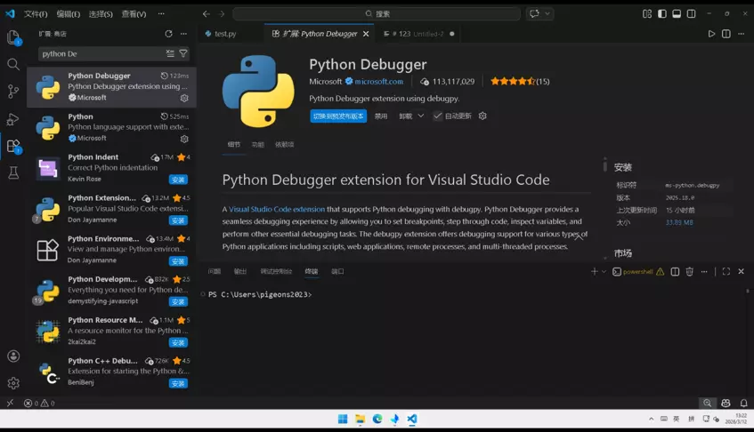
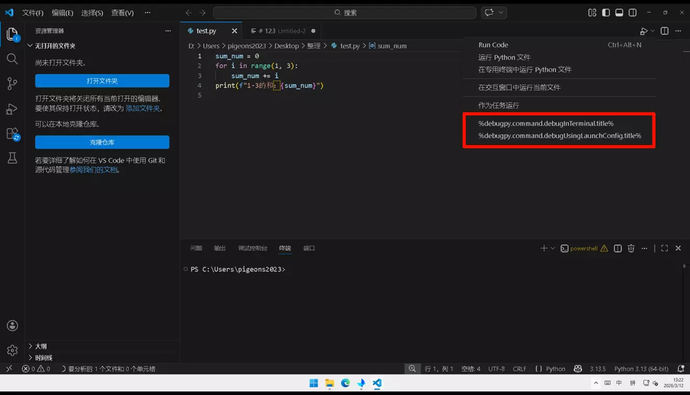
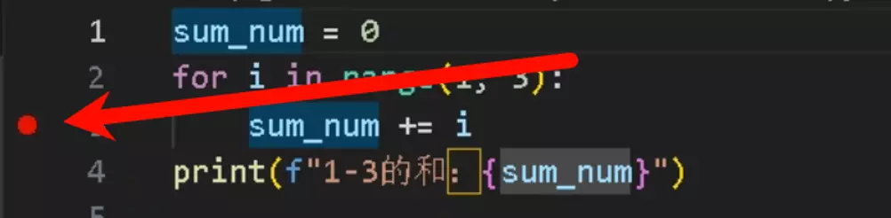
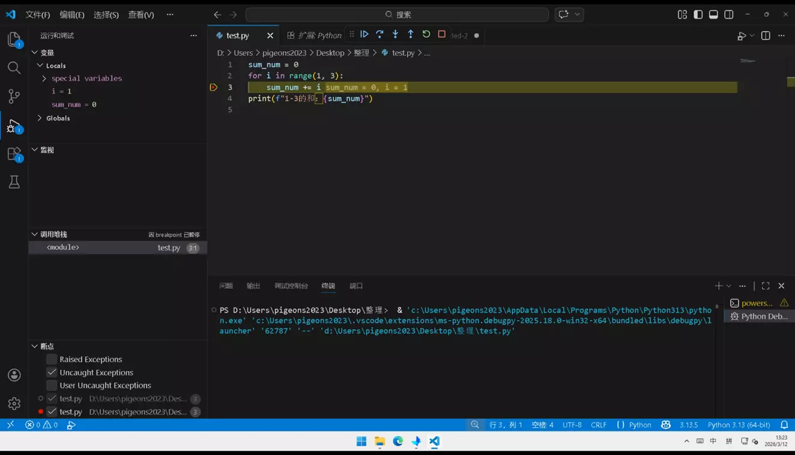
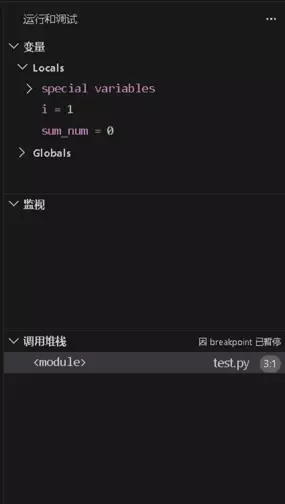
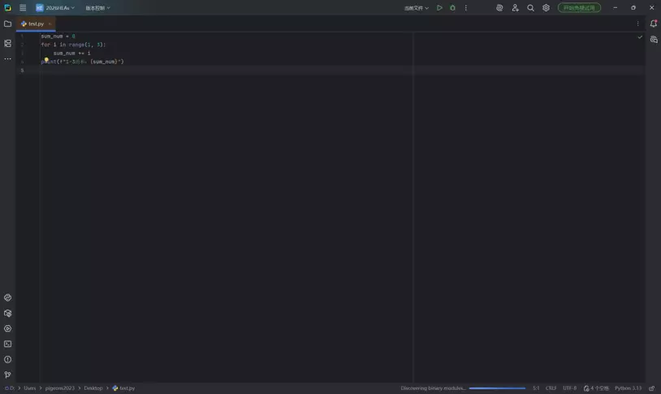
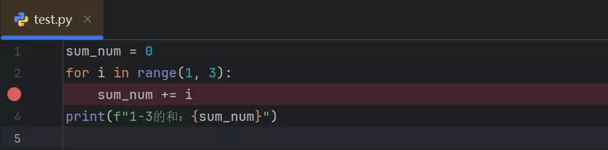
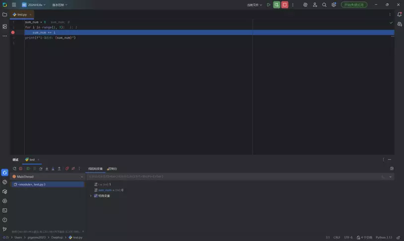
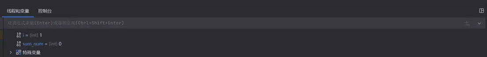
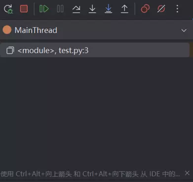

:::note
Python作为计算机学生的必修课，同时也是当下最热门的编程语言之一，我们将以一种基础、简单的方式，向大家介绍Python，带领大家一步一步学习Python语言！
:::

### Python是什么？

Python是由荷兰程序员Guido van Rossum于1989年构思、1991 年正式推出的解释型面向对象程序设计语言。

Python由Python Software Foundation（Python软件基金会）维护，是一款开源免费的编程语言，凭借简洁的语法和丰富的生态，成为全球最受欢迎的编程语言之一。

Python无严格的体系划分，核心应用方向可分为三类：

- 通用开发（Python Core）：涵盖基础语法、文件操作、网络编程等通用能力，是所有方向的基础
- 专业领域开发：包括Web开发（Django/Flask）、数据分析（Pandas/NumPy）、人工智能（TensorFlow/PyTorch）等
- 自动化开发：涵盖自动化运维、自动化测试、网络爬虫等场景化应用

2008 年Python 3.0版本发布，解决了Python 2.x的设计缺陷，目前Python 3.x已成为主流版本，Python 2.x已于2020年停止维护。

### Python的特点是什么？

1. **语法简洁，易上手**：Python抛弃了复杂的语法符号（比如C/C++的分号、大括号），采用贴近自然语言的语法风格，代码可读性极高。新手写第一行可运行的代码往往只需要几分钟。
2. **跨平台与解释型**：无需编译成机器码，代码直接由解释器逐行执行，调试、修改代码更灵活；一份代码可以在 Windows、Mac、Linux 等系统上运行，无需针对不同系统做大量适配。
3. **丰富的库与生态**：官方标准库覆盖了文件操作、网络编程、数据处理等几乎所有基础场景；第三方库更是数量庞大，能快速解决各类问题，避免重复造轮子。
4. **多范式编程**：支持面向对象、面向过程、函数式编程，你可以根据场景选择最适合的编程风格，灵活性极高。
5. **应用场景广泛**：Python能覆盖：数据分析/可视化；Web开发；人工智能/机器学习；自动化脚本；后端服务、运维开发等。
6. **动态类型**：无需提前声明变量类型，解释器会自动识别，代码更简洁，但也需要注意运行时的类型错误。

### 出入茅庐

#### 1.安装 Python、IDE、基础使用

**Python核心介绍**：Python是解释型语言，必须先安装解释器才能运行代码。推荐安装3.8+版本，支持Windows/macOS/Linux系统。

**安装步骤**

1. **下载安装包**

- 访问 Python 官方下载地址：https://www.python.org/downloads/
- 选择「Python 3.10.x」（稳定版），点击「Download Windows Installer (64-bit)」下载。

2. **运行安装包**

- 勾选 Add Python 3.10 to PATH（关键！自动配置环境变量，避免手动配置）；
- 点击「Install Now」默认安装，或「Customize installation」自定义安装路径；
  安装完成后，点击「Disable path length limit」（解决路径过长问题）。

3. **验证安装成功**

- 按下 Win+R，输入 cmd 打开命令提示符；
- 输入 python --version（或 python3 --version），回车后显示 Python 3.10.x 则安装成功。

**Pycharm核心介绍**：PyCharm是最主流的Python集成开发环境（IDE），提供代码补全、语法检查、调试等功能，新手推荐安装「社区版（Community）」（免费）。

**安装步骤**

1. **下载安装包**

- 访问 PyCharm 官方下载地址：https://www.jetbrains.com/pycharm/download/
- 选择「Community Edition」（社区版），对应系统下载（Windows/macOS/Linux）。

2. **安装（Windows 为例）**

- 运行安装包，点击「Next」；选择安装路径，点击「Next」；
- 勾选以下选项（方便使用）：
  - Create Desktop Shortcut；
  - Add launchers dir to PATH；
  - Associate .py files with PyCharm；
- 点击「Install」，等待安装完成后点击「Finish」。

3. **首次启动配置**

- 启动PyCharm，选择「Do not import settings」；
- 选择主题，点击「Next」直到完成。

**基础使用**

1. **打开终端 / 命令提示符**
   Windows：PyCharm底部Terminal；
   手动：Win+R→cmd→切换到项目路径
2. **创建虚拟环境**

```bash
# 创建名为 venv 的虚拟环境
python -m venv venv
```

3. **激活虚拟环境**

```bash
venv\Scripts\activate
```

（激活后终端前缀显示 (venv)）

**HTTP核心介绍**

http.server是Python内置模块，无需安装额外依赖，可快速搭建本地HTTP服务器，用于测试静态文件（如HTML、图片）。

```bash
# 方式：默认当前目录作为服务器根目录
python -m http.server 8000
```

### 入门基石

#### 1.Python 输入输出

**核心介绍**

这是Python最基础的交互方式：print()用于输出内容到控制台，input()用于接收用户从控制台输入的内容，是新手写第一个程序的核心。

**基本结构**

```python
# 输出：直接打印内容/变量
print(内容/变量)

# 输入：接收用户输入，默认返回字符串类型
变量 = input("提示文字")
```

**代码示例**

```python
# 基础输出
print("Hello Python!")  # 打印字符串
print(100 + 200)        # 打印计算结果
 
# 基础输入
name = input("请输入你的名字：")
age = int(input("请输入你的年龄："))  # 转换为整数
print(f"你好{name}，你今年{age}岁")  # 格式化输出
```

**练习题**

1、编写程序，接收用户输入的身高（cm）和体重（kg），计算BMI指数（BMI=体重/(身高/100)²）并打印结果。

2、编写程序，打印出「你的姓名是XXX，你的生日是XXXX年XX月XX日」，其中姓名和生日通过input获取。

**参考答案**

```python
# 练习题1
height = float(input("请输入你的身高（cm）："))
weight = float(input("请输入你的体重（kg）："))
bmi = weight / ((height/100) **2)
print(f"你的BMI指数是：{bmi:.2f}")  # 保留2位小数
```

```python
# 练习题2
name = input("请输入你的姓名：")
birthday = input("请输入你的生日（格式：XXXX年XX月XX日）：")
print(f"你的姓名是{name}，你的生日是{birthday}")
```

#### 补充：调试python程序

**核心介绍**
调试（Debug）就是在程序出现问题时，通过一些方法找出程序出错的原因和位置，并进行修复的过程。
最常见的几类bug：

- 语法错误
- 逻辑错误
- 运行错误

**Visual Studio Code**











1. **变量(Variables)**

- 这里会实时显示当前代码执行到断点时，所有可见变量的值和类型。
- Locals(局部变量)：当前函数/代码块内定义的变量；
- special variables：一些特殊内置变量；
- Globals(全局变量)：整个脚本/模块范围内的全局变量；
- **作用**：你可以直观看到变量在执行过程中的变化，快速定位逻辑错误。

2. **监视(Watch)**

- 你可以在这里手动添加表达式或变量，让调试器持续监控它们的值。
- **作用**：聚焦你最关心的计算结果，不用每次都去算一遍。

3. **调用堆栈(Call Stack)**

- 显示当前代码的函数调用链，也就是“代码是怎么一步步执行到这里的”。
- 图里显示`<module>`，说明当前停在test.py第3行的主程序入口。
- 如果是函数嵌套调用，这里会从上到下显示：当前函数→调用它的上层函数→…→最开始的主程序。
- 右侧提示“因breakpoint已暂停”，说明程序是在你设置的断点处停下来的。
- **作用**：帮你理清执行流程，尤其是在多层函数调用时，快速回溯到问题根源。


**暂停 / 继续**

快捷键：`F5`

功能：暂停当前执行的程序，或在断点处继续执行直到下一个断点或程序结束。

**单步跳过**

快捷键：`F10`

功能：执行当前行代码，不进入函数内部，直接跳到下一行。适合快速跳过已知没问题的函数调用。

**单步进入**

快捷键：`F11`

功能：执行当前行代码，如果这行是函数调用，就进入函数内部，停在函数第一行。适合深入排查函数内部逻辑。

**单步跳出**

快捷键：`Shift + F11 `

功能：执行完当前函数的剩余代码，跳出到函数被调用的下一行。适合快速结束当前函数调试，回到上层逻辑。

**重启**

快捷键：`Ctrl + Shift + F5` *(Windows/Linux)* / `Cmd + Shift + F5` *(Mac)*

功能：重新启动调试会话，从程序入口重新开始执行，保留当前断点设置。

**停止**

快捷键：`Shift + F5 `

功能：终止当前调试会话，结束程序运行并退出调试模式。

**Pycharm**









1. **线程和变量 (Threads & Variables)**

- 变量展示：这些都是当前代码作用域内的局部变量，会随着代码执行实时更新
- 特殊变量：展开后可以查看一些内置特殊变量（如__name__、__file__等）
- 线程管理：在多线程调试时，这里会列出所有活跃线程，方便你切换查看不同线程的变量状态

2. **控制台 (Console)**

- 切换到这个标签页后，你可以：查看程序运行时的标准输出/错误输出；在断点暂停时，交互式执行代码：直接输入表达式（如 `i + sum_num`）并回车，就能实时计算结果；临时修改变量值：比如输入 `i = 5`来改变当前变量值，测试不同逻辑

3. **顶部输入栏**

- 求值：输入表达式（如 `i*2`），按回车直接计算并显示结果
- 添加监视：输入表达式后按 `Ctrl+Shift+Enter`，会把它加入“监视”列表，每次断点暂停时自动更新结果



1. **顶部调试控制栏**

- 调试重启：重新启动当前调试会话
- 停止：终止调试进程
- 继续（`F9`）：从断点处继续执行到下一个断点
- 暂停：暂停正在运行的程序
- 单步跳过（`F8`）：执行当前行，不进入函数
- 单步进入（`F7`）：执行当前行，进入函数内部
- 强制单步进入（`Alt+Shift+F7`）：忽略调试设置，强制进入任何函数
- 单步跳出（`Shift+F8`）：跳出当前函数，回到调用处
- 重新运行：重新执行整个程序
- 屏蔽断点：临时禁用所有断点，让程序正常跑完
- 更多选项：打开调试设置、查看历史等

2. **线程与调用堆栈区域**

`MainThread`：当前调试的主线程

`<module>`, test.py:3：表示当前程序停在 test.py 文件的第 3 行

`<module>`：说明当前在脚本的顶层作用域这就是调用堆栈，显示代码执行到这里的完整调用链

#### 2.Python 变量类型

**核心介绍**

变量是存储数据的「容器」，Python无需声明类型，赋值时自动确定。核心基础类型包括整数、浮点数、字符串、布尔值，是所有编程的基础。

**基本结构**

```python
# 变量赋值：变量名 = 数据值
变量名 = 数值/字符串/布尔值
```

**代码示例**

```python
# 不同类型的变量
num_int = 25          # 整数(int)
num_float = 98.5      # 浮点数(float)
str_info = "Python"   # 字符串(str)
bool_flag = True      # 布尔值(bool)
 
# 查看变量类型
print(type(num_float))  # <class 'float'>
print(type(bool_flag))  # <class 'bool'>
```

**练习题**

1、定义变量存储「手机号（整数）」「邮箱（字符串）」「是否是会员（布尔值）」，打印所有变量的值和类型。

2、将字符串"78.9"转换为浮点数，将整数2024转换为字符串，打印转换结果和类型。

**参考答案**

```python
# 练习题1
phone = 13800138000
email = "test@python.com"
is_vip = True
 
print(phone, type(phone))  # 13800138000 <class 'int'>
print(email, type(email))  # test@python.com <class 'str'>
print(is_vip, type(is_vip))# True <class 'bool'>
```

```python
# 练习题2
str_num = "78.9"
float_num = float(str_num)
print(float_num, type(float_num))  # 78.9 <class 'float'>
 
int_num = 2024
str_num2 = str(int_num)
print(str_num2, type(str_num2))    # 2024 <class 'str'>
```

#### 3.Python Number

**核心介绍**

Number是数字类型的总称，包括整数（int）、浮点数（float），是数值计算的核心，新手重点掌握整数和浮点数的运算即可。

**基本结构**

```python
# 整数：无小数点
int_var = 100
# 浮点数：带小数点
float_var = 3.14
```

**代码示例**

```python
# 整数运算
a = 15
b = 4
print(a + b)   # 加法：19
print(a // b)  # 整除：3
print(a % b)   # 取余：3
 
# 浮点数运算
pi = 3.14
r = 5
area = pi * r * r  # 圆的面积
print(f"半径为5的圆面积：{area}")
```

**练习题**

1、计算长方形的周长和面积（长8.5cm，宽4cm），公式：周长=2*(长+宽)，面积=长×宽。

2、计算100除以7的商（保留2位小数）和余数。

**参考答案**

```python
# 练习题1
length = 8.5
width = 4
perimeter = 2 * (length + width)
area = length * width
print(f"周长：{perimeter}cm，面积：{area}cm²")  # 周长：25.0cm，面积：34.0cm²
```

```python
# 练习题2
dividend = 100
divisor = 7
quotient = dividend / divisor
remainder = dividend % divisor
print(f"商：{quotient:.2f}，余数：{remainder}")  # 商：14.29，余数：2
```

#### 4.Python 运算符

**核心介绍**

运算符是对变量/数据进行计算的「工具」，包括算术、赋值、比较、逻辑四类，是实现程序逻辑的基础。

**基本结构**

```python
# 算术运算符：+ - * / // % **
# 赋值运算符：= += -= *= /=
# 比较运算符：> < >= <= == !=
# 逻辑运算符：and or not
```

**代码示例**

```python
# 算术+赋值运算
x = 10
x += 5  # 等价于x = x + 5
print(x)  # 15
 
# 比较+逻辑运算
score = 85
print(score >= 60 and score < 90)  # True（及格且未优秀）
print(not (score == 100))          # True（分数不是100）
```

**练习题**

1、用运算符判断一个输入的整数是否是偶数（能被2整除，即余数为0）。

2、定义变量a=20，依次执行a-=5、a*=3、a/=2，打印最终的a值。

**参考答案**

```python
# 练习题1
num = int(input("请输入一个整数："))
if num % 2 == 0:
    print(f"{num}是偶数")
else:
    print(f"{num}是奇数")
```

```python
# 练习题2
a = 20
a -= 5  # 15
a *= 3  # 45
a /= 2  # 22.5
print(a)  # 22.5
```

### 逻辑控制

#### 1.Python 条件语句

**核心介绍**

条件语句让程序根据「条件是否成立」执行不同代码，核心是if-elif-else，是程序分支逻辑的核心。

**基本结构**

```python
if 条件1:
    条件1成立时执行的代码
elif 条件2:
    条件1不成立、条件2成立时执行的代码
else:
    所有条件都不成立时执行的代码
```

**代码示例**

```python
# 成绩等级判断
score = int(input("请输入成绩："))
if score >= 90:
    print("优秀")
elif score >= 80:
    print("良好")
elif score >= 60:
    print("及格")
else:
    print("不及格")
```

**练习题**

1、编写程序，根据输入的年龄判断：<18岁为未成年人，18-60岁为成年人，>60岁为老年人。

2、编写程序，判断输入的整数是正数、负数还是0。

**参考答案**

```python
# 练习题1
age = int(input("请输入年龄："))
if age < 18:
    print("未成年人")
elif age <= 60:
    print("成年人")
else:
    print("老年人")
```

```python
# 练习题2
num = int(input("请输入一个整数："))
if num > 0:
    print("正数")
elif num < 0:
    print("负数")
else:
    print("0")
```

#### 2.Python 循环语句

**核心介绍**

循环语句让程序重复执行一段代码，Python核心有while和for两种循环，是处理重复任务的关键。

#### 3.Python While 循环语句

**核心介绍**

while循环是「条件型循环」：只要条件成立，就重复执行代码，适合不确定循环次数的场景。

**基本结构**

```python
while 条件:
    循环体代码（条件成立时执行）
    # 注意：必须有终止条件，避免死循环while 条件:
    循环体代码（条件成立时执行）
    # 注意：必须有终止条件，避免死循环
```

**代码示例**

```python
# 计算1-10的累加和
sum_num = 0
i = 1
while i <= 10:
    sum_num += i
    i += 1  # 终止条件：i超过10
print(f"1-10的和：{sum_num}")  # 55
```

**练习题**

1、用while循环打印10以内的所有偶数。

2、用while循环实现：接收用户输入的数字，直到输入0时停止，打印所有输入的数字之和。

**参考答案**

```python
# 练习题1
i = 0
while i <= 10:
    print(i)
    i += 2
```

```python
# 练习题2
sum_input = 0
while True:
    num = int(input("请输入数字（输入0停止）："))
    if num == 0:
        break
    sum_input += num
print(f"所有输入数字的和：{sum_input}")
```

#### 4.Python for 循环语句

**核心介绍**

for循环是「遍历型循环」：遍历序列（字符串、列表等）中的每个元素，适合确定循环次数的场景。

**基本结构**

```python
for 变量 in 序列:
    遍历每个元素时执行的代码
```

**代码示例**

```python
# 遍历字符串
str1 = "Python"
for char in str1:
    print(char)
 
# 遍历数字范围（1-5）
for i in range(1, 6):
    print(i)
```

**练习题**

1、用for循环计算1-100的累加和。

2、用for循环遍历列表[10,20,30,40,50]，打印每个元素的2倍值。

**参考答案**

```python
# 练习题1
sum_num = 0
for i in range(1, 101):
    sum_num += i
print(f"1-100的和：{sum_num}")  # 5050
```

```python
# 练习题2
nums = [10,20,30,40,50]
for num in nums:
    print(num * 2)
```

#### 5.Python 循环嵌套

**核心介绍**

循环嵌套是「循环里套循环」，常用于处理二维数据（如打印九九乘法表、矩阵），是循环进阶的基础。

**基本结构**

```python
# for循环嵌套
for 变量1 in 序列1:
    for 变量2 in 序列2:
        内层循环代码
```

**代码示例**

```python
# 打印3行4列的星号
for i in range(3):
    for j in range(4):
        print("*", end=" ")  # end=" "不换行
    print()  # 换行
```

**练习题**

1、用循环嵌套打印九九乘法表（1×1=1到9×9=81）。

2、用循环嵌套打印5行，每行的星号数量依次为1、2、3、4、5。

**参考答案**

```python
# 练习题1
for i in range(1, 10):
    for j in range(1, i+1):
        print(f"{j}×{i}={i*j}", end=" ")
    print()
```

```python
# 练习题2
for i in range(1, 6):
    for j in range(i):
        print("*", end="")
    print()
```

#### 6.Python break 语句

**核心介绍**

break用于强制终止当前循环，跳出循环体，不再执行后续循环代码。

**基本结构**

```python
for/while 条件:
    代码1
    if 终止条件:
        break
    代码2
```

**代码示例**

```python
# 遍历1-10，遇到5就终止循环
for i in range(1, 11):
    if i == 5:
        break
    print(i)  # 输出1-4
```

**练习题**

1、用for循环遍历1-20，遇到能被7整除的数就终止循环，打印终止前的所有数。

2、接收用户输入的密码，最多输入3次，输入正确则终止循环，否则提示次数用完。

**参考答案**

```python
# 练习题1
for i in range(1, 21):
    if i % 7 == 0:
        break
    print(i)
```

```python
# 练习题2
correct_pwd = "123456"
for i in range(3):
    pwd = input("请输入密码：")
    if pwd == correct_pwd:
        print("密码正确")
        break
    else:
        print(f"密码错误，还剩{2-i}次机会")
else:
    print("次数用完，锁定账号")
```

#### 7.Python continue 语句

**核心介绍**

continue用于跳过当前次循环，直接进入下一次循环，不终止整个循环。

**基本结构**

```python
for/while 条件:
    代码1
    if 跳过条件:
        continue
    代码2  # 跳过条件成立时，此代码不执行
```

**代码示例**

```python
# 打印1-10的奇数（跳过偶数）
for i in range(1, 11):
    if i % 2 == 0:
        continue
    print(i)  # 输出1,3,5,7,9
```

**练习题**

1、用for循环遍历1-100，跳过能被5整除的数，打印其余数字。

2、接收用户输入的10个数字，累加所有正数，跳过负数和0。

**参考答案**

```python
# 练习题1
for i in range(1, 101):
    if i % 5 == 0:
        continue
    print(i)
```

```python
# 练习题2
sum_positive = 0
for _ in range(10):
    num = float(input("请输入数字："))
    if num <= 0:
        continue
    sum_positive += num
print(f"所有正数的和：{sum_positive}")
```

#### 8.Python pass 语句

**核心介绍**

pass是「空语句」，仅作为占位符，语法上需要代码块但暂时不想写逻辑时使用，不会影响程序执行。

**基本结构**

```python
if 条件:
    pass  # 暂时不写逻辑，避免语法错误
```

**代码示例**

```python
# 定义空的条件分支（后续补充逻辑）
score = 75
if score >= 90:
    pass  # 优秀逻辑待补充
elif score >= 60:
    print("及格")
else:
    pass  # 不及格逻辑待补充
```

**练习题**

1、编写一个for循环遍历列表[1,2,3,4,5]，对偶数执行pass，对奇数打印出来。

2、定义一个空的while循环（条件为True），用pass占位（注意：实际运行需加break，避免死循环）。

**参考答案**

```python
# 练习题1
nums = [1,2,3,4,5]
for num in nums:
    if num % 2 == 0:
        pass
    else:
        print(num)
```

```python
# 练习题2
i = 0
while True:
    pass
    i += 1
    if i > 5:
        break
```

### 数据结构

#### 1.Python 字符串

**核心介绍**

字符串是字符的序列，用于存储文本数据，Python 提供丰富的操作方法（切片、拼接、替换等）。

**基本结构**

```python
# 字符串定义：单引号/双引号/三引号
str1 = 'hello'
str2 = "world"
str3 = """多行
字符串"""
```

**代码示例**

```python
# 字符串操作
s = "Python编程"
print(s[0:6])       # 切片：Python
print(s + "入门")   # 拼接：Python编程入门
print(s.replace("编程", "学习"))  # 替换：Python学习
print(len(s))       # 长度：8
```

**练习题**

1、接收用户输入的字符串，判断是否以"Py"开头，以"n"结尾。

2、将输入的字符串反转打印（如输入"abc"，输出"cba"）。

**参考答案**

```python
# 练习题1
s = input("请输入字符串：")
if s.startswith("Py") and s.endswith("n"):
    print("符合条件")
else:
    print("不符合条件")
```

```python
# 练习题2
s = input("请输入字符串：")
print(s[::-1])  # 切片反转
```

#### 2.Python 列表

**核心介绍**

列表是有序、可变的序列，可存储不同类型的数据，是Python最常用的容器。

**基本结构**

```python
# 列表定义
list1 = [元素1, 元素2, 元素3]
```

**代码示例**

```python
# 列表操作
fruits = ["苹果", "香蕉", "橙子"]
print(fruits[1])          # 取值：香蕉
fruits.append("葡萄")     # 添加元素
fruits.remove("香蕉")     # 删除元素
print(fruits)             # ['苹果', '橙子', '葡萄']
```

**练习题**

1、编写程序，接收用户输入的5个数字，存入列表，计算列表的最大值、最小值和平均值。

2、反转列表[10,20,30,40,50]，并打印结果。

**参考答案**

```python
# 练习题1
nums = []
for _ in range(5):
    num = float(input("请输入数字："))
    nums.append(num)
print(f"最大值：{max(nums)}")
print(f"最小值：{min(nums)}")
print(f"平均值：{sum(nums)/len(nums)}")
```

```python
# 练习题2
nums = [10,20,30,40,50]
nums.reverse()
print(nums)  # [50,40,30,20,10]
```

#### 3.Python 元组

**核心介绍**

元组是有序、不可变的序列，语法和列表类似，但元素不能修改，适合存储固定数据。

**基本结构**

```python
# 元组定义：小括号（也可省略）
tuple1 = (元素1, 元素2, 元素3)
```

**代码示例**

```python
# 元组操作
t = (10, "Python", 3.14)
print(t[0])          # 取值：10
print(len(t))        # 长度：3
# t[0] = 20  # 报错：元组不可修改
```

**练习题**

1、定义一个元组存储个人信息（姓名、年龄、性别），打印每个元素。

2、将元组(1,2,3)转换为列表，修改第二个元素为10，再转换回元组。

**参考答案**

```python
# 练习题1
info = ("小明", 18, "男")
for item in info:
    print(item)
```

```python
# 练习题2
t = (1,2,3)
lst = list(t)
lst[1] = 10
t_new = tuple(lst)
print(t_new)  # (1,10,3)
```

#### 4.Python 字典

**核心介绍**

字典是「键值对」结构，无序、可变，通过「键」快速查找「值」，适合存储有映射关系的数据。

**基本结构**

```python
# 字典定义：大括号，键值对用冒号分隔
dict1 = {"键1": 值1, "键2": 值2}
```

**代码示例**

```python
# 字典操作
student = {"name": "小红", "age": 19, "score": 90}
print(student["name"])        # 取值：小红
student["age"] = 20           # 修改值
student["gender"] = "女"      # 添加键值对
print(student)                # {'name':'小红','age':20,'score':90,'gender':'女'}
```

**练习题**

1、定义字典存储3个学生的信息（学号为键，姓名为值），遍历打印所有学号和姓名。

2、接收用户输入的键，判断是否存在于字典中，存在则打印对应值，不存在则提示。

**参考答案**

```python
# 练习题1
students = {"2024001": "小明", "2024002": "小红", "2024003": "小刚"}
for id, name in students.items():
    print(f"学号：{id}，姓名：{name}")
```

```python
# 练习题2
info = {"city": "北京", "area": "海淀", "zip": 100080}
key = input("请输入要查询的键：")
if key in info:
    print(f"对应值：{info[key]}")
else:
    print("键不存在")
```

### 进阶基础

#### 1.Python 内置函数

**核心介绍**

Python内置了大量常用函数（如print()、len()、max()、sum()等），无需定义即可直接使用，提升开发效率。

**基本结构**

```python
# 内置函数调用：函数名(参数)
结果 = 内置函数(参数)
```

**代码示例**

```python
# 常用内置函数
lst = [5,2,8,1]
print(len(lst))    # 长度：4
print(max(lst))    # 最大值：8
print(sorted(lst)) # 排序：[1,2,5,8]
print(abs(-10))    # 绝对值：10
```

**练习题**

1、用内置函数计算列表[3,7,1,9,4]的总和、平均值、长度。

2、用round()函数将3.1415926保留3位小数，用type()函数判断结果类型。

**参考答案**

```python
# 练习题1
lst = [3,7,1,9,4]
total = sum(lst)
avg = total / len(lst)
print(f"总和：{total}，平均值：{avg}，长度：{len(lst)}")
```

```python
# 练习题2
num = round(3.1415926, 3)
print(num)          # 3.142
print(type(num))    # <class 'float'>
```

#### 2.Python 函数

**核心介绍**

函数是封装可重复使用的代码块，通过def定义，可接收参数、返回结果，是代码复用的核心。

**基本结构**

```python
def 函数名(参数1, 参数2):
    函数体代码
    return 返回值  # 可选
```

**代码示例**

```python
# 定义求和函数
def add(a, b):
    result = a + b
    return result
 
# 调用函数
print(add(10, 20))  # 30
print(add(3.5, 4.5))# 8.0
```

**练习题**

1、定义函数，接收两个数，返回较大的数。

2、定义函数，接收一个列表，返回列表中所有偶数的和。

**参考答案**

```python
# 练习题1
def max_num(a, b):
    if a > b:
        return a
    else:
        return b
 
print(max_num(15, 20))  # 20
```

```python
# 练习题2
def sum_even(lst):
    total = 0
    for num in lst:
        if num % 2 == 0:
            total += num
    return total
 
print(sum_even([1,2,3,4,5]))  # 6
```

#### 3.Python 模块

**核心介绍**

模块是包含Python定义和语句的文件（.py），可导入并使用其中的函数/变量，实现代码的模块化管理。

**基本结构**

```python
# 导入模块
import 模块名
# 导入模块中的指定函数
from 模块名 import 函数名
# 导入模块起别名
import 模块名 as 别名
```

**代码示例**

```python
# 导入math模块（数学相关函数）
import math
print(math.pi)          # 圆周率：3.141592653589793
print(math.sqrt(16))    # 平方根：4.0
 
# 导入random模块的randint函数
from random import randint
print(randint(1, 10))   # 生成1-10的随机整数
```

**练习题**

1、用math模块的ceil()（向上取整）和floor()（向下取整）函数处理3.2和3.8。

2、用random模块生成一个1-100的随机整数，让用户猜数字，直到猜对为止。

**参考答案**

```python
# 练习题1
import math
print(math.ceil(3.2))   # 4
print(math.floor(3.2))  # 3
print(math.ceil(3.8))   # 4
print(math.floor(3.8))  # 3
```

```python
# 练习题2
from random import randint
target = randint(1, 100)
while True:
    guess = int(input("请猜数字（1-100）："))
    if guess == target:
        print("猜对了！")
        break
    elif guess < target:
        print("太小了，再试试")
    else:
        print("太大了，再试试")
```

#### 4.Python 异常处理

**核心介绍**

异常处理用于捕获程序运行时的错误（如除零、类型错误），避免程序崩溃，核心是try-except。

**基本结构**

```python
try:
    可能出错的代码
except 异常类型:
    出错时执行的代码
else:
    没出错时执行的代码（可选）
finally:
    无论是否出错都执行的代码（可选）
```

**代码示例**

```python
# 处理除零异常
try:
    a = 10
    b = 0
    print(a / b)
except ZeroDivisionError:
    print("错误：除数不能为0")
else:
    print("计算成功")
finally:
    print("程序执行完毕")
```

**练习题**

1、编写程序，接收用户输入的数字，用异常处理捕获非数字输入的错误。

2、编写程序，读取一个不存在的文件，用异常处理捕获文件不存在的错误。

**参考答案**

```python
# 练习题1
try:
    num = float(input("请输入一个数字："))
    print(f"你输入的数字是：{num}")
except ValueError:
    print("错误：请输入有效的数字")
```

```python
# 练习题2
try:
    f = open("none.txt", "r")
    f.close()
except FileNotFoundError:
    print("错误：文件不存在")
```

### 实用进阶

#### 1.Python 日期和时间

**核心介绍**

处理日期和时间需导入datetime模块，可实现日期的获取、格式化、计算等操作。

**基本结构**

```python
import datetime
# 获取当前时间
now = datetime.datetime.now()
# 格式化时间
now_str = now.strftime("格式字符串")
```

**代码示例**

```python
import datetime
 
# 获取当前时间
now = datetime.datetime.now()
print(now)  # 2026-03-10 12:00:00.123456
 
# 格式化
print(now.strftime("%Y-%m-%d %H:%M:%S"))  # 2026-03-10 12:00:00
 
# 计算昨天的日期
yesterday = now - datetime.timedelta(days=1)
print(yesterday.strftime("%Y-%m-%d"))
```

**练习题**

1、编写程序，打印当前的年月日时分秒（格式：2026年03月10日 12:00:00）。
2、计算从当前时间到 2027年1月1日还有多少天。

**参考答案**

```python
# 练习题1
import datetime
now = datetime.datetime.now()
print(now.strftime("%Y年%m月%d日 %H:%M:%S"))
```

```python
# 练习题2
import datetime
now = datetime.datetime.now()
target = datetime.datetime(2027, 1, 1)
delta = target - now
print(f"还有{delta.days}天")
```

#### 2.Python 文件I/O

**核心介绍**

文件I/O实现对文件的读写操作，核心是open()函数，需注意文件打开模式和关闭操作。

#### 3.Python File 方法

**核心介绍**

open()返回的文件对象有丰富的方法（如read()、write()、readline()等），用于读写文件内容。

**基本结构**

```python
# 写文件
with open("文件名", "模式") as f:
    f.write(内容)  # 自动关闭文件，推荐用法
 
# 读文件
with open("文件名", "模式") as f:
    content = f.read()
```

**代码示例**

```python
# 写文件
with open("test.txt", "w", encoding="utf-8") as f:
    f.write("Hello Python\n")
    f.write("文件操作入门")
 
# 读文件
with open("test.txt", "r", encoding="utf-8") as f:
    content = f.read()
    print(content)
```

**练习题**

1、编写程序，将用户输入的3行内容写入文件，然后读取并打印所有内容。

2、编写程序，读取文件中的内容，统计其中包含的行数和字符数。

**参考答案**

```python
# 练习题1
# 写文件
with open("user_input.txt", "w", encoding="utf-8") as f:
    for _ in range(3):
        line = input("请输入内容：")
        f.write(line + "\n")
 
# 读文件
with open("user_input.txt", "r", encoding="utf-8") as f:
    print(f.read())
```

```python
# 练习题2
with open("test.txt", "r", encoding="utf-8") as f:
    lines = f.readlines()
    line_count = len(lines)
    char_count = len("".join(lines))
print(f"行数：{line_count}，字符数：{char_count}")
```

#### 4.Python Sqlite

**核心介绍**

SQLite是轻量级嵌入式数据库，Python内置sqlite3模块，无需安装数据库服务即可操作数据库。

**基本结构**

```python
import sqlite3
# 连接数据库（不存在则创建）
conn = sqlite3.connect("test.db")
cursor = conn.cursor()
# 执行SQL
cursor.execute(SQL语句)
conn.commit()  # 提交修改
# 关闭连接
cursor.close()
conn.close()
```

**代码示例**

```python
import sqlite3
 
# 连接数据库
conn = sqlite3.connect("student.db")
cursor = conn.cursor()
 
# 创建表
cursor.execute("CREATE TABLE IF NOT EXISTS student (id INT, name TEXT, score INT)")
 
# 插入数据
cursor.execute("INSERT INTO student VALUES (1, '小明', 90)")
conn.commit()
 
# 查询数据
cursor.execute("SELECT * FROM student")
print(cursor.fetchall())  # [(1, '小明', 90)]
 
# 关闭
cursor.close()
conn.close()
```

**练习题**

1、编写程序，在SQLite中创建「book」表（id、书名、价格），插入2条数据，查询并打印所有数据。

2、编写程序，查询book表中价格大于50的书籍。

**参考答案**

```python
# 练习题1
import sqlite3
conn = sqlite3.connect("book.db")
cursor = conn.cursor()
 
# 创建表
cursor.execute("CREATE TABLE IF NOT EXISTS book (id INT, name TEXT, price FLOAT)")
 
# 插入数据
cursor.execute("INSERT INTO book VALUES (1, 'Python入门', 49.9)")
cursor.execute("INSERT INTO book VALUES (2, 'SQL进阶', 69.9)")
conn.commit()
 
# 查询
cursor.execute("SELECT * FROM book")
print(cursor.fetchall())  # [(1, 'Python入门', 49.9), (2, 'SQL进阶', 69.9)]
 
cursor.close()
conn.close()
```

```python
# 练习题2
import sqlite3
conn = sqlite3.connect("book.db")
cursor = conn.cursor()
cursor.execute("SELECT * FROM book WHERE price > 50")
print(cursor.fetchall())  # [(2, 'SQL进阶', 69.9)]
cursor.close()
conn.close()
```

#### 补充：SQL语句

SQLite 无需手动「创建数据库」，连接不存在的数据库文件时会自动创建（这是 SQLite 最显著的特点）。

**1.连接/创建数据库**

```bash
# 连接（不存在则创建）名为 test.db 的数据库文件
sqlite3 test.db
```

**2.查看当前数据库**

```sql
-- 查看当前连接的数据库文件路径
SELECT sqlite_version(), database();
```

**3.创建表**

```sql
CREATE TABLE [IF NOT EXISTS] 表名 (
    字段1 数据类型 [约束],
    字段2 数据类型 [约束],
    ...
    [PRIMARY KEY (主键字段)]
);
```

**示例：创建学生表**

```sql
CREATE TABLE IF NOT EXISTS students (
    id INTEGER PRIMARY KEY AUTOINCREMENT,  -- 自增主键
    name TEXT NOT NULL,                   -- 姓名，非空
    age INTEGER DEFAULT 18,               -- 年龄，默认18
    score REAL,                           -- 成绩，浮点型
    create_time TIMESTAMP DEFAULT CURRENT_TIMESTAMP  -- 创建时间，默认当前时间
);
```

**4.常用数据类型：**
INTEGER：整数（int）
TEXT：字符串（varchar）
REAL：浮点数（float/double）
BLOB：二进制数据（如文件）
TIMESTAMP：时间戳

**5.查看表结构/所有表**

```sql
-- 查看所有表
.tables
 
-- 查看指定表结构（students）
PRAGMA table_info(students);
-- 或（兼容标准SQL）
SELECT * FROM sqlite_master WHERE type='table' AND name='students';
```

**6.修改表**

```sql
-- 1. 添加字段
ALTER TABLE students ADD COLUMN gender TEXT DEFAULT '未知';
 
-- 2. 修改表名
ALTER TABLE students RENAME TO student_info;
```

**注意**：SQLite 不支持直接修改字段（如类型 / 约束），需通过「新建表 + 数据迁移」实现。

**7.删除表**

```sql
DROP TABLE IF EXISTS students;
```

**8.插入数据**

```sql
-- 方式1：指定字段插入
INSERT INTO students (name, age, score) VALUES ('小明', 18, 92.5);
 
-- 方式2：插入多条数据
INSERT INTO students (name, age, score) 
VALUES ('小红', 17, 88.0), ('小李', 19, 79.5);
 
-- 方式3：插入所有字段（主键自增可省略）
INSERT INTO students VALUES (NULL, '小王', 20, 95.0, CURRENT_TIMESTAMP, '男');
```

**9.更新数据**

```sql
-- 修改指定条件的数据（务必加WHERE，否则修改全表）
UPDATE students 
SET score = 90.0, age = 18 
WHERE name = '小李';
```

**10.删除数据**

```sql
-- 删除指定条件的数据（务必加WHERE，否则删除全表）
DELETE FROM students WHERE id = 3;
 
-- 清空表（保留表结构，自增主键重置）
DELETE FROM students;
-- 或（更快，直接重置表）
TRUNCATE TABLE students;  -- SQLite 3.35+ 支持
```

**11.基础查询**

```sql
-- 查询所有字段
SELECT * FROM students;
 
-- 查询指定字段
SELECT name, age, score FROM students;
 
-- 去重查询
SELECT DISTINCT age FROM students;
 
-- 条件查询（WHERE）
SELECT * FROM students WHERE score >= 80 AND age < 20;
 
-- 排序（ORDER BY）：ASC升序（默认），DESC降序
SELECT * FROM students ORDER BY score DESC;
 
-- 限制结果行数（LIMIT）
SELECT * FROM students LIMIT 5;  -- 取前5条
SELECT * FROM students LIMIT 2 OFFSET 3;  -- 从第4条开始取2条
```

**12.聚合查询**

```sql
-- 统计总数
SELECT COUNT(*) AS total FROM students;
 
-- 计算平均分、最高分、最低分
SELECT AVG(score) AS avg_score, MAX(score) AS max_score, MIN(score) AS min_score 
FROM students;
 
-- 分组查询（GROUP BY）：按年龄分组统计人数
SELECT age, COUNT(*) AS count
FROM students 
GROUP BY age;
```

**13.多表查询**

```sql
SELECT s.name, sc.subject, sc.score 
FROM students s
JOIN scores sc ON s.id = sc.student_id;
```

**14.事务操作**

SQLite 默认自动提交事务，可手动控制：

```sql
-- 开启事务
BEGIN TRANSACTION;
 
-- 执行操作（如插入/更新）
INSERT INTO students (name, age) VALUES ('小张', 18);
UPDATE students SET score = 85 WHERE name = '小张';
 
-- 提交事务（确认修改）
COMMIT;
 
-- 回滚事务（撤销修改）
-- ROLLBACK;
```

**15.索引**

```sql
-- 创建索引（针对频繁查询的字段）
CREATE INDEX idx_student_name ON students(name);
 
-- 删除索引
DROP INDEX idx_student_name;
```

**16.与python结合**

**步骤1：导入模块 + 连接数据库**

```python
# 导入内置的 sqlite3 模块
import sqlite3
 
# 连接数据库：test.db 是数据库文件名，不存在则在当前目录创建
conn = sqlite3.connect("test.db")
 
# 创建游标：所有 SQL 语句都通过游标执行
cursor = conn.cursor()
 
print("数据库连接成功，游标创建完成")
```

**步骤2：创建数据表**

```python
# 定义创建表的 SQL 语句（IF NOT EXISTS 避免重复创建报错）
create_sql = """
CREATE TABLE IF NOT EXISTS students (
    id INTEGER PRIMARY KEY AUTOINCREMENT,  -- 主键，自增
    name TEXT NOT NULL,                   -- 姓名，非空
    score REAL                            -- 分数（浮点型）
);
"""
 
# 执行创建表的 SQL 语句
cursor.execute(create_sql)
 
print("数据表创建成功（或已存在）")
```

**步骤3：插入数据**

```python
# 1. 插入单条数据（用 ? 占位符，避免 SQL 注入）
insert_sql = "INSERT INTO students (name, score) VALUES (?, ?)"
cursor.execute(insert_sql, ("小明", 92.5))  # 第二个参数是占位符的取值
 
# 2. 批量插入多条数据（可选）
batch_data = [("小红", 88.0), ("小李", 79.5)]
cursor.executemany(insert_sql, batch_data)
 
# 提交事务：增/删/改操作必须提交，否则数据不会写入数据库
conn.commit()
 
print("数据插入成功")
```

**步骤4：查询数据**

```python
# 1. 基础查询：查询所有学生数据
select_sql = "SELECT * FROM students"
cursor.execute(select_sql)
 
# 获取所有查询结果（返回列表，每个元素是一行数据的元组）
all_data = cursor.fetchall()
print("所有学生数据：", all_data)
 
# 2. 遍历打印（更易读）
print("\n格式化打印：")
for row in all_data:
    # row[0] = id，row[1] = 姓名，row[2] = 分数
    print(f"ID：{row[0]}，姓名：{row[1]}，分数：{row[2]}")
```

**步骤5：关闭连接**

```sql
# 先关闭游标，再关闭连接
cursor.close()
conn.close()
 
print("数据库连接已关闭")
```

#### 5.Python 多线程

**核心介绍**

多线程用于同时执行多个任务，Python通过threading模块实现，适合I/O密集型任务（如网络请求、文件读写）。

**基本结构**

```python
import threading
def 任务函数(参数):
    任务逻辑
 
# 创建线程
t = threading.Thread(target=任务函数, args=(参数,))
t.start()  # 启动线程
t.join()   # 等待线程结束
```

**代码示例**

```python
import threading
import time
 
# 定义任务
def print_num(name, delay):
    for i in range(3):
        time.sleep(delay)
        print(f"线程{name}：{i}")
 
# 创建线程
t1 = threading.Thread(target=print_num, args=("A", 1))
t2 = threading.Thread(target=print_num, args=("B", 2))
 
# 启动线程
t1.start()
t2.start()
 
# 等待结束
t1.join()
t2.join()
print("所有线程结束")
```

**练习题**

1、编写多线程程序，一个线程打印1-5（间隔1秒），另一个线程打印a-e（间隔1秒）。

2、编写多线程程序，统计两个不同文件的字符数，同时执行。


**参考答案**

```python
# 练习题1
import threading
import time
 
def print_nums():
    for i in range(1,6):
        time.sleep(1)
        print(i)
 
def print_chars():
    for c in ["a","b","c","d","e"]:
        time.sleep(1)
        print(c)
 
t1 = threading.Thread(target=print_nums)
t2 = threading.Thread(target=print_chars)
 
t1.start()
t2.start()
t1.join()
t2.join()
```

```python
# 练习题2
import threading
 
def count_chars(filename, result):
    with open(filename, "r", encoding="utf-8") as f:
        content = f.read()
        result[filename] = len(content)
 
# 存储结果的字典（线程安全）
result = {}
t1 = threading.Thread(target=count_chars, args=("test1.txt", result))
t2 = threading.Thread(target=count_chars, args=("test2.txt", result))
 
t1.start()
t2.start()
t1.join()
t2.join()
 
print(result)  # {'test1.txt': 100, 'test2.txt': 200}
```

#### 6.Python GUI 编程

**核心介绍**

Tkinter是Python内置的GUI库，用于创建图形界面程序，无需额外安装，适合入门级GUI开发。

**基本结构**

```python
import tkinter as tk
# 创建窗口
window = tk.Tk()
window.title("窗口标题")
# 添加组件
label = tk.Label(window, text="文本")
label.pack()
# 运行主循环
window.mainloop()
```

**代码示例**

```python
import tkinter as tk
from tkinter import messagebox
 
# 创建窗口
window = tk.Tk()
window.title("第一个GUI程序")
window.geometry("300x200")
 
# 定义按钮点击事件
def click():
    messagebox.showinfo("提示", "你点击了按钮！")
 
# 添加组件
label = tk.Label(window, text="欢迎使用Tkinter", font=("Arial", 12))
label.pack(pady=20)
 
button = tk.Button(window, text="点击我", command=click)
button.pack()
 
# 运行
window.mainloop()
```

**练习题**

1、编写GUI程序，包含一个输入框、一个按钮，点击按钮弹出输入框中的内容。

2、编写GUI程序，创建一个计算器界面（包含数字按钮0-9、加减乘除按钮），暂不实现计算逻辑。

**参考答案**

```python
# 练习题1
import tkinter as tk
from tkinter import messagebox
 
def show_input():
    content = entry.get()
    messagebox.showinfo("输入内容", content)
 
window = tk.Tk()
window.title("输入框示例")
window.geometry("300x100")
 
entry = tk.Entry(window, width=30)
entry.pack(pady=10)
 
btn = tk.Button(window, text="显示内容", command=show_input)
btn.pack()
 
window.mainloop()
```

```python
# 练习题2
import tkinter as tk
 
window = tk.Tk()
window.title("简易计算器")
 
# 数字按钮
for i in range(9):
    btn = tk.Button(window, text=str(i+1), width=5, height=2)
    btn.grid(row=i//3, column=i%3)
 
# 0按钮
btn0 = tk.Button(window, text="0", width=5, height=2)
btn0.grid(row=3, column=1)
 
# 运算符按钮
ops = ["+", "-", "*", "/"]
for i, op in enumerate(ops):
    btn = tk.Button(window, text=op, width=5, height=2)
    btn.grid(row=i, column=3)
 
window.mainloop()
```

#### 补充：高DPI适配的Tkinter编程

**核心介绍**

hidpi-tk基于high-dpi-tkinter重构开发，核心优势是无副作用、使用极简、跨平台兼容，自动处理Windows（含老旧系统Vista/Win7）的DPI缩放，对macOS/Linux也会自动优化字体缩放，让Tkinter界面在所有高DPI显示器上清晰显示，无需手动调整控件/字体尺寸。

**前置条件：安装库**

```bash
pip install hidpi-tk
```

**基本结构**

仅需替换1行代码，将原生tkinter.Tk替换为hidpi_tk.DPIAwareTk，其余Tkinter用法完全不变，零学习成本。

**代码示例**

```python
# 替换原生导入
# from tkinter import Tk, Label, Button
from tkinter import Label, Button
from hidpi_tk import DPIAwareTk  # 导入适配类
 
# 替换根窗口创建
# root = Tk()
root = DPIAwareTk()  # 一键适配HiDPI
 
# 后续代码和原生Tkinter完全一致，无需任何修改
root.title("hidpi-tk 适配示例")
# 直接添加控件，自动缩放
Label(root, text="HiDPI清晰显示，无需手动适配").pack(pady=20)
Button(root, text="原生用法，无变化").pack()
 
root.mainloop()
```

#### 7.FastAPI 核心介绍

**核心介绍**

FastAPI是一个现代、高性能的Python Web框架，专为构建API设计，基于Python类型提示，兼具易用性和高效性，能快速开发出符合OpenAPI标准的API接口，且自动生成交互式文档。

**基本结构**

```python
# 基础 FastAPI 应用结构
from fastapi import FastAPI
import uvicorn
 
# 创建 FastAPI 应用实例
app = FastAPI()
 
# 定义路由（接口）
@app.get("/")  # GET 请求方式，路径为根路径
def read_root():
    return {"message": "Hello FastAPI"}
 
# 启动服务（直接运行脚本时执行）
if __name__ == "__main__":
    uvicorn.run(app, host="127.0.0.1", port=8000)
```

**代码示例**

```python
from fastapi import FastAPI
from pydantic import BaseModel  # 用于数据校验
import uvicorn
 
# 初始化应用
app = FastAPI(title="FastAPI 示例", version="1.0")
 
# 定义数据模型（POST 请求参数校验）
class Item(BaseModel):
    name: str
    price: float
    is_offer: bool = None
 
# GET 接口：获取信息
@app.get("/items/{item_id}")
def read_item(item_id: int, q: str = None):
    """根据 item_id 获取商品信息，q 为可选查询参数"""
    return {"item_id": item_id, "q": q}
 
# POST 接口：创建/提交数据
@app.post("/items/")
def create_item(item: Item):
    """提交商品信息，自动校验参数类型"""
    return {"item_name": item.name, "item_price": item.price}
 
# 启动服务
if __name__ == "__main__":
    # host=0.0.0.0 允许外部访问，port 为端口号
    uvicorn.run("main:app", host="127.0.0.1", port=8000, reload=True)
```

**启动指令**
```bash
# 安装依赖
pip install fastapi uvicorn
 
# 运行脚本（假设文件名为 main.py）
python main.py
 
# 访问自动生成的交互式文档
# Swagger UI：http://127.0.0.1:8000/docs
# ReDoc：http://127.0.0.1:8000/redoc
```

**练习题**

1、编写一个FastAPI应用，包含一个GET接口/hello/{name}，返回{"message": "Hello {name}"}（例如访问/hello/张三，返回{"message": "Hello 张三"}）。

2、编写一个FastAPI应用，定义一个接收用户信息（姓名、年龄、邮箱）的POST接口/user，返回格式化的用户信息（如`{"name": "李四", "age": 20, "email": "lisi@test.com", "status": "success"}`）。

**参考答案**

```python
# 练习题1
from fastapi import FastAPI
import uvicorn
 
app = FastAPI()
 
@app.get("/hello/{name}")
def hello(name: str):
    return {"message": f"Hello {name}"}
 
if __name__ == "__main__":
    uvicorn.run(app, host="127.0.0.1", port=8000)
```

```python
# 练习题2
from fastapi import FastAPI
from pydantic import BaseModel, EmailStr  # EmailStr 用于邮箱格式校验
import uvicorn
 
app = FastAPI()
 
# 定义用户数据模型
class User(BaseModel):
    name: str
    age: int
    email: EmailStr  # 自动校验邮箱格式
 
@app.post("/user")
def create_user(user: User):
    return {
        "name": user.name,
        "age": user.age,
        "email": user.email,
        "status": "success"
    }
 
if __name__ == "__main__":
    uvicorn.run(app, host="127.0.0.1", port=8000)
```

### 小测试

#### 学生信息系统-需求文档

**一、整体功能框架**

**1.UI界面组件**

- 实时时间显示区域

- 基础信息录入区

  - 姓名输入框

  - 体重输入框（单位：kg）

  - 身高输入框（单位：m）

  - 「计算BMI」按钮 + BMI结果显示Label

- 成绩信息录入区

  - 分数输入框（格式：以英文逗号分割多个成绩）

  - 「执行基础运算」按钮

- 文件操作区

  - 「创建/写入文件」按钮

  - 「读取并统计文件」按钮

- 数据库操作区

  - 「初始化数据库」按钮

  - 「查询高数成绩」按钮 + 成绩查询结果显示Label


**2.核心功能需求**

（1）基础UI交互 - 实时时间显示

- 功能描述：在UI界面实时展示当前系统时间，要求分线程实现，保证界面无卡顿

- 技术要求：独立线程更新时间，避免阻塞主线程

（2）BMI计算功能

- 触发方式：点击「计算BMI」按钮

- 计算逻辑：BMI = 体重(kg) / (身高(m) × 身高(m))

- 输出要求：计算结果显示在专属Label中，保留2位小数

（3）成绩基础运算功能

- 触发方式：点击「执行基础运算」按钮

- 输入处理：将分数输入框中以逗号分割的内容转换为数值型成绩列表

- 计算要求：

  - 统计成绩列表的平均分、最高分、最低分

- 数据输出：

  - 将以下信息整合为字典并打印：

    ```python
    {
        "name": "姓名输入框内容",
        "height": 身高数值,
        "weight": 体重数值,
        "scores": [成绩1, 成绩2, ...]
    }
    ```

（4）文件操作功能

① 创建/写入文件

- 触发方式：点击「创建/写入文件」按钮

- 写入内容：将姓名、体重、身高、分数列表（格式：[AA, BB, CC]）按行写入文件（如student_data.txt）

- 格式要求：每行存储一条学生数据，字段清晰分隔

（5）数据库操作功能

 ① 初始化数据库

- 触发方式：点击「初始化数据库」按钮

- 功能要求：

  - 创建student.db数据库文件

  - 创建score表（字段：姓名、成绩）

  - 插入示例数据：小明（98）、小紫（66）、小白（100）

② 查询高数成绩

- 触发方式：点击「查询高数成绩」按钮

- 功能要求：从score表中查询指定学生（姓名输入框内容）的成绩，显示在专属Label中

6）API接口功能（无UI，仅提供接口）

① GET接口 - 7的倍数查询

- 接口路径：/api/divisible-by-7

- 功能：返回100以内所有能被7整除的数

- 响应格式：JSON（包含状态、数据列表）


② POST接口 - 日期差值计算

- 接口路径：/api/date-delta

- 功能：接收用户输入的日期（YYYY-MM-DD），返回该日期与当前日期的差值（天数）

- 请求格式：JSON（{"date": "YYYY-MM-DD"}）

- 响应格式：JSON（包含状态、输入日期、当前日期、差值天数）

#### 参考答案

```python
#!/usr/bin/env python3
# -*- coding: utf-8 -*-

# @Time : 2026-03-14 14:30:00
# @Author: pigeons2023
# @File : main.py
# @Project: homework
# @License: MIT

# 引入所需库
# 时间库
import datetime
# 数据库库
import sqlite3
# 线程库
import threading
# UI库
# import tkinter as tk
from tkinter.ttk import Button, Entry, Label
from hidpi_tk import DPIAwareTk
# API库
import fastapi
import uvicorn

# 全局变量
score_list = []


# 定义函数
# 实时时间函数
def updata_time():
    now = datetime.datetime.now().strftime("%Y-%m-%d %H:%M:%S")
    TimeDisplay.config(text=f"Time:{now}")
    TimeDisplay.after(1000, updata_time)


# 计算BMI函数
def caculate_BMI():
    try:
        height = float(HeightInput.get()) / 100
        weight = float(WeighInput.get())
        bmi = weight / (height ** 2)
        BMILable.config(text=f"BMI:{bmi:.2f}")
    except ValueError:
        BMILable.config(text="计算错误")


# 处理计算分数函数
def process_score():
    score = ScoreInput.get().strip()
    str_score = [s.strip() for s in score.split(",")]
    for s in str_score:
        try:
            score_list.append(float(s))
        except ValueError:
            pass
    total_score = sum(score_list)
    average_score = total_score / 3
    max_score = max(score_list)
    min_score = min(score_list)
    ScoreLable.config(text=f"Average: {average_score:.2f},Max: {max_score:.2f},Min: {min_score:.2f}")
    print(
        f"name: {NameInput.get().strip()},height: {HeightInput.get().strip()},weight: {WeighInput.get().strip()},score: {score_list}")


# 文件创建函数
def FileCreate():
    with open("output.txt", "w") as f:
        f.write(
            f"name: {NameInput.get().strip()}\nheight: {HeightInput.get().strip()}\nweight: {WeighInput.get().strip()}\nscore:{score_list}\n")


# 新建数据库函数
def init_db():
    conn = sqlite3.connect("app_data.db")
    cursor = conn.cursor()
    cursor.execute('''
        CREATE TABLE IF NOT EXISTS score (
            姓名 TEXT PRIMARY KEY,
            成绩 REAL NOT NULL
        )
    ''')

    cursor.execute("INSERT OR REPLACE INTO score (姓名, 成绩) VALUES ('小明', 98)")
    cursor.execute("INSERT OR REPLACE INTO score (姓名, 成绩) VALUES ('小紫', 66)")
    cursor.execute("INSERT OR REPLACE INTO score (姓名, 成绩) VALUES ('小白', 100)")

    conn.commit()
    conn.close()


# 查询高数成绩函数
def GaoshuScore():
    conn = sqlite3.connect("app_data.db")
    cursor = conn.cursor()
    student_name = NameInput.get().strip()
    cursor.execute("SELECT 成绩 FROM score WHERE 姓名=?", (student_name,))
    result = cursor.fetchone()
    if result:
        GaoshuScoreLable.config(text=f"高数成绩: {result[0]}")
    else:
        GaoshuScoreLable.config(text="未找到成绩")
    conn.close()


# fastapi实例
web = fastapi.FastAPI()


# 定义API接口
# 7的倍数查询（Get）(参数：无)
@web.get("/api/divisible-by-7")
def divisible_by_7():
    result = [i for i in range(1, 101) if i % 7 == 0]
    return {"divisible_by_7": result}


# 日期差计算（Post）（参数：data1:str）
@web.post("/api/date-delta")
def date_delta(date1: str):
    try:
        d1 = datetime.datetime.strptime(date1, "%Y-%m-%d")
        d2 = datetime.datetime.now()
        delta = abs((d2 - d1).days)
        return {"date1": date1, "date2": d2.strftime("%Y-%m-%d"), "delta_days": delta}
    except ValueError:
        return {"error"}


# API接口函数
def Api():
    uvicorn.run("main:web", host="127.0.0.1", port=8000, reload=False)


if __name__ == "__main__":
    # 启动API线程
    api_thread = threading.Thread(target=Api, daemon=True)
    api_thread.start()

    # UI实例
    app = DPIAwareTk()
    app.title("学生信息系统")
    app.geometry("500x500")

    # 绘制UI组件
    # 时间显示组件
    TimeDisplay = Label(text="Time:")
    TimeDisplay.pack()

    # 姓名标签+输入组件
    NameLable = Label(text="Name:")
    NameLable.pack()
    NameInput = Entry(app, width=40)
    NameInput.pack()

    # 身高标签+输入组件
    HeightLable = Label(text="Height:")
    HeightLable.pack()
    HeightInput = Entry(app, width=40)
    HeightInput.pack()

    # 体重标签+输入组件
    WeightLable = Label(text="Weight:")
    WeightLable.pack()
    WeighInput = Entry(app, width=40)
    WeighInput.pack()

    # BMI按钮和展示组件
    BMIButton = Button(app, text="BMI", command=caculate_BMI)
    BMIButton.pack()
    BMILable = Label(text="BMI:")
    BMILable.pack()

    # 成绩输入+按钮+展示组件
    ScoreInput = Entry(app, width=40)
    ScoreInput.pack()
    ScoreButton = Button(app, text="Score", command=process_score)
    ScoreButton.pack()
    ScoreLable = Label(text="Score:")
    ScoreLable.pack()

    # 文件创建组件
    FileButton = Button(app, text="Save to File", command=FileCreate)
    FileButton.pack()

    # 查询高数成绩按钮+展示组件
    GaoshuScoreButton = Button(app, text="查询高数成绩", command=GaoshuScore)
    GaoshuScoreButton.pack()
    GaoshuScoreLable = Label(text="高数成绩:")
    GaoshuScoreLable.pack()

    # 初始化数据库
    init_db()

    # 启动时间更新线程
    time_thread = threading.Thread(target=updata_time, daemon=True)
    time_thread.start()

    # 启动主循环
    app.mainloop()
```