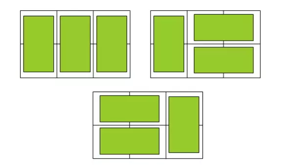

:::note
本系列将以一个学习者的眼光，从零基础一步一步学会最基础的C语言编程，本文将讲解C语言第十二个板块：递推算法。
:::

递推算法是C语言编程中最基础、最常用的算法之一，核心是**通过已知条件，利用特定关系逐步推导未知结果**。它避开了复杂的逻辑推理，通过“步步为营”的方式将复杂问题拆解为可重复的简单步骤，广泛应用于数列计算、路径规划、分割问题等场景。

### 递推算法核心思想
#### 1.基本定义
递推算法：从**初始条件（边界）**出发，通过递推公式（规律）推导出第n项的结果，本质是“由前及后”的推导思维。
- 核心三要素：
  1. **初始条件**：递推的起点（已知的基础数据）；
  2. **递推公式**：相邻项之间的固定关系（核心规律）；
  3. **终止条件**：推导到目标项停止。

#### 2.递推算法分类
| 类型       | 核心逻辑                | 适用场景                  | 示例                  |
|:----------:|:-----------------------:|:-------------------------:|:---------------------:|
| 顺推法     | 从初始条件推导到目标项  | 已知起点，求后续结果      | 斐波那契数列、蟠桃记  |
| 逆推法     | 从目标条件倒推到初始项  | 已知结果，求初始值        | 蟠桃记（反向推导）|

#### 3.递推vs递归
很多同学容易混淆递推和递归，两者核心区别如下：
| 特性       | 递推                     | 递归                     |
|:----------:|:------------------------:|:------------------------:|
| 执行方式   | 循环迭代，自底向上       | 函数调用自身，自顶向下   |
| 内存占用   | 低（仅需循环变量）| 高（栈帧累积）|
| 效率       | 高（无函数调用开销）| 低（有函数调用/回溯开销） |
| 可读性     | 稍差（需找递推公式）| 稍好（逻辑贴近自然思维） |
| 适用场景   | 已知边界，推导目标       | 问题可拆解为子问题       |

### 示例

#### 1.斐波那契数列

求斐波那契数列第n项，数列规律：F(1)=1，F(2)=1，F(n)=F(n-1)+F(n-2)（n≥3）。

```c
#include <stdio.h>

int main() {
    int n;
    scanf("%d", &n);
    if (n == 1 || n == 2) {
        printf("1\n");
        return 0;
    }
    int a = 1, b = 1, res;
    for (int i = 3; i <= n; i++) {
        res = a + b;
        a = b;
        b = res;
    }
    printf("%d\n", res);
    return 0;
}
```

#### 2.蟠桃记
孙悟空每天吃桃子总数的一半多1个，第n天只剩1个，求第一天的桃子总数。
逆推公式：前一天数量=(当天数量+1)×2  
初始条件：第n天数量=1

```c
#include <stdio.h>

int main() {
    int n;
    scanf("%d", &n);
    long long peach = 1;
    for (int i = n - 1; i >= 1; i--) {
        peach = (peach + 1) * 2;
    }
    printf("%lld\n", peach);
    return 0;
}
```

#### 3.煎饼切割问题
#### 问题描述
切n刀最多将煎饼分成多少块？规律：f(n)=f(n-1)+n，初始条件f(0)=1。

f(n) = 1 + n×(n+1)/2

#### 代码实现
```c
#include <stdio.h>

int main() {
    int n;
    scanf("%d", &n);
    long long res = 1 + (long long)n * (n + 1) / 2;
    printf("%lld\n", res);
    return 0;
}
```

#### 案例4：马拦过河卒

卒从(0,0)走到(n,m)，只能向右/向下走，避开马的控制点，求路径总数。

初始条件：f(0,0)=1（起点），第一行/第一列无禁止点时f(i,0)=1、f(0,j)=1；
递推公式：f(i,j)=f(i-1,j)+f(i,j-1)（非禁止点）。

```c
#include <stdio.h>

int main() {
    int n, m, a, b;
    scanf("%d %d %d %d", &n, &m, &a, &b);
    long long f[20][20] = {0};
    int g[20][20] = {0};
    if (a >= 0 && a <= n && b >= 0 && b <= m) g[a][b] = 1;
    int dx[] = {1,1,2,2,-2,-2,-1,-1};
    int dy[] = {2,-2,1,-1,1,-1,2,-2};
    for (int k = 0; k < 8; k++) {
        int x = a + dx[k], y = b + dy[k];
        if (x >= 0 && x <= n && y >= 0 && y <= m) g[x][y] = 1;
    }
    if (g[0][0] == 0) f[0][0] = 1;
    for (int i = 1; i <= n; i++) {
        if (g[i][0] == 1) break;
        f[i][0] = f[i-1][0];
    }
    for (int j = 1; j <= m; j++) {
        if (g[0][j] == 1) break;
        f[0][j] = f[0][j-1];
    }
    for (int i = 1; i <= n; i++) {
        for (int j = 1; j <= m; j++) {
            if (g[i][j] == 0) {
                f[i][j] = f[i-1][j] + f[i][j-1];
            }
        }
    }
    printf("%lld\n", f[n][m]);
    return 0;
}
```

### 应用

> **7-1 sdut-C语言实验-母牛的故事**
>
> 有一对夫妇买了一头母牛，它从第2年起每年年初生一头小母牛。每头小母牛从第四个年头开始，每年年初也生一头小母牛。
> 
> 请编程实现在第n年的时候，共有多少头母牛？
>
> **输入格式**：输入为一个整数n(0< n< 55)
>
> **输出格式**：输出在第n年的时候母牛的数量。
>
> **输入示例1**：
>
> ```
> 2
> ```
>
> **输出示例1**：
>
> ```
> 2
> ```
>
> **输入示例2**：
>
> ```
> 5
> ```
>
> **输出示例2**：
>
> ```
> 6
> ```

<details>
<summary>7-1 解答：</summary>

```c
#include <stdio.h>

int muniu(int x);

int main(){
    int n,sum;
    scanf("%d",&n);
    sum=muniu(n);
    printf("%d",sum);
    return 0;
}

int muniu(int x){
    int a=1;
    int b=2;
    int c=3;
    if(x==1){
        return a;
    }else if(x==2){
        return b;
    }else if(x==3){
        return c;
    }else{
        for (int i = 4; i <= x; i++) {
            int current=0;
            current = c + a;
            a = b;
            b = c;
            c = current;
        }
    return c;
    }
}
```

</details>

> **7-2 sdut-C语言实验-养兔子**
>
> 这是一个编程题模板。
> 
> 一对成熟的兔子每天能且只能产下一对小兔子，每次都生一公一母，每只小兔子的成熟期是1天，小兔子出生后隔一天才能再生小兔子。第一天某人领养了一对成熟的兔子，一公一母，请问第N天以后，他将会得到多少对兔子。
>
> **输入格式**：输入为一个整数n(1≤n≤90)。
>
> **输出格式**：对应输出第n天有几对兔子(假设没有兔子死亡现象，而且是一夫一妻制)。
>
> **输入示例1**：
>
> ```
> 1
> ```
>
> **输出示例1**：
>
> ```
> 1
> ```
> **输入示例2**：
>
> ```
> 2
> ```
>
> **输出示例2**：
>
> ```
> 2
> ```

<details>
<summary>7-2 解答：</summary>

```c
#include <stdio.h>

long long int rabbit(long long int x);

int main(){
    long long int n,sum;
    scanf("%lld",&n);
    sum = rabbit(n);
    printf("%lld",sum);
    return 0;
}

long long int rabbit(long long int x){
    long long int a=1,b=2,c=0;
    if(x==1){
        return a;
    }else if(x==2){
        return b;
    }else{
        for(long long int i=3;i<=x;i++){
            c = a+b;
            a = b;
            b = c;
        }
        return c;
    }
}
```

</details>

> **7-3 sdut-C语言实验-骨牌铺方格**
>
> 斐波那契数列（Fibonacci sequence），又称黄金分割数列，因数学家莱昂纳多·斐波那契（Leonardo Fibonacci）以兔子繁殖为例子而引入，故又称为“兔子数列”，很多题目由此衍生而来，骨牌铺方格便是这样一道题目。具体题目如下：
> 
> 在2×n的一个长方形方格中,用一个1× 2的骨牌铺满方格,输入n ,输出铺放方案的总数.
> 
> 例如n=3时,为2× 3方格，骨牌的铺放方案有三种,如下图：
> 
> 
>
> **输入格式**：输入包含一个整数n,表示该测试实例的长方形方格的规格是2×n (0< n<=50)。
>
> **输出格式**：输出铺放方案的总数。
>
> **输入示例**：
>
> ```
> 3
> ```
>
> **输出示例**：
>
> ```
> 3
> ```

<details>
<summary>7-3 解答：</summary>

```c
#include <stdio.h>

long long int Fi(long long int x);

int main(){
    long long int n;
    scanf("%lld",&n);
    long long int sum = Fi(n);
    printf("%lld",sum);
    return 0;
}

long long int Fi(long long int x){
    long long int a=1,b=2,c=0;
    if(x==1){
        return a;
    }else if(x==2){
        return b;
    }else{
        for(long long int i=3;i<=x;i++){
            c=a+b;
            a=b;
            b=c;
        }
        return c;
    }
}
```

</details>

> **7-4 sdut-C语言实验-马拦过河卒**
>
> 棋盘上A点有一个过河卒，需要走到目标B点。卒行走的规则：可以向下、或者向右。同时在棋盘上C点有一个对方的马，该马所在的点和所有跳跃一步可达的点称为对方马的控制点。因此称之为“马拦过河卒”。
> 
> 
> 
> 棋盘用坐标表示，A点（0，0）、B点（n，m）（n，m为不超过15的整数），同样马的位置坐标是需要给出的。现在要求你计算出卒从A点能够到达B点的路径的条数，假设马的位置是固定不动的，并不是卒走一步马走一步。
>
> **输入格式**：一行四个数据，用空格分隔，分别表示B点的坐标和马的坐标。
>
> **输出格式**：一个数据，表示所有的路径条数。
>
> **输入示例**：
>
> ```
> 6 6 3 3
> ```
>
> **输出示例**：
>
> ```
> 6
> ```

<details>
<summary>7-4 解答：</summary>

```c
#include <stdio.h>

int main(){
    int i,j,n,m,a,b;
    scanf("%d %d %d %d", &n, &m, &a, &b);
    int f[20][20];
    int g[20][20];
    for(i=0;i<=n;i++){
        for(j=0;j<=m;j++){
            f[i][j]=0;
            g[i][j]=0;
        }
    }
    if(a>=0&&a<=n&&b>=0&&b<=m){
        g[a][b]=1;
    }
    int dx[]={1,1,2,2,-2,-2,-1,-1};
    int dy[]={2,-2,1,-1,1,-1,2,-2};
    for (int k=0;k<8;k++){
        int x=a+dx[k];
        int y=b+dy[k];
        if (x>=0&&x<=n&&y>=0&&y<=m){
            g[x][y]=1;
        }
    }
    if(g[0][0]==0){
        f[0][0]=1;
    }
    for(i=1;i<=n;i++){
        if(g[i][0]==1){
            f[i][0]=0;
            for(;i<=n;i++){
                f[i][0]=0;
            }
        }else{
            f[i][0]=f[i-1][0];
        }
    }
    for(j=1;j<=m;j++){
        if(g[0][j]==1){
            f[0][j]=0;
            for(;j<=m;j++){
                f[0][j]=0;
            }
        }else{
            f[0][j]=f[0][j-1];
        }
    }
    for(i=1;i<=n;i++){
        for(j=1;j<=m;j++){
            if(g[i][j]==0){
                f[i][j]=f[i-1][j]+f[i][j-1];
            }
        }
    }
    printf("%d", f[n][m]);
    return 0;
}
```

</details>

> **7-5 sdut-C语言实验-黄金时代**
>
> 在古希腊时期，有一天毕达哥拉斯走在街上，在经过铁匠铺前他听到铁匠打铁的声音非常好听，于是驻足倾听。他发现铁匠打铁节奏很有规律，这个声音的比例被毕达哥拉斯用数学的方式表达出来。
> 
> 这个比例就叫做黄金分割比，它是指将整体一分为二，较大部分与整体部分的比值等于较小部分与较大部分的比值，其比值约为0.6180339887。这个比例被公认为是最能引起美感的比例，因此被称为黄金分割。
> 
> 现在小玉有一个正整数数列，这个数列的前一项和后一项的比值十分趋近于黄金分割比，即（a[i]）/（a[i+1]）~ 0.6180339887，(i>=1)，可是她只知道数列的第一项是5，现在她想通过已有条件推断出数列的任意项，请你帮助她编写一个程序计算。（请留意题目提示）
>
> **输入格式**：每次输入一个整数n（1<=n<=20）
>
> **输出格式**：输出一个数，代表这个数列的第n项a[n]。
>
> **输入示例**：
>
> ```
> 1
> ```
>
> **输出示例**：
>
> ```
> 5
> ```

<details>
<summary>7-5 解答：</summary>

```c
#include <stdio.h>

int main(){
    int a[30],n;
    scanf("%d",&n);
    a[1]=5;
    if(n>=2){
        a[2]=8;
        for(int i=3;i<=n;i++){
            a[i]=a[i-1]+a[i-2];
        }
    }
    printf("%d", a[n]);
    return 0;
}
```

</details>

> **7-6 sdut-C语言实验-爬楼梯**
>
> 小明是个非常无聊的人，他每天都会思考一些奇怪的问题，比如爬楼梯的时候，他就会想，如果每次可以上一级台阶或者两级台阶，那么上 n 级台阶一共有多少种方案？
>
> **输入格式**：输入只有一行为一个正整数 n(1 ≤ n ≤ 50)。
>
> **输出格式**：输出符合条件的方案数。
>
> **输入示例**：
>
> ```
> 4
> ```
>
> **输出示例**：
>
> ```
> 5
> ```

<details>
<summary>7-6 解答：</summary>

```c
#include <stdio.h>

long long int louti(long long int x);

int main() {
    long long int n;
    scanf("%lld", &n);
    printf("%lld",louti(n));
    return 0;
}

long long int louti(long long int x){
    if(x==1){
        return 1;
    }else if(x==2){
        return 2;
    }else{
        long long int a = 1;
        long long int b = 2;
        long long int res;
        for (long long int i=3;i<=x;i++) {
            res = a+b;
            a = b;
            b = res;
        }
        return res;
    }
}
```

</details>

> **7-7 sdut-C语言实验-三国佚事——巴蜀之危**
>
> 话说天下大势，分久必合，合久必分。。。却道那魏蜀吴三国鼎力之时，多少英雄豪杰以热血谱写那千古之绝唱。古人诚不我欺，确是应了那句“一将功成万骨枯”。
> 
> 是夜，明月高悬。诸葛丞相轻摇羽扇，一脸愁苦。原来是日前蜀国战事吃紧，丞相彻夜未眠，奋笔急书，于每个烽火台写下安排书信。可想，这战事多变，丞相运筹 帷幄，给诸多烽火台定下不同计策，却也实属不易。
> 
> 谁成想这送信小厮竟投靠曹操，给诸葛丞相暗中使坏。这小厮将每封书信都投错了烽火台，居然没有一封是对的。不多时小厮便被抓住，前后之事却也明朗。这可急坏了诸葛丞相，这书信传错，势必会让蜀军自乱阵脚，不攻自破啊!
> 
> 诸葛丞相现在想知道被这小厮一乱，这书信传错共有多少种情况。
>
> **输入格式**：输入一个正数n，代表丞相共写了n（1 <= n <= 20）封书信。
>
> **输出格式**：输出书信传错的情况数。
>
> **输入示例**：
>
> ```
> 3
> ```
>
> **输出示例**：
>
> ```
> 2
> ```

<details>
<summary>7-7 解答：</summary>

```c
#include <stdio.h>

int main(){
    long long D[21];
    int n;
    scanf("%d",&n);
    D[1]=0;
    D[2]=1;
    for(int i=3;i<=n;i++){
        D[i]=(i-1)*(D[i-1]+D[i-2]);
    }
    printf("%lld",D[n]);
    return 0;
}
```

</details>

> **7-8 sdut-C语言实验-王小二切饼**
>
> 王小二自夸刀工不错，有人放一张大的煎饼在砧板上，问他：“饼不许离开砧板，切n(1<=n<=100)刀最多能分成多少块？”
>
> **输入格式**：输入切的刀数n。
>
> **输出格式**：输出为切n刀最多切的饼的块数。
>
> **输入示例**：
>
> ```
> 100
> ```
>
> **输出示例**：
>
> ```
> 5051
> ```

<details>
<summary>7-8 解答：</summary>

```c
#include <stdio.h>

int main(){
    int n;
    scanf("%d",&n);
    long long f=1;
    for (int i=1;i<=n;i++) {
        f+=i;
    }
    printf("%lld",f);
    return 0;
}
```

</details>

> **7-9 sdut-C语言实验-蟠桃记**
>
> 蟠桃，又称仙桃、长生桃，是中国神话传说中的仙家水果，生长在天宫的蟠桃园里，由七仙女负责采摘，吃了能延长寿命，并增加法力，每年王母娘娘举办的蟠桃会中都以蟠桃为主要食物。主要出自于明代神仙小说《西游记》。小说中的人物孙悟空便偏爱吃蟠桃。
> 
> 孙悟空在大闹蟠桃园的时候，第一天吃掉了所有桃子总数一半多一个，第二天又将剩下的桃子吃掉一半多一个，以后每天吃掉前一天剩下的一半多一个，到第n天准备吃的时候只剩下一个桃子。这下可把神仙们心疼坏了。
> 
> 请帮忙计算一下，第一天开始吃的时候一共有多少个桃子？
>
> **输入格式**：输入包含一个正整数n（1≤n≤30），表示只剩下一个桃子的时候是在第n天发生的。
>
> **输出格式**：输出第一天开始吃的时候桃子的总数。
>
> **输入示例**：
>
> ```
> 2
> ```
>
> **输出示例**：
>
> ```
> 4
> ```

<details>
<summary>7-9 解答：</summary>

```c
#include <stdio.h>

int main(){
    int n;
    scanf("%d",&n);
    long long peach=1;
    for(int i=n-1;i>=1;i--){
        peach=(peach+1)*2;
    }
    printf("%lld",peach);
    return 0;
}
```

</details>

> **7-10 sdut-C语言实验-拍皮球**
>
> 小瑜3岁了，很喜欢玩皮球，看来今后喜欢打篮球的^_^。最近她发现球从手中落下时，每次落地后反跳回原高度的一半，再落下，每次球落地时数球跳了几次，数到n次时爸爸在边上喊停，问小瑜现在球到底总共走了多少距离，小瑜故作沉思状，爸爸又问接下来小球能跳多高啊，小瑜摇摇头，心想还没跳我怎么知道啊，难道爸爸是神啊！这时的你在边上出主意想给小瑜写个程序计算一下，因此任务就交给你啦！
> 
> 假设球的初始高度为h，计算第n次落地时球经过的距离，以及落地后反弹能有多高。
>
> **输入格式**：每行有两个数，球的初始高度h(h<=100)和球落地的次数n(n <= 10)，用空格分隔。
>
> **输出格式**：输出第n次反弹时球经过的距离和球最后的高度，保留小数点后2位。
>
> **输入示例**：
>
> ```
> 100 1
> ```
>
> **输出示例**：
>
> ```
> 100.00 50.00
> ```

<details>
<summary>7-10 解答：</summary>

```c
#include <stdio.h>

int main(){
    double h,total;
    int n;
    scanf("%lf %d",&h,&n);
    total=h;
    double current=h/2.0;
    for (int i=2;i<=n;i++){
        total+=2*current;
        current/=2.0;
    }
    printf("%.2lf %.2lf",total,current);
    return 0;
}
```

</details>

### 总结

OK了，今天你学会了C语言程序的递推算法及其相关知识点！那么我们一起加油吧！